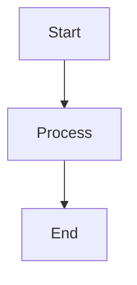
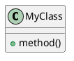

# Getting Started with Open Ticket AI

Welcome to Open Ticket AI! This guide will help you get started whether you're a new user, contributor, or documentation author.

## For End Users

### Quick Installation

The fastest way to get started:

```bash
# Install the complete bundle
pip install open-ticket-ai-bundle

# Or install core package only
pip install open-ticket-ai
```

### First Configuration

1. **Initialize a configuration file**:
   ```bash
   otai init queue_classification
   ```

2. **Configure your ticket system**:
   ```yaml
   # config.yml
   plugins:
     - name: otobo_znuny
       config:
         base_url: "https://your-ticket-system.com"
         api_token: "${OTOBO_API_TOKEN}"
   ```

3. **Set environment variables**:
   ```bash
   export OTOBO_API_TOKEN="your-api-token"
   export OTOBO_BASE_URL="https://your-ticket-system.com"
   ```

4. **Validate configuration**:
   ```bash
   otai check-config config.yml
   ```

5. **Run the application**:
   ```bash
   otai start --config config.yml
   ```

### Next Steps

- **Configuration Examples**: See `docs/raw_en_docs/config_examples/` for ready-to-use examples
- **Quick Start Guide**: See `docs/raw_en_docs/general/QUICK_START.md`
- **Full Installation Guide**: See `docs/raw_en_docs/en/guides/installation.md`
- **Online Documentation**: Visit https://open-ticket-ai.com

## For Contributors

### Development Setup

1. **Clone the repository**:
   ```bash
   git clone https://github.com/Softoft-Orga/open-ticket-ai.git
   cd open-ticket-ai
   ```

2. **Install dependencies with uv**:
   ```bash
   # Install uv if needed
   curl -LsSf https://astral.sh/uv/install.sh | sh
   
   # Sync workspace
   uv sync --all-extras
   ```

3. **Install pre-commit hooks**:
   ```bash
   uv run pre-commit install
   ```

4. **Run tests**:
   ```bash
   uv run -m pytest
   ```

### Code Guidelines

- **Python Version**: 3.13 only
- **Type Hints**: Use modern typing (PEP 695)
- **No Comments**: Code should be self-documenting
- **Testing**: All code must have tests
- **Linting**: Must pass `ruff check`
- **Type Checking**: Must pass `mypy`

### Contributing Workflow

1. **Create a feature branch**:
   ```bash
   git checkout -b feature/your-feature-name
   ```

2. **Make changes and test**:
   ```bash
   # Run linter
   uv run ruff check .
   
   # Run type checker
   uv run mypy .
   
   # Run tests
   uv run -m pytest
   ```

3. **Commit and push**:
   ```bash
   git add .
   git commit -m "Add your feature"
   git push origin feature/your-feature-name
   ```

4. **Open a pull request** on GitHub

## For Documentation Authors

### Documentation Structure

Open Ticket AI uses **VitePress** (not Jekyll) for its documentation website.

**Key directories**:
- `docs/raw_en_docs/` - Primary English documentation (Markdown)
- `docs/vitepress_docs/` - VitePress website source (multi-lingual)
- `docs/diagrams/` - Architecture diagrams
- `docs/config_examples/` - YAML configuration examples

### Local Documentation Setup

1. **Navigate to VitePress directory**:
   ```bash
   cd docs/vitepress_docs
   ```

2. **Install Node.js dependencies**:
   ```bash
   npm install
   ```

3. **Start development server**:
   ```bash
   npm run docs:dev
   ```

4. **Access locally**:
   Open http://localhost:5173 in your browser

### Editing Documentation

#### For English Content

1. **Edit primary source**:
   ```bash
   # Edit files in docs/raw_en_docs/
   vim docs/raw_en_docs/general/QUICK_START.md
   ```

2. **Sync to VitePress** (if needed):
   ```bash
   # Copy to VitePress docs
   cp docs/raw_en_docs/general/QUICK_START.md \
      docs/vitepress_docs/docs_src/en/guide/quick-start.md
   ```

3. **Preview changes**:
   ```bash
   cd docs/vitepress_docs
   npm run docs:dev
   ```

#### For Multi-Language Content

1. **Edit English first**: Always update English version first
2. **Update other languages**:
   - German: `docs/vitepress_docs/docs_src/de/`
   - Spanish: `docs/vitepress_docs/docs_src/es/`
   - French: `docs/vitepress_docs/docs_src/fr/`

### Adding Configuration Examples

1. **Create YAML file**:
   ```bash
   vim docs/raw_en_docs/config_examples/my_example.yml
   ```

2. **Update README**:
   ```bash
   vim docs/raw_en_docs/config_examples/README.md
   ```

3. **Update quick reference**:
   ```bash
   vim docs/raw_en_docs/config_examples/QUICK_REFERENCE.md
   ```

4. **Test configuration**:
   ```bash
   otai check-config docs/raw_en_docs/config_examples/my_example.yml
   ```

### Building Documentation

```bash
cd docs/vitepress_docs

# Build for production
npm run docs:build

# Preview production build
npm run docs:preview
```

### Documentation Deployment

Documentation is automatically deployed to https://open-ticket-ai.com via Netlify:

- **Production**: Deploys from `main` branch
- **Preview**: Deploys from pull requests
- **Build**: Triggered automatically on push

For more details, see:
- **VitePress Setup**: `docs/VITEPRESS_SETUP.md`
- **Deployment Guide**: `docs/DEPLOYMENT.md`

## Common Documentation Tasks

### Adding a New Guide

1. **Create Markdown file**:
   ```bash
   vim docs/raw_en_docs/en/guides/my-new-guide.md
   ```

2. **Add frontmatter**:
   ```markdown
   ---
   title: My New Guide
   description: Brief description for SEO
   ---
   
   # My New Guide
   
   Content here...
   ```

3. **Add to navigation** (auto-generated by VitePress NavGenerator)

### Creating Diagrams

**Mermaid diagrams** (preferred for flowcharts):

```markdown
# My Diagram


```

**PlantUML** (for class/component diagrams):



### Updating API Documentation

1. **Edit sidecar files**:
   ```bash
   vim docs/man_structured/pipes/my_pipe.sidecar.yml
   ```

2. **Follow schema**:
   ```yaml
   _class: my.package.MyPipe
   _title:
     en: "My Pipe"
     de: "Meine Pipe"
   _summary:
     en: "Does something useful"
   ```

## Project Architecture Overview

### Core Concepts

- **Pipeline**: Ordered execution of pipes
- **Orchestrator**: Manages pipeline scheduling
- **Pipe**: Individual processing unit
- **Context**: Shared state across execution
- **Dependency Injection**: Service container

### Key Files

- `config.yml` - Runtime configuration
- `pyproject.toml` - Package metadata
- `config.schema.json` - Configuration schema

### Directory Structure

```
open-ticket-ai/
├── src/                    # Source code
│   └── open_ticket_ai/     # Core package
├── packages/               # Plugin packages
├── tests/                  # Test suite
├── docs/                   # Documentation
│   ├── raw_en_docs/        # Primary docs
│   └── vitepress_docs/     # Website
├── examples/               # Example configs
└── deployment/             # Deployment files
```

## Getting Help

### Documentation Resources

- **Online Docs**: https://open-ticket-ai.com
- **API Reference**: `docs/raw_en_docs/developers/api/`
- **Config Examples**: `docs/raw_en_docs/config_examples/`
- **Troubleshooting**: `docs/raw_en_docs/en/guides/troubleshooting.md`

### Support Channels

- **GitHub Issues**: Report bugs or request features
- **GitHub Discussions**: Ask questions
- **Documentation**: Check guides and examples

### Useful Commands

```bash
# Show help
otai --help

# Check version
otai --version

# List plugins
otai plugin list

# Validate config
otai check-config config.yml

# Show system info
otai info
```

## Important Guidelines

### For Code Contributors

✅ **DO**:
- Write tests for all code
- Follow type hints requirements
- Run linters before committing
- Keep PRs focused and small
- Update documentation

❌ **DON'T**:
- Add inline code comments
- Commit without testing
- Mix refactoring with features
- Break existing tests

### For Documentation Authors

✅ **DO**:
- Edit `raw_en_docs/` first
- Test examples before documenting
- Use clear, concise language
- Add code examples
- Update all languages when possible

❌ **DON'T**:
- Edit VitePress without updating raw docs
- Leave broken links
- Remove examples without replacement
- Skip testing configuration examples

## Next Steps

### New Users
1. Read the [Quick Start Guide](docs/raw_en_docs/general/QUICK_START.md)
2. Try a [configuration example](docs/raw_en_docs/config_examples/)
3. Explore the [online documentation](https://open-ticket-ai.com)

### Contributors
1. Read [CONTRIBUTING.md](docs/raw_en_docs/general/CONTRIBUTING.md)
2. Set up development environment
3. Pick an issue to work on

### Documentation Authors
1. Read [VITEPRESS_SETUP.md](docs/VITEPRESS_SETUP.md)
2. Set up local VitePress environment
3. Review [AGENTS.md](docs/AGENTS.md) guidelines

## Additional Resources

- **Repository**: https://github.com/Softoft-Orga/open-ticket-ai
- **PyPI Packages**:
  - [open-ticket-ai](https://pypi.org/project/open-ticket-ai/)
  - [open-ticket-ai-hf-local](https://pypi.org/project/open-ticket-ai-hf-local/)
  - [open-ticket-ai-otobo-znuny-plugin](https://pypi.org/project/open-ticket-ai-otobo-znuny-plugin/)
- **Documentation Site**: https://open-ticket-ai.com
