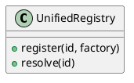

# Open Ticket AI Documentation

This directory contains all documentation for the Open Ticket AI project. The documentation is organized into multiple folders, each serving a specific purpose in the documentation ecosystem.

## Documentation Structure

```
docs/
├── raw_en_docs/           # Raw English documentation (manually edited)
├── man_structured/        # Structured documentation in YAML format
│   └── pipes/            # Pipe definitions and schemas
├── diagrams/             # Architecture and flow diagrams
├── config_examples/      # Configuration file examples
├── internal_docs/        # Internal development notes
├── vitepress_docs/       # Auto-generated VitePress documentation site
└── README.md            # This file
```

## Folder Descriptions

### `/raw_en_docs` - Raw English Documentation

**Purpose**: Contains manually-written documentation in Markdown format. This is the primary location for human-readable documentation.

**Content**:
- User guides (QUICK_START.md, SETUP_INSTRUCTIONS.md)
- Developer documentation (CONTRIBUTING.md, developer_process.md)
- Implementation guides (IMPLEMENTATION_SUMMARY.md, TESTING.md)
- Process documentation (PREFECT_SETUP.md, PREFECT_USAGE.md)
- Architecture overviews (workflow_architecture.md, pipeline_flow.md)

**Language**: All documentation is currently in English. Translation to other languages will be added in future releases.

**Editing**: Contributors should add new documentation files here. Follow the existing naming conventions (UPPERCASE for major guides, lowercase_with_underscores for detailed documents).

### `/man_structured` - Structured Documentation

**Purpose**: Contains machine-readable documentation in YAML format. This structured data can be consumed by tooling and converted to other formats.

**Content**:
- `/pipes/` - Sidecar YAML files defining pipe specifications
  - `add_note_pipe.sidecar.yml` - AddNote pipe specification
  - `fetch_tickets_pipe.sidecar.yml` - FetchTickets pipe specification
  - `update_ticket_pipe.sidecar.yml` - UpdateTicket pipe specification
  - `jinja_expression_pipe.sidecar.yml` - JinjaExpression pipe specification
  - `default_pipe.sidecar.yml` - Default pipe template
  - `sidecar_pipe_schema.yml` - Schema for pipe sidecar files

**Format**: YAML with specific schema for each document type. See `sidecar_pipe_schema.yml` for the pipe specification schema.

**Editing**: When creating new pipes or components, add corresponding sidecar YAML files here. These files document the API surface, parameters, and behavior in a structured way.

### `/diagrams` - Architecture and Flow Diagrams

**Purpose**: Visual representations of system architecture, data flows, and component relationships.

**Content**:
- PlantUML diagrams (*.puml)
  - `architecture_overview.puml` - High-level system architecture
  - `dependency_injection.puml` - DI container and service resolution
  - `to_mermaid_conversion.puml` - Diagram conversion workflows
- Markdown diagram documentation (*.md)
  - `pipeline-context.md` - Pipeline context flow documentation
  - `pipeline_flow.md` - Pipeline execution flow details
  - `test-structure.md` - Testing architecture overview

**Format**: PlantUML (.puml) for diagrams, Markdown (.md) for diagram explanations.

**Editing**: Add new diagrams here when documenting architecture, workflows, or complex interactions. Use PlantUML for maintainable text-based diagrams.

### `/config_examples` - Configuration Examples

**Purpose**: Real-world configuration file examples demonstrating different use cases.

**Content**:
- `queue_classification.yml` - Queue routing example
- `priority_classification.yml` - Priority assignment example
- `add_note_when_in_queue.yml` - Automated note addition
- `create_ticket_on_condition.yml` - Conditional ticket creation
- `complete_workflow.yml` - Full pipeline example
- `template_extensions_example.py` - Jinja2 template extension examples
- `README.md` - Index and description of all examples
- `QUICK_REFERENCE.md` - Quick comparison table
- `TEMPLATE_RENDERER_CONFIG.md` - Template rendering documentation

**Format**: YAML for configurations, Python for code examples.

**Editing**: When adding new features or use cases, provide a working configuration example here. Include comments explaining key sections and required environment variables.

### `/internal_docs` - Internal Development Notes

**Purpose**: Temporary notes, brainstorming documents, and internal planning materials.

**Content**:
- `note.md` - Development ideas and improvement proposals

**Status**: These are working documents and may not be fully polished or up-to-date.

**Editing**: Use this for quick notes during development. Content here is not published to the main documentation site.

### `/vitepress_docs` - VitePress Documentation Site

**Purpose**: Auto-generated documentation website source. This is the output that gets published to the documentation website.

**⚠️ Important**: This directory is auto-generated from other documentation sources. **DO NOT edit files here directly.**

**Content**:
- `/docs_src/en/` - Generated English documentation pages
- `/.vitepress/` - VitePress configuration
- `/stories/` - Component stories
- `/.storybook/` - Storybook configuration

**Process**: Documentation from `/raw_en_docs`, `/man_structured`, and `/diagrams` is processed and transformed into the VitePress site structure.

**Deployment**: The site is deployed via Netlify (see `netlify.toml` in project root).

## Language and Translation

All documentation is currently written in **English only**. The structure supports future localization:

- Raw docs will have language-specific folders (e.g., `/raw_de_docs`, `/raw_fr_docs`)
- VitePress site will support multi-language navigation
- Structured YAML files will include language-specific content sections

Translation to other languages is planned for future releases.

## Contributor Guidelines

### Where to Add Documentation

**✅ DO add documentation here:**
- `/raw_en_docs/` - For user guides, tutorials, and explanatory documentation
- `/man_structured/pipes/` - For pipe specifications and API documentation
- `/diagrams/` - For architecture diagrams and visual explanations
- `/config_examples/` - For configuration examples and templates

**❌ DO NOT add documentation here:**
- Source code files (no docstrings per project standards)
- `/vitepress_docs/` (auto-generated, changes will be overwritten)
- Pull request descriptions (documentation should be in the repository)

### Documentation Best Practices

1. **Write in Markdown**: Use standard Markdown syntax for all text documentation
2. **Be Concise**: Write self-explanatory content without excessive comments
3. **Provide Examples**: Include working code/config examples when applicable
4. **Keep Updated**: Update documentation when changing functionality
5. **Use Clear Names**: File names should be descriptive and follow existing conventions
6. **Version Awareness**: Note which version introduces new features

### Adding New Documentation

#### For User Documentation:
1. Create a `.md` file in `/raw_en_docs/`
2. Use clear heading structure (H1 for title, H2 for sections)
3. Include practical examples
4. Update relevant index or README files

#### For API Documentation:
1. Create a `.sidecar.yml` file in `/man_structured/pipes/`
2. Follow the schema defined in `sidecar_pipe_schema.yml`
3. Include input/output specifications
4. Provide usage examples in the YAML structure

#### For Architecture Documentation:
1. Create a `.puml` file in `/diagrams/`
2. Add a corresponding `.md` file explaining the diagram
3. Reference the diagram from relevant documentation
4. Keep diagrams focused on one concept

#### For Configuration Examples:
1. Create a `.yml` file in `/config_examples/`
2. Add inline comments explaining key sections
3. List required environment variables
4. Update `/config_examples/README.md` with the new example

## Examples

### Example 1: Structured Pipe Documentation (YAML)

Located in `/man_structured/pipes/add_note_pipe.sidecar.yml`:

```yaml
_version: 1.0.x
_class: open_ticket_ai.base.ticket_system_pipes.AddNotePipe
_extends: open_ticket_ai.core.pipeline.ConfigurablePipe

_title: Add Note
_summary: Appends a note/article to a ticket in the connected system.
_category: ticket-system

_inputs:
    placement: flat
    alongside: [ id, use ]
    params:
        ticket_system_id: Target ticket system ID from registry
        ticket_id: Target ticket ID
        note: Note body text or UnifiedNote object
```

### Example 2: Raw Documentation (Markdown)

Located in `/raw_en_docs/QUICK_START.md`:

```markdown
# Quick Start Guide for PyPI Publishing

This guide helps you get started with the automated PyPI publishing system.

## ⚡ Quick Setup (5 minutes)

### 1. Configure PyPI Tokens
[...]
```

### Example 3: Architecture Diagram (PlantUML)

Located in `/diagrams/dependency_injection.puml`:



### Example 4: Configuration Example

Located in `/config_examples/queue_classification.yml`:

```yaml
open_ticket_ai:
  orchestrator:
    pipelines:
      - id: classify_queue
        schedule: "*/5 * * * *"
        steps:
          - id: fetch_tickets
            use: fetch_tickets
```

## Additional Resources

- **Project Root README**: `/README.md` - Main project documentation
- **Contributing Guide**: `/raw_en_docs/CONTRIBUTING.md` - Development workflow
- **Testing Documentation**: `/raw_en_docs/TESTING.md` - Test structure and guidelines
- **Plugin Standards**: `/PLUGIN_STANDARDS.md` - Plugin development requirements
- **Website**: https://open-ticket-ai.com - Published documentation site

## Build and Deployment

The VitePress documentation site is automatically built and deployed when changes are pushed to the main branch:

1. Changes in `/raw_en_docs/`, `/man_structured/`, or `/diagrams/` trigger documentation processing
2. Processed documentation is placed in `/vitepress_docs/`
3. VitePress builds the static site
4. Netlify deploys to https://open-ticket-ai.com

For local development of the documentation site, see the VitePress documentation and the project's `netlify.toml` configuration.
