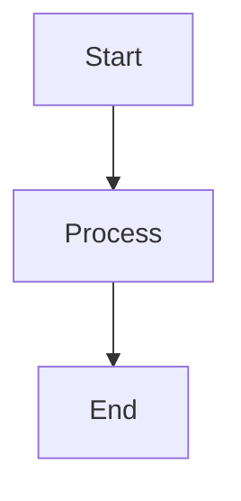
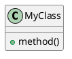

# Open Ticket AI Documentation

This directory contains all documentation for the Open Ticket AI project.

## Quick Links

- **Getting Started**: [GETTING_STARTED.md](GETTING_STARTED.md) - For users, contributors, and doc authors
- **VitePress Setup**: [VITEPRESS_SETUP.md](VITEPRESS_SETUP.md) - Documentation website setup
- **VitePress Config Reference**: [VITEPRESS_CONFIG_REFERENCE.md](VITEPRESS_CONFIG_REFERENCE.md) - Quick config snippets
- **Deployment Guide**: [DEPLOYMENT.md](DEPLOYMENT.md) - Production deployment instructions
- **AI Agent Guidelines**: [AGENTS.md](AGENTS.md) - Guidelines for AI agents working with docs
- **Online Documentation**: https://open-ticket-ai.com

## Documentation Structure

### Primary Documentation Source

**Location**: `raw_en_docs/`

This is the **authoritative source** for English documentation:

```
raw_en_docs/
├── README.md                    # Main project README
├── DOCUMENTATION_STRUCTURE.md   # Proposed documentation organization
├── config_examples/             # YAML configuration examples
│   ├── queue_classification.yml
│   ├── priority_classification.yml
│   ├── complete_workflow.yml
│   └── ...
├── general/                     # General guides
│   ├── QUICK_START.md
│   ├── SETUP_INSTRUCTIONS.md
│   └── testing/
└── en/                          # Structured English docs
    ├── guides/
    │   ├── installation.md
    │   ├── quick_start.md
    │   └── troubleshooting.md
    └── configuration/
        ├── config_schema.md
        └── config_structure.md
```

### VitePress Documentation Website

**Location**: `vitepress_docs/`

Multi-lingual documentation website built with VitePress:

```
vitepress_docs/
├── .vitepress/           # VitePress configuration
│   ├── config.mts        # Main config
│   └── theme/            # Custom theme
├── docs_src/             # Source content
│   ├── en/               # English (primary)
│   ├── de/               # German
│   ├── es/               # Spanish
│   └── fr/               # French
└── package.json          # Node.js dependencies
```

**Local Development**:
```bash
cd vitepress_docs
npm install
npm run docs:dev
```

**Production Build**:
```bash
npm run docs:build
npm run docs:preview
```

See [VITEPRESS_SETUP.md](VITEPRESS_SETUP.md) for complete setup instructions.

### Architecture Diagrams

**Location**: `diagrams/`

Visual documentation using PlantUML and Mermaid:

- `architecture_overview.puml` - System architecture
- `pipeline_flow.md` - Pipeline execution flow
- `otobo_demo_*.md` - OTOBO integration diagrams

### API Documentation

**Location**: `man_structured/pipes/`

YAML sidecar files documenting pipe APIs:

```yaml
# Example: add_note_pipe.sidecar.yml
_class: open_ticket_ai.core.pipes.AddNotePipe
_title:
  en: "Add Note to Ticket"
  de: "Notiz zum Ticket hinzufügen"
_summary:
  en: "Adds a note or article to a ticket"
_inputs:
  config: AddNotePipeConfig
  params:
    note_text: "The text content of the note"
```

## Documentation Types

### For End Users

- **Quick Start**: `raw_en_docs/general/QUICK_START.md`
- **Installation**: `raw_en_docs/en/guides/installation.md`
- **Configuration Examples**: `raw_en_docs/config_examples/`
- **Troubleshooting**: `raw_en_docs/en/guides/troubleshooting.md`

### For Developers

- **Developer Information**: `vitepress_docs/docs_src/en/developers/developer-information.md`
- **API Reference**: `man_structured/pipes/`
- **Architecture Diagrams**: `diagrams/`
- **Testing Guides**: `raw_en_docs/general/testing/`

### For Documentation Authors

- **VitePress Setup**: [VITEPRESS_SETUP.md](VITEPRESS_SETUP.md)
- **Deployment**: [DEPLOYMENT.md](DEPLOYMENT.md)
- **AI Guidelines**: [AGENTS.md](AGENTS.md)
- **Getting Started**: [GETTING_STARTED.md](GETTING_STARTED.md)

## Working with Documentation

### Editing Documentation

1. **Edit primary source** in `raw_en_docs/`:
   ```bash
   vim raw_en_docs/general/QUICK_START.md
   ```

2. **Sync to VitePress** (if needed):
   ```bash
   cp raw_en_docs/general/QUICK_START.md \
      vitepress_docs/docs_src/en/guide/quick-start.md
   ```

3. **Preview changes**:
   ```bash
   cd vitepress_docs
   npm run docs:dev
   ```

### Adding Configuration Examples

1. Create YAML file in `raw_en_docs/config_examples/`
2. Update `README.md` in that directory
3. Update `QUICK_REFERENCE.md` comparison table
4. Test the configuration:
   ```bash
   otai check-config raw_en_docs/config_examples/your_example.yml
   ```

### Creating Diagrams

**Mermaid** (preferred for flowcharts):
```markdown

```

**PlantUML** (for class/component diagrams):


## Multi-Language Support

### Supported Languages

- **English (EN)**: Primary language
- **German (DE)**: Secondary
- **Spanish (ES)**: Supported
- **French (FR)**: Supported

### Translation Workflow

1. **English first**: Always update English version first
2. **Other languages**: Update translations in `vitepress_docs/docs_src/{lang}/`
3. **i18n messages**: Update `messages.ts` files for UI strings

## Deployment

Documentation is automatically deployed to https://open-ticket-ai.com via Netlify:

- **Trigger**: Push to `main` or `dev` branch
- **Build**: `npm run docs:build` in `vitepress_docs/`
- **Deploy**: Automatic via Netlify webhook
- **Preview**: Every pull request gets a preview URL

See [DEPLOYMENT.md](DEPLOYMENT.md) for complete deployment guide.

## Important Notes

### Documentation System

**This project uses VitePress, NOT Jekyll**

If you see references to Jekyll in issues or old documentation, they are incorrect or outdated. The project has always used VitePress for its documentation website.

### Editing Guidelines

✅ **DO**:
- Edit `raw_en_docs/` as the primary source
- Test configuration examples before documenting
- Use clear, concise language
- Add code examples
- Update all languages when possible
- Follow existing Markdown structure

❌ **DON'T**:
- Edit VitePress without updating raw docs
- Leave broken links
- Remove examples without replacement
- Skip testing YAML configurations
- Duplicate documentation

## Configuration Examples

Key configuration examples in `raw_en_docs/config_examples/`:

- `queue_classification.yml` - Route tickets to queues
- `priority_classification.yml` - Assign ticket priorities
- `add_note_when_in_queue.yml` - Conditional note addition
- `create_ticket_on_condition.yml` - Automatic ticket creation
- `complete_workflow.yml` - Full-featured production example

Each example includes:
- Complete working configuration
- Detailed comments
- Customizable parameters
- Best practices

## Resources

- **Main README**: `raw_en_docs/README.md`
- **Project Repository**: https://github.com/Softoft-Orga/open-ticket-ai
- **Online Documentation**: https://open-ticket-ai.com
- **VitePress Documentation**: https://vitepress.dev/

## Getting Help

- **Documentation Questions**: Open an issue on GitHub
- **VitePress Issues**: See [VITEPRESS_SETUP.md](VITEPRESS_SETUP.md) troubleshooting
- **General Support**: Check online documentation at https://open-ticket-ai.com

## Directory Map

```
docs/
├── README.md                    # This file
├── GETTING_STARTED.md           # Quick start for all users
├── VITEPRESS_SETUP.md           # VitePress setup guide
├── DEPLOYMENT.md                # Deployment instructions
├── AGENTS.md                    # AI agent guidelines
│
├── raw_en_docs/                 # Primary documentation source
│   ├── README.md
│   ├── DOCUMENTATION_STRUCTURE.md
│   ├── config_examples/         # Configuration examples
│   ├── general/                 # General guides
│   └── en/                      # Structured docs
│
├── vitepress_docs/              # VitePress website
│   ├── .vitepress/
│   ├── docs_src/
│   └── package.json
│
├── diagrams/                    # Architecture diagrams
│   ├── *.puml                   # PlantUML diagrams
│   └── *.md                     # Mermaid diagrams
│
├── man_structured/              # API documentation
│   └── pipes/                   # Pipe sidecar files
│
└── internal_docs/               # Internal notes
    └── AGENTS_STRUCTURE.md
```

## Contributing to Documentation

See [GETTING_STARTED.md](GETTING_STARTED.md) for:
- Setting up local environment
- Editing documentation
- Testing changes
- Submitting pull requests

## Version Information

Documentation version tracking:
- **VitePress**: v1.6.3+
- **Node.js**: 18+ (20 recommended)
- **Python**: 3.13 (for code examples)

---

**Last Updated**: 2025-10-11

For the most up-to-date information, visit https://open-ticket-ai.com
