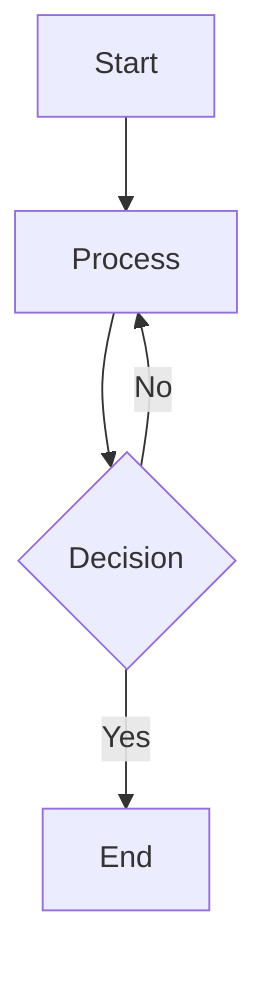

# VitePress Configuration Quick Reference

This is a quick reference for the VitePress configuration used in Open Ticket AI.

## Main Configuration

**File**: `docs/vitepress_docs/.vitepress/config.mts`

### Basic Setup

```typescript
import {defineConfig} from "vitepress";

export default defineConfig({
  // Site metadata
  title: 'Open Ticket AI',
  description: 'Open Ticket AI documentation',
  
  // Source directory
  srcDir: './docs_src',
  
  // Appearance
  appearance: 'force-dark',
  
  // Clean URLs (no .html extension)
  cleanUrls: true,
  
  // SEO
  sitemap: {
    hostname: 'https://open-ticket-ai.com',
  }
})
```

### Multi-Language Configuration

```typescript
export default defineConfig({
  locales: {
    root: {
      label: 'English',
      lang: 'en',
      link: '/en/',
      themeConfig: {
        nav: [...navGenerator.generateNavbar('en')],
        sidebar: navGenerator.generateSidebar("en")
      }
    },
    de: {
      label: 'Deutsch',
      lang: 'de',
      link: '/de/',
      themeConfig: {
        nav: [...navGenerator.generateNavbar('de')],
        sidebar: navGenerator.generateSidebar("de")
      }
    },
    // ... similar for es, fr
  }
})
```

### Theme Customization

```typescript
export default defineConfig({
  themeConfig: {
    footer: {
      message: '<b>OTAI</b> - Open Ticket AI',
      copyright: "by <a href='https://www.softoft.de' target='_blank'>Softoft</a>"
    }
  }
})
```

### Build Optimization

```typescript
import viteCompression from 'vite-plugin-compression'

export default defineConfig({
  vite: {
    build: {
      cssCodeSplit: true,
    },
    plugins: [
      viteCompression({algorithm: 'brotliCompress'}),
      viteCompression({algorithm: 'gzip'})
    ]
  }
})
```

## Navigation Configuration

### Auto-Generated Navigation

```typescript
import {NavGenerator} from "./util/navgen.ts";

const navGeneratorOptions = {
  rootPath: './docs_src',
  allowedExtensions: ['.md'],
  excludePatterns: [/^_/, /\/_/, /\.\//],
  hideHiddenEntries: true,
  includeIndexAsFolderLink: false,
  stripExtensionsInLinks: true,
  sidebarCollapsible: true,
  sidebarCollapsed: true,
}

const navGenerator = new NavGenerator(navGeneratorOptions);
```

### Manual Navigation (Alternative)

```typescript
export default defineConfig({
  themeConfig: {
    nav: [
      { text: 'Guide', link: '/guide/' },
      { text: 'API', link: '/api/' },
      { text: 'Config', link: '/config/' }
    ],
    sidebar: {
      '/guide/': [
        {
          text: 'Introduction',
          items: [
            { text: 'Getting Started', link: '/guide/getting-started' },
            { text: 'Installation', link: '/guide/installation' }
          ]
        }
      ]
    }
  }
})
```

## Netlify Configuration

**File**: `netlify.toml` (repository root)

```toml
[build]
base = "docs/vitepress_docs"
command = "npm run docs:build"
publish = ".vitepress/dist"
functions = "netlify/functions"

# Language-based redirects
[[redirects]]
from = "/"
to = "/de"
status = 302
conditions = { Language = ["de"] }

[[redirects]]
from = "/"
to = "/en"
status = 302
conditions = { Language = ["en"] }

# Asset caching
[[headers]]
for = "/assets/*.js"
[headers.values]
Cache-Control = "public, max-age=31536000, immutable"

[[headers]]
for = "/assets/*.css"
[headers.values]
Cache-Control = "public, max-age=31536000, immutable"
```

## Package Configuration

**File**: `docs/vitepress_docs/package.json`

```json
{
  "name": "vitepress-atc-docs",
  "version": "1.0.0",
  "scripts": {
    "docs:dev": "vitepress dev",
    "docs:build": "vitepress build",
    "docs:preview": "vitepress preview"
  },
  "devDependencies": {
    "vitepress": "^1.6.3",
    "vitepress-plugin-mermaid": "^2.0.17",
    "mermaid": "^11.9.0",
    "vue": "^3.4.27",
    "tailwindcss": "^3.4.4",
    "vite-plugin-compression": "^0.5.1"
  },
  "dependencies": {
    "vue-i18n": "^11.1.2"
  }
}
```

## Frontmatter Examples

### Page Frontmatter

```markdown
---
title: Page Title
description: SEO description
layout: doc
---

# Page Content
```

### Home Page Frontmatter

```markdown
---
layout: home
hero:
  name: Open Ticket AI
  text: AI-powered ticket automation
  tagline: Integrate with OTOBO, Znuny, and OTRS
  actions:
    - theme: brand
      text: Get Started
      link: /guide/getting-started
    - theme: alt
      text: View on GitHub
      link: https://github.com/Softoft-Orga/open-ticket-ai
---
```

## Custom Components

### Using Vue Components in Markdown

```markdown
<script setup>
import MyComponent from './.vitepress/components/MyComponent.vue'
</script>

<MyComponent>
  Content here
</MyComponent>
```

### Component Example

```vue
<!-- .vitepress/components/MyComponent.vue -->
<template>
  <div class="my-component">
    <slot />
  </div>
</template>

<script setup lang="ts">
// Component logic
</script>

<style scoped>
.my-component {
  /* Styles */
}
</style>
```

## Mermaid Diagrams

### Configuration

Already configured via `vitepress-plugin-mermaid`:

```typescript
import { defineConfig } from 'vitepress'

export default defineConfig({
  // Mermaid is automatically enabled
  // Just use mermaid code blocks
})
```

### Usage in Markdown

```markdown

```

## Analytics Configuration

### Google Analytics

```typescript
export default defineConfig({
  head: [
    ['script', { async: true, src: 'https://www.googletagmanager.com/gtag/js?id=G-FBWC3JDZJ4' }],
    ['script', {}, `
      window.dataLayer = window.dataLayer || [];
      function gtag(){dataLayer.push(arguments);}
      gtag('js', new Date());
      gtag('config', 'G-FBWC3JDZJ4');
    `]
  ]
})
```

## Search Configuration

VitePress includes built-in search (local search):

```typescript
export default defineConfig({
  themeConfig: {
    search: {
      provider: 'local',
      options: {
        locales: {
          en: {
            translations: {
              button: {
                buttonText: 'Search',
                buttonAriaLabel: 'Search'
              }
            }
          },
          de: {
            translations: {
              button: {
                buttonText: 'Suchen',
                buttonAriaLabel: 'Suchen'
              }
            }
          }
        }
      }
    }
  }
})
```

## Common Customizations

### Custom CSS

Add custom styles in `.vitepress/theme/style.css`:

```css
:root {
  --vp-c-brand: #646cff;
  --vp-c-brand-light: #747bff;
  --vp-c-brand-lighter: #9499ff;
  --vp-c-brand-dark: #535bf2;
  --vp-c-brand-darker: #454ce1;
}
```

### Custom Layout

Override default layout in `.vitepress/theme/Layout.vue`:

```vue
<template>
  <Layout>
    <template #nav-bar-content-before>
      <!-- Custom content before nav -->
    </template>
    <template #sidebar-nav-before>
      <!-- Custom content before sidebar -->
    </template>
  </Layout>
</template>

<script setup>
import DefaultTheme from 'vitepress/theme'
const { Layout } = DefaultTheme
</script>
```

## Environment Variables

For build-time environment variables:

```bash
# .env (not committed to repo)
VITE_API_URL=https://api.example.com
```

Access in config:

```typescript
export default defineConfig({
  define: {
    __API_URL__: JSON.stringify(process.env.VITE_API_URL)
  }
})
```

## Troubleshooting Quick Fixes

### Clear Cache

```bash
rm -rf docs/vitepress_docs/.vitepress/cache
```

### Rebuild Node Modules

```bash
cd docs/vitepress_docs
rm -rf node_modules package-lock.json
npm install
```

### Check Build Locally

```bash
npm run docs:build
npm run docs:preview
```

## References

- **VitePress**: https://vitepress.dev/
- **Full Setup Guide**: [VITEPRESS_SETUP.md](VITEPRESS_SETUP.md)
- **Deployment Guide**: [DEPLOYMENT.md](DEPLOYMENT.md)
- **Getting Started**: [GETTING_STARTED.md](GETTING_STARTED.md)
