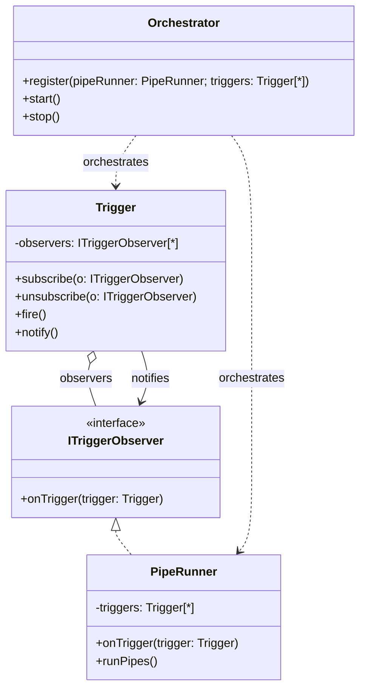

```mermaid
classDiagram
class Orchestrator {
  +register(pipeRunner: PipeRunner; triggers: Trigger[*])
  +start()
  +stop()
}

class ITriggerObserver {
  <<interface>>
  +onTrigger(trigger: Trigger)
}

class PipeRunner {
  +onTrigger(trigger: Trigger)
  +runPipes()
  -triggers: Trigger[*]
}

class Trigger {
  +subscribe(o: ITriggerObserver)
  +unsubscribe(o: ITriggerObserver)
  +fire()
  +notify()
  -observers: ITriggerObserver[*]
}

ITriggerObserver <|.. PipeRunner
Trigger o-- ITriggerObserver : observers
Trigger --> ITriggerObserver : notifies

Orchestrator ..> PipeRunner : orchestrates
Orchestrator ..> Trigger : orchestrates


```