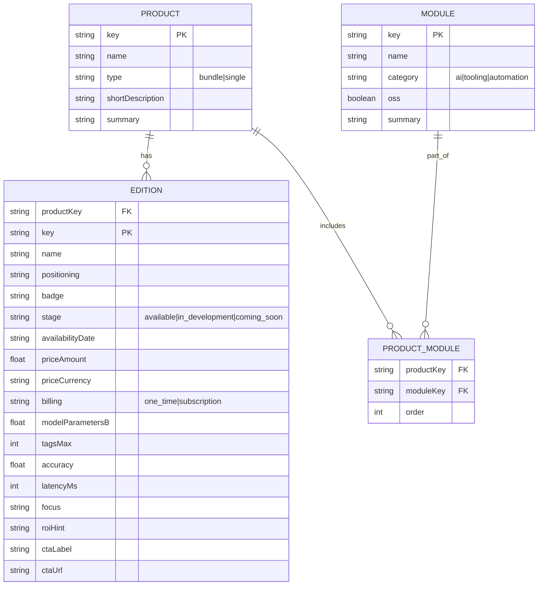

```mermaid
erDiagram
  PRODUCT ||--o{ EDITION : has
  PRODUCT ||--o{ PRODUCT_MODULE : includes
  MODULE  ||--o{ PRODUCT_MODULE : part_of

  PRODUCT {
    string key PK
    string name
    string type  "bundle|single"
    string shortDescription
    string summary
  }

  EDITION {
    string productKey FK
    string key PK
    string name
    string positioning
    string badge
    string stage  "available|in_development|coming_soon"
    string availabilityDate
    float  priceAmount
    string priceCurrency
    string billing  "one_time|subscription"
    float  modelParametersB
    int    tagsMax
    float  accuracy
    int    latencyMs
    string focus
    string roiHint
    string ctaLabel
    string ctaUrl
  }

  MODULE {
    string key PK
    string name
    string category  "ai|tooling|automation"
    boolean oss
    string summary
  }

  PRODUCT_MODULE {
    string productKey FK
    string moduleKey FK
    int order
  }
```
