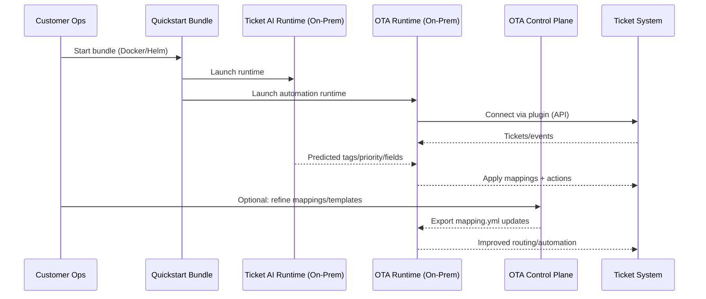

# Open Ticket AI — Product Offerings, Services, Marketing Docs

## Positioning

**Open Ticket AI** is **on-premise AI for ticket automation**.

It automatically:

- tags tickets
- predicts priority
- routes to the right queue/team
- triggers deterministic automations

**Ticket processing stays on-premise.**
**Configuration and intelligence are managed via the OTA Control Plane (SaaS or on-prem).** ✅

**Tagline:** **On-premise AI for ticket automation.**

---

## Core Value Proposition

- **Privacy-first:** ticket content stays in the customer’s infrastructure
- **Fast time-to-value:** “start with defaults, refine later”
- **No rule maintenance:** fewer brittle manual rules; AI handles variability
- **Works with existing ticket systems:** integrates via APIs/plugins
- **Deterministic automation:** AI decides → OTA applies mappings + workflows reliably

---

## What “One Product” Means

Open Ticket AI is sold as **one product** composed of three parts:

### 1) Ticket AI Runtime (On-Premise)

**Purpose:** understand tickets.

- classification, tagging, metadata enrichment
- priority prediction
- runs inside customer infrastructure (Docker/K8s)

**Outputs:** structured fields (tags, category, priority, extracted entities).

### 2) OTA Runtime (On-Premise)

**Purpose:** apply actions deterministically.

- executes workflows
- applies mapping rules
- calls ticket-system APIs (create/update/route/assign)
- plugins are open source

**Outputs:** real ticket changes + automation actions.

### 3) OTA Control Plane (SaaS or On-Prem)

**Purpose:** configure + control everything.

- mapping editor + automation templates
- AI-assisted mapping generation (time saver)
- project/version management
- licensing/entitlements + API keys

**Ticket content does not need to leave the customer environment.**

---

## OTA Control Plane

### Responsibilities

- create/manage mappings (`mapping.yml`)
- AI-assisted mapping generation (suggestions, templates)
- manage automation templates and defaults
- issue/manage API keys, enforce plan limits
- versioning + rollback (higher tiers)

### Deployment Modes

- **SaaS (default)**
- **On-prem (Pro/Enterprise)**

---

## Products vs Solutions

### Product Page (what it is)

One canonical product page that explains:

- what Open Ticket AI is
- editions & licensing
- architecture (high level)
- guarantees: on-prem processing, privacy

Example: `/product`

### Solution Pages (who it’s for)

System-specific pages focused on outcomes, language, and quickstart.

Examples:

- `/solutions/zammad`
- `/solutions/otobo`
- `/solutions/znuny`

Each solution page:

- uses that system’s terminology
- shows screenshots in that UI
- links to the dedicated quickstart bundle

---

## Quickstart Strategy

Each solution ships a **ready-to-run bundle**:

- Docker Compose (or Helm)
- default plugin enabled
- default mappings included
- produces value immediately after startup

Customization is optional and can happen later in the Control Plane.

---

## Editions & Commercial Model

### Lite (Free)

- on-prem runtime
- default mappings
- limited Control Plane access
- limited AI generation
- community support

### Pro

- full Control Plane (SaaS or on-prem)
- editable mappings
- AI-assisted mapping generation
- multiple projects/environments
- standard support

### Full / Enterprise

- on-prem Control Plane
- advanced automation logic + governance
- versioning, rollback, approvals
- custom policies + integration hardening
- priority support / SLA options

---

## API Keys & AI Usage

- customers receive **Open Ticket AI API keys**
- keys are plan-bound, rate-limited, spend-limited
- no need for customers to manage OpenRouter/provider keys

Optional (advanced tiers):

- bring-your-own key / model provider

---

## Open Source Strategy

**Open Source**

- OTA core
- ticket system connectors/plugins
- on-prem runtime components

**Commercial**

- OTA Control Plane
- AI mapping generation features
- templates + convenience features
- governance + entitlement management

---

## Services (Softoft)

Services are **not** part of Open Ticket AI product packaging.

Handled via **Softoft**:

- custom automation logic
- custom connectors/integrations
- synthetic data generation
- custom model development
- process consulting + rollout support

---

## Marketing Principles

- one product, many system-specific solutions
- outcome-first messaging
- defaults before configuration
- guided setup > “magic”
- honest expectations (“self-hosted, quickstart in minutes”)

---

# Mermaid Diagrams

## 1) External Product Architecture (Customer View)

```mermaid
flowchart LR
  subgraph CUST[Customer Infrastructure (On-Prem)]
    TICK["Ticket System<br/>(Zammad / OTOBO / Znuny / ...)"]
    AIR["Ticket AI Runtime<br/>(classify · tag · priority · enrich)"]
    OTAR["OTA Runtime<br/>(mapping · workflows · actions)"]
    PLUG["Open-Source Plugins<br/>(connectors via APIs)"]

    TICK <--> PLUG
    PLUG <--> OTAR
    TICK -->|"ticket events/data"| AIR
    AIR -->|"predictions: tags/priority/fields"| OTAR
    OTAR -->|"deterministic actions"| TICK
  end

  subgraph CP[OTA Control Plane (SaaS or On-Prem)]
    MAP["Mapping & Automation Studio<br/>(mapping.yml · templates)"]
    AIH["AI-Assisted Mapping Generation<br/>(suggestions · defaults)"]
    GOV["Governance & Entitlements<br/>(projects · versions · rollback · API keys · plan limits)"]

    MAP <--> AIH
    MAP <--> GOV
  end

  CP -->|"export mapping.yml"| OTAR
  CP -->|"issue/manage API keys"| AIR

```

---

## 2) “Product vs Solutions” Website Structure

```mermaid
flowchart TB
  P[/Product Page\nOne canonical entry/] --> E[Editions & Licensing]
  P --> A[Architecture Overview]
  P --> G[Guarantees\n(on-prem processing · privacy)]
  P --> S[/Solutions Hub/]

  S --> Z[/Solutions: Zammad/]
  S --> O[/Solutions: OTOBO/]
  S --> N[/Solutions: Znuny/]

  Z --> QZ[Quickstart Bundle\nDocker Compose/Helm]
  O --> QO[Quickstart Bundle\nDocker Compose/Helm]
  N --> QN[Quickstart Bundle\nDocker Compose/Helm]
```

---

## 3) Setup Lifecycle (Time-to-Value)



---

```mermaid
flowchart LR
  %% Open Ticket AI — External Architecture (Customer View)

  subgraph CUST[Customer Infrastructure (On-Prem)]
    TS[Ticket System\n(Zammad / OTOBO / Znuny / ...)]
    AIR[Ticket AI Runtime\n(classify · tag · priority · enrich)]
    OTAR[OTA Runtime\n(mapping · workflows · actions)]
    PLUG[Open-Source Plugins\n(connectors via APIs)]

    TS <--> PLUG
    PLUG <--> OTAR
    TS -->|ticket events/data| AIR
    AIR -->|predictions: tags/priority/fields| OTAR
    OTAR -->|deterministic actions| TS
  end

  subgraph CP[OTA Control Plane (SaaS or On-Prem)]
    MAP[Mapping & Automation Studio\n(edit mappings · templates)]
    AIH[AI-Assisted Mapping Generation\n(suggestions · defaults)]
    GOV[Governance & Entitlements\n(projects · versions · rollback · API keys · plan limits)]

    MAP <--> AIH
    MAP <--> GOV
  end

  CP -->|export mapping.yml| OTAR
  CP -->|issue/manage API keys| AIR
```

# Short Descriptions (copy-ready)

## One-liners

- **Ticket AI Runtime:** On-prem engine that reads tickets and outputs structured intelligence (tags, priority, extracted fields).
- **OTA Runtime:** On-prem workflow engine that applies mappings deterministically and executes actions via ticket-system APIs.
- **OTA Control Plane:** Central configuration and governance layer (SaaS or on-prem) for mappings, templates, projects, and entitlements.

## Product page blurb (public)

Open Ticket AI delivers on-premise AI that understands incoming tickets and automates routing and actions. Configuration and governance happen in the OTA Control Plane, while ticket processing stays inside your infrastructure.

## Solution page blurb (system-specific)

Open Ticket AI for **{System}** auto-tags and routes tickets using **{System}** terminology and workflows. Start with a ready-to-run quickstart bundle and refine mappings later in the OTA Control Plane.

## “Why it’s different”

- **On-prem ticket processing by default**
- **Deterministic automation, not fragile rules**
- **Fast start with defaults + optional refinement**
- **Open-source connectors, commercial control plane**

If you want: I can convert this into **website sections** (hero, pain, proof, pricing cards, FAQ) and an **SEO outline** for `/product` + each `/solutions/*`.
