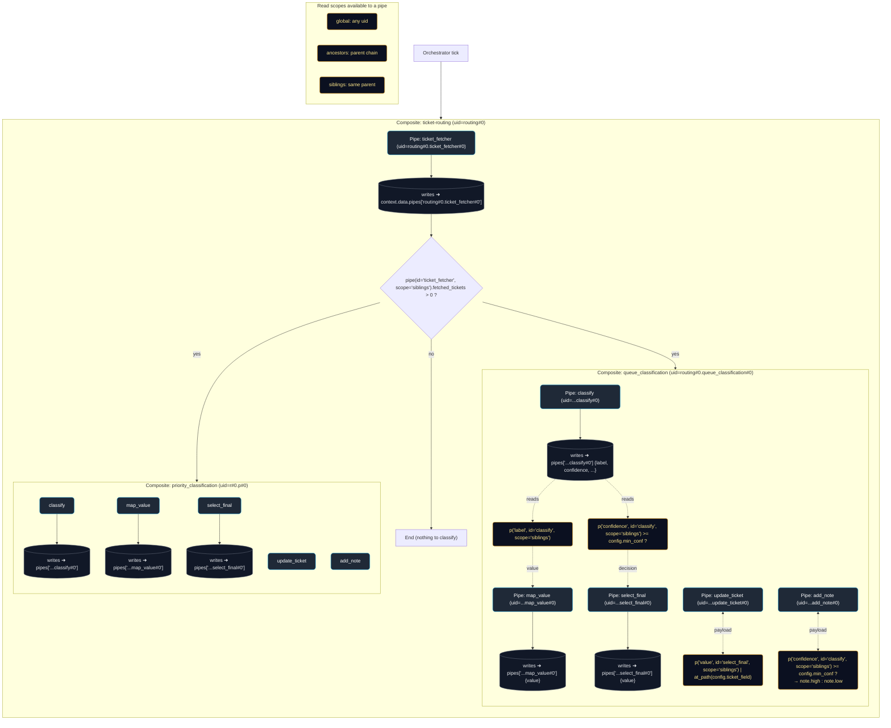

```mermaid
    flowchart TD
        classDef pipe fill:#1f2937,stroke:#0ea5e9,color:#fff,rx:8,ry:8
        classDef comp fill:#0b1020,stroke:#22c55e,color:#fff,rx:12,ry:12
        classDef data fill:#111827,stroke:#6b7280,color:#e5e7eb,rx:6,ry:6
        classDef helper fill:#0b1020,stroke:#f59e0b,color:#fde68a,rx:6,ry:6
        
        O[Orchestrator tick] --> TR
        
        subgraph TR["Composite: ticket-routing (uid=routing#0)"]
        direction TB
        TF["Pipe: ticket_fetcher (uid=routing#0.ticket_fetcher#0)"]:::pipe
        P_TF[("writes ➜ context.data.pipes['routing#0.ticket_fetcher#0']")]:::data
        TF --> P_TF
        
        cond_fetched{"pipe(id='ticket_fetcher', scope='siblings').fetched_tickets > 0 ?"}
        P_TF --> cond_fetched
        
        subgraph QC["Composite: queue_classification (uid=routing#0.queue_classification#0)"]
        direction TB
        CLS["Pipe: classify (uid=...classify#0)"]:::pipe
        P_CLS[("writes ➜ pipes['...classify#0'] {label, confidence, ...}")]:::data
        CLS --> P_CLS
        
        MV["Pipe: map_value (uid=...map_value#0)"]:::pipe
        H1["p('label', id='classify', scope='siblings')"]:::helper
        P_MV[("writes ➜ pipes['...map_value#0'] {value}")]:::data
        P_CLS -.reads.-> H1 -.value.-> MV --> P_MV
        
        SEL["Pipe: select_final (uid=...select_final#0)"]:::pipe
        H2["p('confidence', id='classify', scope='siblings') >= config.min_conf ?"]:::helper
        P_SEL[("writes ➜ pipes['...select_final#0'] {value}")]:::data
        P_CLS -.reads.-> H2 -.decision.-> SEL --> P_SEL
        
        UT["Pipe: update_ticket (uid=...update_ticket#0)"]:::pipe
        H3["p('value', id='select_final', scope='siblings') | at_path(config.ticket_field)"]:::helper
        UT <-.payload.-> H3
        AN["Pipe: add_note (uid=...add_note#0)"]:::pipe
        H4["p('confidence', id='classify', scope='siblings') >= config.min_conf ?\n→ note.high : note.low"]:::helper
        AN <-.payload.-> H4
        end
        
        subgraph PC["Composite: priority_classification (uid=r#0.p#0)"]
        direction TB
        CLS2["classify"]:::pipe --> P_CLS2[("writes ➜ pipes['...classify#0']")]:::data
        MV2["map_value"]:::pipe --> P_MV2[("writes ➜ pipes['...map_value#0']")]:::data
        SEL2["select_final"]:::pipe --> P_SEL2[("writes ➜ pipes['...select_final#0']")]:::data
        UT2["update_ticket"]:::pipe
        AN2["add_note"]:::pipe
        end
        
        cond_fetched -- yes --> QC
        cond_fetched -- yes --> PC
        cond_fetched -- no --> E["End (nothing to classify)"]
        
        end
        
        subgraph SCOPES["Read scopes available to a pipe"]
        direction LR
        G["global: any uid"]:::helper
        A["ancestors: parent chain"]:::helper
        S["siblings: same parent"]:::helper
        end
        
```