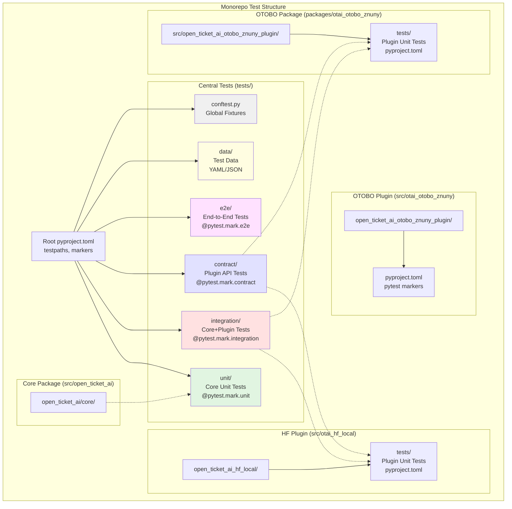
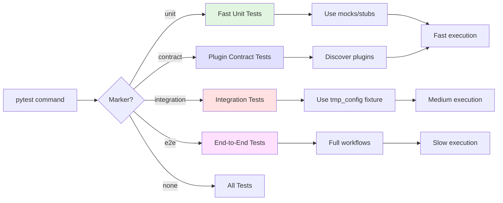
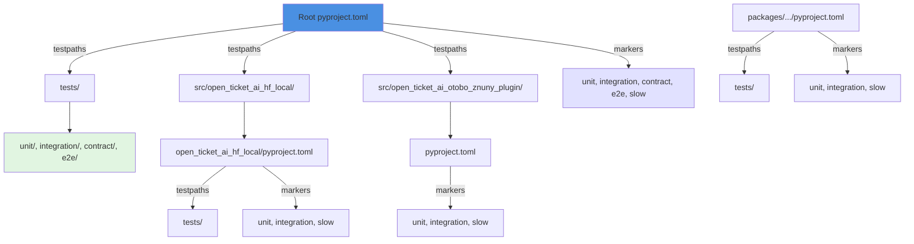

```mermaid
graph TB
    subgraph "Monorepo Test Structure"
        root[Root pyproject.toml<br/>testpaths, markers]
        
        subgraph "Central Tests (tests/)"
            unit[unit/<br/>Core Unit Tests<br/>@pytest.mark.unit]
            integration[integration/<br/>Core+Plugin Tests<br/>@pytest.mark.integration]
            contract[contract/<br/>Plugin API Tests<br/>@pytest.mark.contract]
            e2e[e2e/<br/>End-to-End Tests<br/>@pytest.mark.e2e]
            data[data/<br/>Test Data<br/>YAML/JSON]
            conftest[conftest.py<br/>Global Fixtures]
        end
        
        subgraph "Core Package (src/open_ticket_ai)"
            core[open_ticket_ai/core/]
        end
        
        subgraph "HF Plugin (src/otai_hf_local)"
            hf_plugin[open_ticket_ai_hf_local/]
            hf_tests[tests/<br/>Plugin Unit Tests<br/>pyproject.toml]
        end
        
        subgraph "OTOBO Plugin (src/otai_otobo_znuny)"
            otobo_plugin[open_ticket_ai_otobo_znuny_plugin/]
            otobo_pyproject[pyproject.toml<br/>pytest markers]
        end
        
        subgraph "OTOBO Package (packages/otai_otobo_znuny)"
            otobo_pkg[src/open_ticket_ai_otobo_znuny_plugin/]
            otobo_tests[tests/<br/>Plugin Unit Tests<br/>pyproject.toml]
        end
    end
    
    root --> unit
    root --> integration
    root --> contract
    root --> e2e
    root --> data
    root --> conftest
    
    core -.-> unit
    hf_plugin --> hf_tests
    otobo_plugin --> otobo_pyproject
    otobo_pkg --> otobo_tests
    
    integration -.-> hf_tests
    integration -.-> otobo_tests
    contract -.-> hf_tests
    contract -.-> otobo_tests
    
    style unit fill:#e1f5e1
    style integration fill:#ffe1e1
    style contract fill:#e1e1ff
    style e2e fill:#ffe1ff
    style data fill:#fffde1
    style conftest fill:#f0f0f0
```

## Test Flow

```mermaid
flowchart LR
    A[pytest command] --> B{Marker?}
    B -->|unit| C[Fast Unit Tests]
    B -->|integration| D[Integration Tests]
    B -->|contract| E[Plugin Contract Tests]
    B -->|e2e| F[End-to-End Tests]
    B -->|none| G[All Tests]
    
    C --> H[Use mocks/stubs]
    D --> I[Use tmp_config fixture]
    E --> J[Discover plugins]
    F --> K[Full workflows]
    
    H --> L[Fast execution]
    I --> M[Medium execution]
    J --> L
    K --> N[Slow execution]
    
    style C fill:#e1f5e1
    style D fill:#ffe1e1
    style E fill:#e1e1ff
    style F fill:#ffe1ff
```

## Pytest Configuration Hierarchy

```mermaid
graph TD
    A[Root pyproject.toml] -->|testpaths| B[tests/]
    A -->|testpaths| C[src/open_ticket_ai_hf_local/]
    A -->|testpaths| D[src/open_ticket_ai_otobo_znuny_plugin/]
    A -->|markers| E[unit, integration, contract, e2e, slow]
    
    B --> F[unit/, integration/, contract/, e2e/]
    
    C --> G[open_ticket_ai_hf_local/pyproject.toml]
    G -->|testpaths| H[tests/]
    G -->|markers| I[unit, integration, slow]
    
    D --> J[pyproject.toml]
    J -->|markers| K[unit, integration, slow]
    
    L[packages/.../pyproject.toml] -->|testpaths| M[tests/]
    L -->|markers| N[unit, integration, slow]
    
    style A fill:#4a90e2
    style E fill:#e1e1ff
    style F fill:#e1f5e1
```
