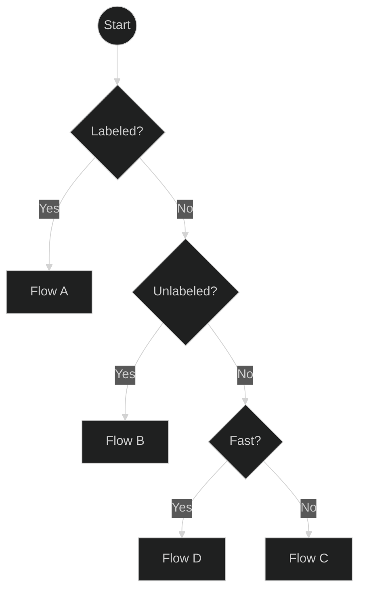
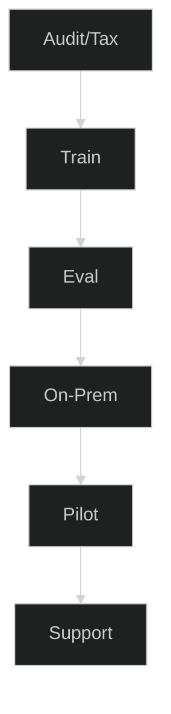
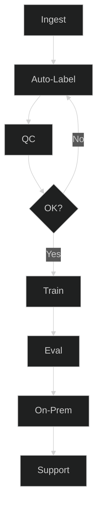
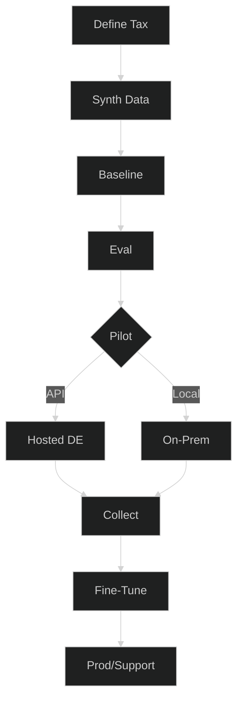
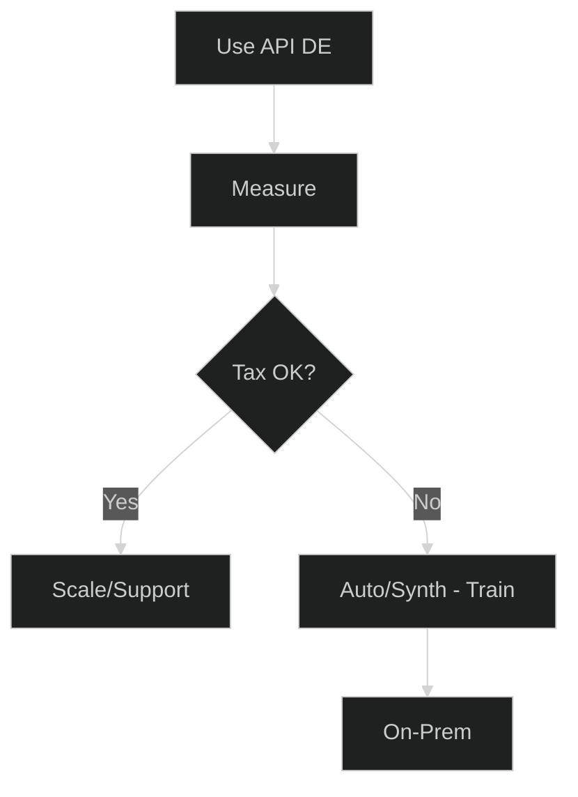
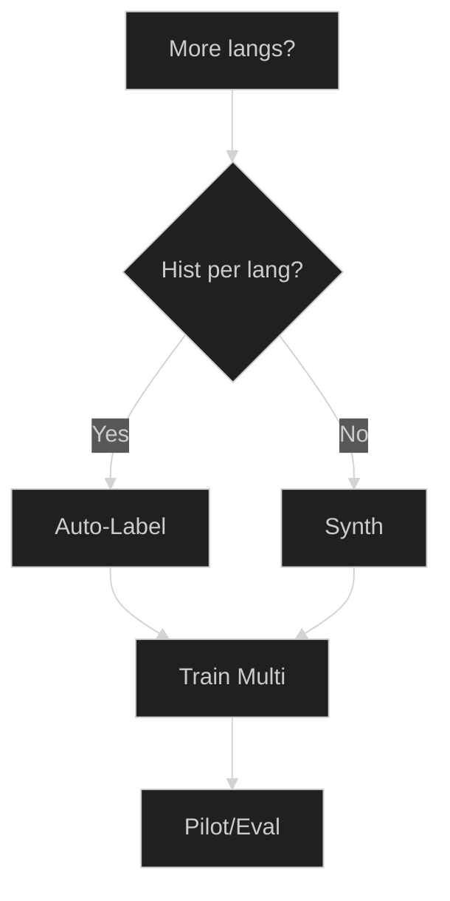
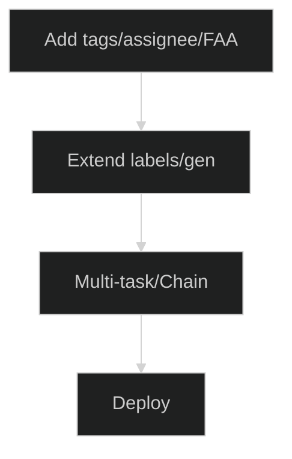

# Planer für Ticket-Automatisierung – Wählen Sie Ihren besten Weg

Modernisieren Sie das Ticket-Routing schnell – egal, wo Sie anfangen. Dieser Planer hilft Ihnen, den richtigen Weg basierend auf Ihrer Datenrealität zu wählen: viele klassifizierte Tickets, viele unklassifizierte Tickets oder fast keine Daten. Jeder Weg endet mit einem konkreten Servicepaket mit klaren Ergebnissen und KPIs, sodass Sie ohne Raten von der Idee → zum Pilotprojekt → in die Produktion übergehen können.

**Für wen ist das:** IT-/Service-Teams, die Znuny/OTRS/OTOBO (oder ähnliches) verwenden und zuverlässige Vorhersagen für Queue/Priorität/Tags wünschen, entweder On-Prem oder über eine gehostete API.

**Was Sie erhalten:** ein kurzer Entscheidungsfluss, 4 umsetzbare Pfade (A–D), Add-ons (mehrsprachig, zusätzliche Attribute), Gates/Metriken, um zu wissen, wann Sie bereit sind, und eine Checkliste zur Datenbereitschaft.

**So verwenden Sie diese Seite**

* Beginnen Sie mit der Übersicht auf einer Seite und beantworten Sie drei Fragen: **Klassifiziert? → Unklassifiziert? → Schnell?**
* Klicken Sie auf das Feld für **Flow A/B/C/D**, um zu den jeweiligen Schritten, Ergebnissen und KPIs zu springen.
* Nutzen Sie die **Add-ons**, wenn Sie mehrere Sprachen oder mehr Ausgaben (Tags, Bearbeiter, Erstantwort) benötigen.
* Halten Sie die **Gates** eng (F1 pro Klasse + geschäftliche KPIs), damit Pilotprojekte zu Vertrauen in die Produktion führen.

Fahren Sie nun mit dem Übersichtsdiagramm und den detaillierten Abläufen unten fort.
Schön – hier ist eine ausführlichere Beschreibung, die Sie unter Ihre Diagramme einfügen können. Ich habe sie überfliegbar gehalten, aber echte Anleitungen und Schwellenwerte hinzugefügt, damit die Leser zuversichtlich einen Flow auswählen können.

Verstanden – ich behalte Ihre neuen kurzen Diagramme bei und füge für jeden Abschnitt klare, prägnante Erklärungen hinzu, damit sich der Artikel vollständig anfühlt und trotzdem leicht zu überfliegen ist.

---

## 0) Übersicht auf einer Seite

**So verwenden Sie diese Übersicht:**
Beginnen Sie oben, beantworten Sie die Fragen und folgen Sie dem Zweig zu Ihrem passenden Flow. Klicken Sie auf einen Flow, um die Details anzuzeigen.

---

##  Flow A – Viele klassifizierte Tickets

**Wann Sie diesen Weg wählen sollten:**

* Sie haben bereits **Tausende von Tickets mit Klassifizierungen für Queue, Priorität oder Tags**.
* Sie möchten ein **individuell trainiertes** Model für maximale Genauigkeit.

**Was in diesem Flow passiert:**

1. **Audit/Taxonomie** – Überprüfung der Label-Qualität, der Klassenverteilung und der Benennung.
2. **Training** – Feinabstimmung des Klassifizierungsmodells mit Ihren Daten.
3. **Evaluierung** – Messung von Precision/Recall/F1 pro Klasse.
4. **On-Prem** – Deployment in Ihrer eigenen Infrastruktur.
5. **Pilot** – Test im Produktivbetrieb mit Monitoring.
6. **Support** – Iteration und erneutes Training nach Bedarf.

**Empfohlenes Paket:** Fine-Tune + On-Prem-Installation.

---

##  Flow B – Viele unklassifizierte Tickets

**Wann Sie diesen Weg wählen sollten:**

* Sie haben **große historische Ticket-Archive**, aber keine Labels.
* Sie können etwas Zeit für die manuelle Überprüfung zur Qualitätssicherung einplanen.

**Was in diesem Flow passiert:**

1. **Ingest** – Sammeln von Tickets aus Ihrem System.
2. **Auto-Label** – Verwendung von LLM-gestütztem Auto-Labeling.
3. **QS** – Stichprobenartige Überprüfung und Korrektur von Beispielen.
4. **OK?** – Wiederholen, bis die Qualität den Schwellenwert erreicht.
5. **Training** – Feinabstimmung mit dem kuratierten Datensatz.
6. **Evaluierung / On-Prem / Support** – Wie bei Flow A.

**Empfohlenes Paket:** Auto-Label + Fine-Tune.

---

##  Flow C – Wenige oder keine Tickets

**Wann Sie diesen Weg wählen sollten:**

* Sie fangen **bei Null an** oder haben zu wenige Tickets für ein Training.
* Sie möchten eine **Cold-Start**-Lösung, um schnell live zu gehen.

**Was in diesem Flow passiert:**

1. **Taxonomie definieren** – Festlegung von Queues, Prioritäten, Tonalität.
2. **Synthetische Daten** – Generierung realistischer Tickets (DE/EN).
3. **Baseline** – Training eines initialen Modells mit synthetischen Daten.
4. **Evaluierung** – Überprüfung der Leistung vor dem Rollout.
5. **Pilot** – Wahl zwischen gehosteter API für Geschwindigkeit oder On-Prem für Kontrolle.
6. **Sammeln** – Erfassen von echten Tickets während des Pilotprojekts.
7. **Fine-Tune** – Zusammenführen von echten und synthetischen Daten.
8. **Produktion/Support** – Live-Betrieb mit fortlaufender Iteration.

**Empfohlenes Paket:** Synthetic Cold-Start.

---

##  Flow D – Schnellstart über gehostete API

**Wann Sie diesen Weg wählen sollten:**

* Sie benötigen **sofort Ergebnisse**.
* Sie möchten die Automatisierung ausprobieren, ohne vorher ein Training durchzuführen.

**Was in diesem Flow passiert:**

1. **API DE nutzen** – Sofortige Klassifizierung über ein gehostetes deutsches Model.
2. **Messen** – Verfolgung der Auswirkungen auf Routing, SLAs und Backlog.
3. **Taxonomie OK?** – Wenn Sie zufrieden sind, skalieren Sie die Nutzung; wenn nicht, wechseln Sie zu Flow B oder C für das Training.

**Empfohlenes Paket:** Hosted API Pilot → Fine-Tune (optional).

---

## Optionale Add-ons

### Mehrsprachige Erweiterung

Fügen Sie Unterstützung für weitere Sprachen durch mehrsprachiges Auto-Labeling oder synthetische Generierung hinzu, trainieren und evaluieren Sie dann pro Sprache/Region.

---

### Zusätzliche Attribute

Sagen Sie mehr als nur Queues/Prioritäten voraus – z. B. Tags, Bearbeiter oder Erstantwortzeit – indem Sie das Labeling erweitern und ein Multi-Task-Modell trainieren.