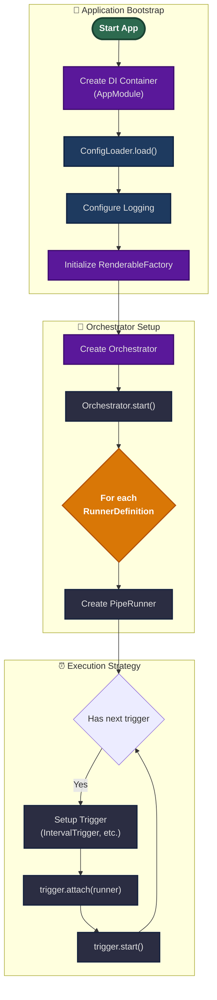

ddd

```mermaid
%%{init:{
  "flowchart":{"defaultRenderer":"elk","htmlLabels":true,"curve":"linear"},
  "themeVariables":{"fontSize":"13px","fontFamily":"system-ui","primaryColor":"#1a1a2e","lineColor":"#718096"},
}}%%

flowchart TB

%% ===================== BOOTSTRAP =====================
subgraph BOOT["🚀 Application Bootstrap"]
  direction TB
  Start([Start App]):::start
  CreateDI["Create DI Container<br/>(AppModule)"]:::di
  LoadConfig["ConfigLoader.load()"]:::cfg
  SetupLog["Configure Logging"]:::cfg
  InitFactory["Initialize RenderableFactory"]:::di
  
  Start  --> CreateDI --> LoadConfig --> SetupLog --> InitFactory
end

%% ===================== ORCHESTRATOR =====================
subgraph ORCH["🎯 Orchestrator Setup"]
  direction TB
  CreateOrch["Create Orchestrator"]:::di
  StartOrch["Orchestrator.start()"]:::proc
  LoopRunners{"For each<br/>RunnerDefinition"}:::dec
  CreateRunner["Create PipeRunner"]:::proc
  
  CreateOrch --> StartOrch --> LoopRunners --> CreateRunner
end

%% ===================== TRIGGER DECISION =====================
subgraph TRIGGER_DECISION["⏰ Execution Strategy"]
  direction TB
  HasTrigger{"Has next trigger"}
  SetupTrigger["Setup Trigger<br/>(IntervalTrigger, etc.)"]:::proc
  AttachRunner["trigger.attach(runner)"]:::proc
  StartTrigger["trigger.start()"]:::proc
  
  HasTrigger -- Yes --> SetupTrigger --> AttachRunner --> StartTrigger --> HasTrigger
end

%% ===================== CONNECTIONS =====================
InitFactory --> CreateOrch
CreateRunner --> HasTrigger

%% ===================== STYLES =====================
classDef start fill:#2d6a4f,stroke:#1b4332,stroke-width:3px,color:#fff,font-weight:bold
classDef cfg fill:#1e3a5f,stroke:#0d1f3d,stroke-width:2px,color:#e0e0e0
classDef di fill:#5a189a,stroke:#3c096c,stroke-width:2px,color:#e0e0e0
classDef proc fill:#2b2d42,stroke:#14213d,stroke-width:2px,color:#e0e0e0
classDef dec fill:#d97706,stroke:#b45309,stroke-width:2px,color:#fff,font-weight:bold
classDef event fill:#be123c,stroke:#9f1239,stroke-width:3px,color:#fff,font-weight:bold
```