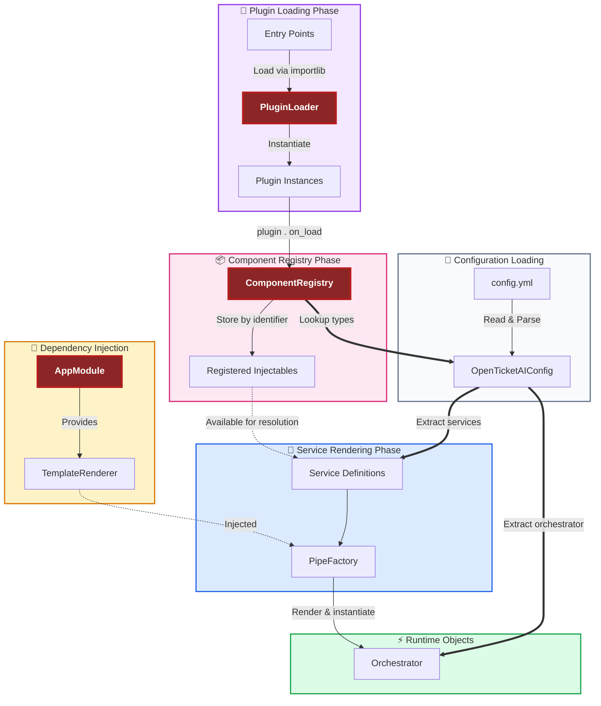

# Configuration and Template Rendering

The configuration and template rendering system is the foundation of Open Ticket AI's dynamic behavior. It transforms
static YAML files into live, context-aware application objects through a multi-stage process involving validation,
template rendering, and dependency injection.

Unlike earlier revisions where the renderer lived under infrastructure defaults, the active `TemplateRenderer` is now
configured explicitly as a **service entry**. During bootstrap, the service container searches the raw service
definitions for exactly one renderer entry. It resolves this entry without performing any template rendering and
registers the
instance for reuse. If the bootstrapper finds zero or more than one renderer entry the configuration loader raises a
validation error before any other services are touched. This single-instance enforcement guarantees that every
downstream dependency resolves against the same renderer instance.

## Overview

Configuration flows through several stages from file to runtime:

1. **YAML Parsing**: Configuration files are loaded and validated
2. **Template Bootstrapping**: The template renderer service is resolved before anything else
3. **Configuration Rendering**: Templates in config are evaluated against runtime context
4. **Object Instantiation**: Rendered configurations become application objects

This process enables dynamic, context-aware pipelines that adapt to runtime conditions while maintaining type safety and
validation.

## Configuration Lifecycle

The following diagram illustrates the complete lifecycle of configuration from YAML to runtime objects:



## Template Rendering Scope

When templates are rendered during pipe execution, the rendering scope is built from the **PipeContext** structure:

## Key Concepts

**Pipe Implementation Pattern:**

## Available helper functions (for `config.yml` templates)

| Signature                                                | Returns                                                                     | Errors if…                       |
|----------------------------------------------------------|-----------------------------------------------------------------------------|----------------------------------|
| `at_path(value, path: str)`                              | Nested value at `"a.b.c"` path. Works with dicts or Pydantic models.        | Path not `*.*`.                  |
| `has_failed(pipe_id: str)`                               | `True` if the given pipe result is marked failed.                           | Pipe ID not found.               |
| `get_pipe_result(pipe_id: str, data_key: str = "value")` | The value under `data_key` from a pipe’s data.                              | Pipe or key missing.             |
| `get_parent_param(param_key: str)`                       | The parent pipe’s parameter value.                                          | No parent params or key missing. |
| `get_env(name: str)`                                     | The environment variable string.                                            | Env var missing.                 |
| `fail()`                                                 | A sentinel “FailMarker” object you can return/emit to signal failure paths. | —                                |

---

## Usage examples in `config.yml`

### Read an environment variable

```yaml
api:
  token: "{{ get_env('API_TOKEN') }}"
  baseUrl: "https://api.example.com"
```

### Access nested data (dict or Pydantic model)

```yaml
userCity: "{{ at_path(user, 'address.city') }}"
```

### Consume a previous pipe’s result

```yaml
classification:
  label: "{{ get_pipe_result('classify_ticket', 'label') }}"
  confidence: "{{ get_pipe_result('classify_ticket', 'score') }}"
  isLowConfidence: "{{ get_pipe_result('classify_ticket', 'score') < 0.6 }}"
```

### Check if a pipe failed

```yaml
shouldRetry: "{{ has_failed('fetch_customer') }}"
```

### Read a parent parameter

```yaml
timeoutMs: "{{ get_parent_param('timeoutMs') }}"
```

### Emit an explicit failure marker

```yaml
result: "{{ fail() }}"
```

---

## Config Reference

Here is the Markdown table describing the **full config structure** clean and ready for your docs.

---

# Configuration Structure

## Root (`AppConfig`)

| Key              | Type                 | Description                                    |
|------------------|----------------------|------------------------------------------------|
| `open_ticket_ai` | `OpenTicketAIConfig` | Main configuration of the OpenTicketAI system. |

---

## `OpenTicketAIConfig`

| Key              | Type                              | Description                                                     |
|------------------|-----------------------------------|-----------------------------------------------------------------|
| `api_version`    | `str`                             | API version of the application for compatibility.               |
| `plugins`        | `list[str]`                       | Plugin module paths to load.                                    |
| `infrastructure` | `InfrastructureConfig`            | Infrastructure configuration (logging, renderer, …).            |
| `services`       | `dict[str, InjectableConfigBase]` | Map of service identifier → DI-based service configuration.     |
| `orchestrator`   | `PipeConfig`                      | Orchestrator pipeline configuration (pipes, runners, triggers). |

---

## `InfrastructureConfig`

| Key       | Type            | Description                                   |
|-----------|-----------------|-----------------------------------------------|
| `logging` | `LoggingConfig` | Configure logging level, format, destination. |

---

## Services: `InjectableConfigBase`

Services are configured under `open_ticket_ai.services.*`

| Key       | Type             | Description                                                     |
|-----------|------------------|-----------------------------------------------------------------|
| `use`     | `str`            | Python path to the class to instantiate.                        |
| `injects` | `dict[str, str]` | Dependency injection mappings (constructor args → service IDs). |
| `params`  | `dict[str, Any]` | Parameters passed to the instance. Supports template rendering. |

If an explicit ID is needed, use:

| Additional Key | Type  | Description                                    |
|----------------|-------|------------------------------------------------|
| `id`           | `str` | Unique identifier for referencing the service. |

---

## Pipelines: `PipeConfig`

Pipe configurations (standalone or inside the orchestrator)

| Key       | Type             | Description                                                      |
|-----------|------------------|------------------------------------------------------------------|
| `id`      | `str`            | Unique pipe identifier for pipe-to-pipe referencing. (Inherited) |
| `use`     | `str`            | Python path to the Pipe implementation class. (Inherited)        |
| `injects` | `dict[str, str]` | DI: children pipes, services, loggers, …                         |
| `params`  | `dict[str, Any]` | Parameters for pipe. Templating supported.                       |

📌 Uses same shape as `InjectableConfig`, only specialized for pipes.

---

## Pipe Results (runtime)

(Only important to understand functions like `get_pipe_result()`)

| Key           | Type             | Description                                       |
|---------------|------------------|---------------------------------------------------|
| `succeeded`   | `bool`           | Whether the pipe completed without errors.        |
| `was_skipped` | `bool`           | Skip handling for conditions/failed dependencies. |
| `message`     | `str`            | Debug message or error description.               |
| `data`        | `dict[str, Any]` | Outputs made available for other pipes.           |

---

### Example minimal structure

```yaml
open_ticket_ai:
  api_version: "1"
  plugins: [ ]
  infrastructure:
    logging:
      level: "INFO"

  services:
    ticket-db:
      use: "project.services.Database"
      params:
        url: "{{ get_env('DB_URL') }}"

  orchestrator:
    id: "root"
    use: "project.pipes.CompositePipe"
    injects:
      step1: "ticket-db"
    params: { }
```

---

If you want, I can also generate:
✅ Visual diagram (Mermaid)
✅ Example full orchestrator config with multiple pipes
✅ Copy-paste VitePress doc section formatting
✅ Links within the docs (`[[...]]`)

Want me to add a **Mermaid diagram** for your docs next?
