# Configuration and Template Rendering

The configuration and template rendering system is the foundation of Open Ticket AI's dynamic behavior. It transforms static YAML files into live, context-aware application objects through a multi-stage process involving validation, template rendering, and dependency injection.

## Overview

Configuration flows through several stages from file to runtime:

1. **YAML Parsing**: Configuration files are loaded and validated
2. **Template Bootstrapping**: The template renderer is initialized first
3. **Configuration Rendering**: Templates in config are evaluated against runtime context
4. **Object Instantiation**: Rendered configurations become application objects

This process enables dynamic, context-aware pipelines that adapt to runtime conditions while maintaining type safety and validation.

## Configuration Lifecycle

The following diagram illustrates the complete lifecycle of configuration from YAML to runtime objects:

```mermaid
%%{init:{
  "flowchart":{
    "defaultRenderer":"elk",
    "htmlLabels":true,
    "curve":"basis"
  },
  "themeVariables":{
    "fontSize":"14px",
    "fontFamily":"system-ui, -apple-system, sans-serif",
    "primaryColor":"#3b82f6",
    "primaryTextColor":"#fff",
    "lineColor":"#64748b"
  }
}}%%

flowchart TB
    %% ===================== CONFIGURATION LOADING =====================
    subgraph LOAD["📁 Configuration Loading"]
        direction TB
        YAML["config.yml<br/><small>YAML File</small>"]
        Loader["ConfigLoader<br/><small>Parse & Load</small>"]
        RawConfig["RawOpenTicketAIConfig<br/><small>Validated Model</small>"]
        
        YAML -->|Read & Parse| Loader
        Loader -->|Validate with<br/>Pydantic| RawConfig
    end

    %% ===================== BOOTSTRAP PHASE =====================
    subgraph BOOT["🔧 Bootstrap Phase"]
        direction TB
        InfraConfig["InfrastructureConfig<br/><small>Extract Infrastructure</small>"]
        RendererConfig["TemplateRendererConfig<br/><small>Renderer Settings</small>"]
        BootstrapRenderer["JinjaRenderer<br/><small>⚠️ NOT Rendered</small>"]:::critical
        
        InfraConfig --> RendererConfig
        RendererConfig -->|Instantiate<br/>NO rendering| BootstrapRenderer
    end

    %% ===================== SERVICE RENDERING PHASE =====================
    subgraph RENDER["🎨 Service Rendering Phase"]
        direction TB
        Renderer["TemplateRenderer<br/><small>Active Renderer</small>"]
        Factory["RenderableFactory<br/><small>Service Factory</small>"]
        ServiceConfigs["RenderableConfig List<br/><small>Service Definitions</small>"]
        
        BootstrapRenderer -.->|Register as<br/>singleton| Renderer
        ServiceConfigs --> Factory
        Renderer -.->|Inject template<br/>renderer| Factory
    end

    %% ===================== RUNTIME OBJECTS =====================
    subgraph RUNTIME["⚡ Runtime Objects"]
        direction TB
        Services["Service Instances<br/><small>Ticket System, etc.</small>"]
        Orchestrator["Orchestrator<br/><small>Pipeline Manager</small>"]
        Runners["PipeRunner<br/><small>Execution Units</small>"]
        
        Factory -->|Render &<br/>instantiate| Services
        Services -.->|Register| Orchestrator
        Orchestrator -->|Create| Runners
    end

    %% ===================== MAIN FLOW =====================
    RawConfig ==>|Extract<br/>infrastructure| InfraConfig
    RawConfig ==>|Extract<br/>services| ServiceConfigs
    RawConfig ==>|Extract<br/>orchestrator| Orchestrator

    %% ===================== STYLES =====================
    classDef critical fill:#dc2626,stroke:#b91c1c,stroke-width:3px,color:#fff,font-weight:bold
    
    %% ===================== SUBGRAPH STYLES =====================
    style LOAD fill:#f8fafc,stroke:#64748b,stroke-width:2px
    style BOOT fill:#fef3c7,stroke:#d97706,stroke-width:2px
    style RENDER fill:#dbeafe,stroke:#2563eb,stroke-width:2px
    style RUNTIME fill:#dcfce7,stroke:#16a34a,stroke-width:2px
```



## Template Rendering Scope

When templates are rendered during pipe execution, the rendering scope is built from the **PipeContext** structure:

```mermaid
%%{init:{
  "flowchart":{"defaultRenderer":"elk","htmlLabels":true,"curve":"linear"},
  "themeVariables":{"fontSize":"14px","fontFamily":"system-ui"},
}}%%

flowchart TB
    subgraph ENV["🌍 Environment Variables"]
        direction TB
        EnvVars["Filtered by prefix<br/>(default: OTAI_*)"]
        EnvAccess["Accessed via env() function"]
    end

    subgraph CONTEXT["📦 PipeContext Structure"]
        direction TB
        
        subgraph CURRENT["Current Pipe Context"]
            direction TB
            CurParams["params: dict<br/>(This pipe's parameters)"]
            CurPipes["pipes: dict<br/>(All previous pipe results)"]
            ParentRef["parent: PipeContext | None<br/>(Link to parent context)"]
        end
        
        subgraph PARENT["Parent Context (if in CompositePipe)"]
            direction TB
            ParParams["params: dict<br/>(Parent pipe parameters)"]
            ParPipes["pipes: dict<br/>(Parent's pipe results)"]
            ParParent["parent: PipeContext | None<br/>(Grandparent context)"]
        end
    end

    subgraph RENDER["🎨 Template Rendering Scope"]
        direction TB
        Scope1["params → Current pipe params"]
        Scope2["pipes → All accumulated results"]
        Scope3["parent → Parent context chain"]
        Scope4["env() → Filtered env vars"]
    end

    EnvVars --> EnvAccess
    
    CurParams --> Scope1
    CurPipes --> Scope2
    ParentRef --> PARENT
    
    ParParams -.-> Scope1
    ParPipes -.-> Scope2
    ParParent -.-> Scope3
    
    EnvAccess --> Scope4
    
    CURRENT --> RENDER
    PARENT -.-> RENDER

    style ENV fill:#1e3a5f,stroke:#0d1f3d,stroke-width:2px,color:#e0e0e0
    style CONTEXT fill:#5a189a,stroke:#3c096c,stroke-width:2px,color:#e0e0e0
    style RENDER fill:#2d6a4f,stroke:#1b4332,stroke-width:2px,color:#e0e0e0
    style CURRENT fill:#2b2d42,stroke:#14213d,stroke-width:2px,color:#e0e0e0
    style PARENT fill:#374151,stroke:#1f2937,stroke-width:2px,color:#9ca3af
```



## Key Concepts

### PipeContext Structure

The `PipeContext` is the core data structure that holds execution state and is used as the rendering scope:

```python
class PipeContext(BaseModel):
    pipes: dict[str, PipeResult[Any]]  # All previous pipe results
    params: dict[str, Any]              # Current pipe parameters
    parent: PipeContext | None          # Parent context (for nested pipes)
```

**What each field provides:**

- **`pipes`**: Contains results from all previously executed pipes in the pipeline, keyed by pipe ID
  - Accumulated as each pipe completes
  - In CompositePipe: merged results from all child steps
  - Access via `pipe_result('pipe_id')` in templates

- **`params`**: Current pipe's parameters
  - Set when the pipe is created
  - Accessible via `params.*` in templates
  - For nested pipes, inherits from parent via the context chain

- **`parent`**: Reference to parent context (if this pipe is inside a CompositePipe)
  - Allows access to parent scope variables
  - Creates hierarchical context chain
  - Can traverse multiple levels (`parent.parent...`)

### Environment Variable Substitution

The template renderer provides environment variable access through the `env()` function:

```yaml
services:
  - id: api_client
    use: "mypackage:APIClient"
    params:
      api_key: "{{ env('OTAI_API_KEY') }}"
      endpoint: "{{ env('OTAI_ENDPOINT', 'https://default.example.com') }}"
```

**Environment variable filtering:**
- By default, only environment variables with the `OTAI_` prefix are accessible
- Configurable via `template_renderer_config.env_config.prefix`
- Prevents accidental exposure of system environment variables

### Jinja2 Template Evaluation

All string values in service and pipe configurations are treated as Jinja2 templates and evaluated against the current scope:

**Available in templates:**
- `{{ params.field_name }}`: Access current pipe parameters
- `{{ pipe_result('pipe_id').data.field }}`: Access previous pipe results
- `{{ parent.params.field }}`: Access parent context parameters
- `{{ env('VAR_NAME', 'default') }}`: Access environment variables
- `...`: Conditional blocks
- `...`: Iteration
- `{{ value | filter }}`: Jinja2 filters

**Template rendering is recursive:**
- Strings are rendered as Jinja2 templates
- Lists have each item rendered
- Dictionaries have each value rendered
- Objects are converted to dicts, rendered, then reconstructed

### Context Flow in Pipelines

**Simple Pipeline (no nesting):**
```yaml
pipes:
  - id: fetch_tickets
    params:
      limit: 50
    # Context: { pipes: {}, params: { limit: 50 }, parent: None }
  
  - id: classify
    params:
      threshold: "{{ params.threshold }}"  # Access own params
      tickets: "{{ pipe_result('fetch_tickets').data.tickets }}"  # Access previous result
    # Context: { pipes: { fetch_tickets: <result> }, params: { threshold: 0.8, tickets: ... }, parent: None }
```

**Nested Pipeline (CompositePipe):**
```yaml
- id: workflow
  use: CompositePipe
  params:
    threshold: 0.8
  steps:
    - id: inner_step
      params:
        # Can access parent params via context chain
        value: "{{ parent.params.threshold }}"
      # Context: { pipes: {}, params: { value: 0.8 }, parent: <workflow context> }
```

**CompositePipe Result Merging:**
When a CompositePipe completes:
1. All child pipe results are collected
2. Results are merged into a single `PipeResult`
3. The merged result is stored in the parent context's `pipes` dict
4. Child results remain accessible via their individual pipe IDs

### Bootstrap Exception: Template Renderer Config

**Critical Rule:** The template renderer configuration itself is **NEVER** rendered. It is used raw to bootstrap the rendering system.

This prevents circular dependencies and ensures the renderer can be initialized before any template processing occurs.

```yaml
infrastructure:
  template_renderer_config:
    type: "jinja"
    env_config:
      prefix: "OTAI_"  # ← This value is NOT rendered
    autoescape: false   # ← This value is NOT rendered
```

All other configurations (services, orchestrator, pipes) are rendered using this bootstrapped renderer.

### Validation Flow

Configuration validation occurs at two stages:

**1. Initial Validation (YAML → RawOpenTicketAIConfig):**
- YAML structure is correct
- Required fields are present
- Types match expected structure
- Happens in `ConfigLoader.load_config()`

**2. Post-Rendering Validation (Rendered dict → Typed Config):**
- Template-rendered values match expected types
- Rendered values satisfy constraints
- Computed values are valid
- Happens in `render_base_model()` after template evaluation

Example:

```yaml
params:
  timeout: "{{ env('TIMEOUT', '30') }}"  # Rendered to "30" (string)
```

After rendering, Pydantic validates that "30" can be coerced to an integer if the field type is `int`.

### Dependency Resolution

Services can depend on other services through the `injects` field:

```yaml
services:
  - id: database_client
    use: "mypackage:DatabaseClient"
    params:
      connection_string: "{{ env('DB_CONNECTION') }}"
  
  - id: ticket_fetcher
    use: "mypackage:TicketFetcher"
    injects:
      db_client: "database_client"  # Injects the database_client service
```

The `RenderableFactory` resolves these dependencies by:
1. Looking up the service by ID in the registry
2. Instantiating it if not already created
3. Passing it to the dependent service's constructor

## Template Functions and Helpers

### Available Template Functions

**`env(var_name, default=None)`**
Access environment variables (filtered by prefix):
```yaml
api_key: "{{ env('OTAI_API_KEY') }}"
endpoint: "{{ env('OTAI_ENDPOINT', 'https://default.com') }}"
```

**`pipe_result(pipe_id, key=None)`**
Access results from previously executed pipes:
```yaml
# Get entire result
tickets: "{{ pipe_result('fetch_tickets').data.fetched_tickets }}"

# Get specific field
count: "{{ pipe_result('fetch_tickets', 'data.count') }}"
```

**`has_succeeded(pipe_id)`**
Check if a pipe executed successfully:
```yaml
if: "{{ has_succeeded('classify') }}"
queue: "{{ pipe_result('classify').data.queue if has_succeeded('classify') else 'default' }}"
```

**`has_failed(pipe_id)`**
Check if a pipe failed:
```yaml
if: "{{ has_failed('classify') }}"
note: "Classification failed, using default routing"
```

## Implementation References

### Configuration Module

**Location**: `src/open_ticket_ai/core/config/`

- **`config_loader.py`**: `ConfigLoader` for loading YAML and initial validation
- **`config_models.py`**: Pydantic models (`RawOpenTicketAIConfig`, `InfrastructureConfig`)
- **`app_config.py`**: `AppConfig` for application-level configuration
- **`renderable_factory.py`**: `RenderableFactory` for rendering and instantiating services/pipes
- **`renderable.py`**: Base `Renderable` interface and `RenderableConfig` model

### Template Rendering Module

**Location**: `src/open_ticket_ai/core/template_rendering/`

- **`template_renderer.py`**: Abstract `TemplateRenderer` base class
- **`renderer_config.py`**: Configuration models for template renderers

**Location**: `src/open_ticket_ai/base/template_renderers/`

- **`jinja_renderer.py`**: `JinjaRenderer` implementation using Jinja2
- **`jinja_renderer_extras.py`**: Custom Jinja2 functions (`env`, `pipe_result`, etc.)

### Pipeline Context

**Location**: `src/open_ticket_ai/core/pipeline/`

- **`pipe_context.py`**: `PipeContext` model with `pipes`, `params`, and `parent` fields
- **`pipe_config.py`**: `PipeResult` and configuration models
- **`pipe.py`**: Base `Pipe` class that uses `PipeContext`

### Dependency Injection

**Location**: `src/open_ticket_ai/core/dependency_injection/`

- **`container.py`**: `AppModule` that bootstraps the DI container and provides the template renderer

## Related Documentation

- [Pipeline System](pipeline.md) - How pipelines use rendered configurations
- [Configuration Structure](../details/config_reference.md) - YAML configuration reference
- [Template Rendering](../developers/template_rendering.md) - Developer guide for templates
- [Services](../developers/services.md) - Service registration and dependency injection

## Best Practices

**Configuration Organization:**
- Keep template logic simple and readable
- Use environment variables for secrets and environment-specific values
- Validate configurations early in development
- Document expected context variables

**Template Usage:**
- Prefer simple variable substitution over complex logic
- Use `has_succeeded()` before accessing pipe results
- Provide defaults with `env()` function
- Test templates with various input scenarios

**Scope Management:**
- Understand the PipeContext structure (`pipes`, `params`, `parent`)
- Use `parent` chain to access parent scope in nested pipes
- Remember that `pipes` accumulates all previous results
- Access own parameters via `params.*`

**Security:**
- Never hardcode secrets in YAML files
- Use environment variables for sensitive data with proper prefix filtering
- The sandboxed Jinja2 environment prevents code injection
- Be cautious with user-provided template input
