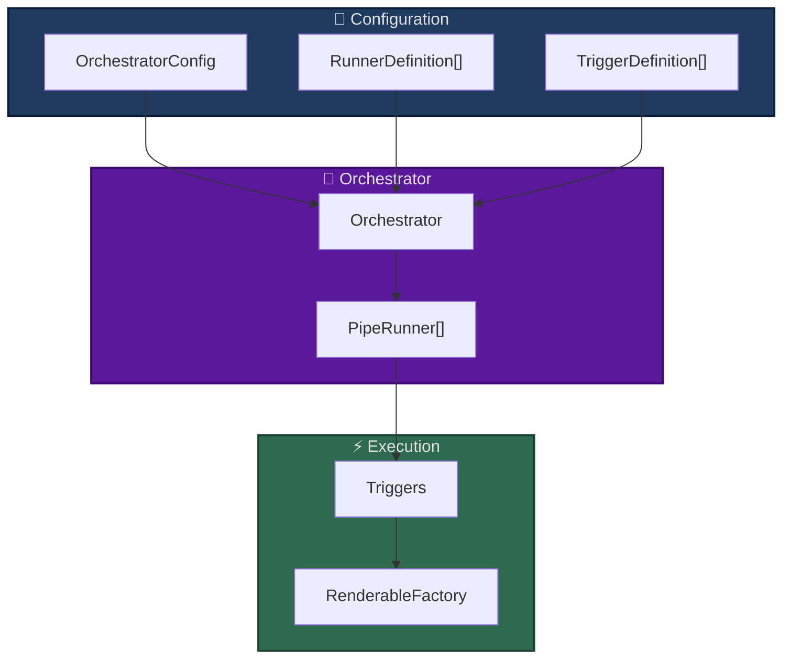

# Orchestrator System

The orchestrator coordinates pipeline scheduling, trigger mechanisms, and execution lifecycle.

## What is the Orchestrator?

Manages:
- Pipeline runners and their lifecycle
- Trigger mechanisms (time-based, event-driven)
- Execution scheduling

## Orchestrator Architecture




## Trigger Mechanisms

### Time-Based Triggers

```yaml
orchestrator:
  runners:
    - id: periodic_classifier
      on:
        - id: "every_5_minutes"
          use: "open_ticket_ai.base.interval_trigger:IntervalTrigger"
          params:
            milliseconds: 300000
      run:
        id: ticket_classifier
        use: open_ticket_ai.base:CompositePipe
        steps: [...]
```

**How it works:**
1. Trigger created with interval (e.g., 300000ms = 5 minutes)
2. Trigger fires periodically
3. Runner executes pipeline
4. Cycle repeats

### One-Time Execution

```yaml
orchestrator:
  runners:
    - id: startup_task
      run:  # No "on" field
        id: initialization
        use: SomePipe
```

Runs once at startup, then completes.

### Multiple Triggers

```yaml
orchestrator:
  runners:
    - id: multi_trigger
      on:
        - id: "hourly"
          use: "open_ticket_ai.base.interval_trigger:IntervalTrigger"
          params:
            milliseconds: 3600000
        - id: "daily"
          use: "open_ticket_ai.base.interval_trigger:IntervalTrigger"
          params:
            milliseconds: 86400000
      run:
        id: maintenance
        use: MaintenancePipe
```

Each trigger independently executes the pipeline.

## Configuration

### OrchestratorConfig

```yaml
orchestrator:
  runners:
    - id: runner_1
      on: [...]  # Optional triggers
      run: {...} # Required pipe config
```

### RunnerDefinition

```yaml
- id: "unique_runner_id"
  on:  # Optional triggers
    - id: "trigger_id"
      use: "module:TriggerClass"
      params: {}
  run:  # Required pipeline
    id: "pipeline_id"
    use: "module:PipeClass"
    params: {}
```

### TriggerDefinition

```yaml
- id: "trigger_id"
  use: "open_ticket_ai.base.interval_trigger:IntervalTrigger"
  params:
    milliseconds: 60000  # 1 minute
```

## Execution Guarantees

- **Non-Overlapping**: Pipeline won't start if previous execution still running
- **Error Isolation**: Runner failures don't affect other runners
- **Clean Lifecycle**: Graceful startup and shutdown

## Common Patterns

### Periodic Processing
```yaml
runners:
  - id: ticket_processor
    on:
      - id: "every_10_minutes"
        use: "open_ticket_ai.base.interval_trigger:IntervalTrigger"
        params:
          milliseconds: 600000
    run:
      id: process_tickets
      use: CompositePipe
      steps: [...]
```

### Startup Initialization
```yaml
runners:
  - id: init_cache
    run:  # No triggers = one-time
      id: cache_warmup
      use: CacheWarmupPipe
```

### Multiple Schedules
```yaml
runners:
  - id: quick_check
    on:
      - id: "every_minute"
        params:
          milliseconds: 60000
    run: {...}
  
  - id: deep_scan
    on:
      - id: "every_hour"
        params:
          milliseconds: 3600000
    run: {...}
```

## Best Practices

**Trigger Intervals:**
- Don't run too frequently (respect resource limits)
- Consider processing time when setting intervals
- Use appropriate intervals for data freshness needs

**Runner Configuration:**
- Use descriptive runner IDs
- Group related operations in one runner
- Separate fast checks from slow operations

**Performance:**
- Monitor execution times
- Adjust intervals based on actual processing time
- Limit concurrent runners to avoid resource exhaustion

## Key Implementation Files

- **`src/open_ticket_ai/core/orchestration/orchestrator.py`** - Main orchestrator
- **`src/open_ticket_ai/core/orchestration/scheduled_runner.py`** - PipeRunner
- **`src/open_ticket_ai/core/orchestration/trigger.py`** - Trigger base class
- **`src/open_ticket_ai/base/triggers/interval_trigger.py`** - IntervalTrigger

## Related Documentation

- [Pipe System](pipeline.md)
- [Configuration Reference](../details/config_reference.md)
- [First Pipeline Tutorial](../guides/first_pipeline.md)
