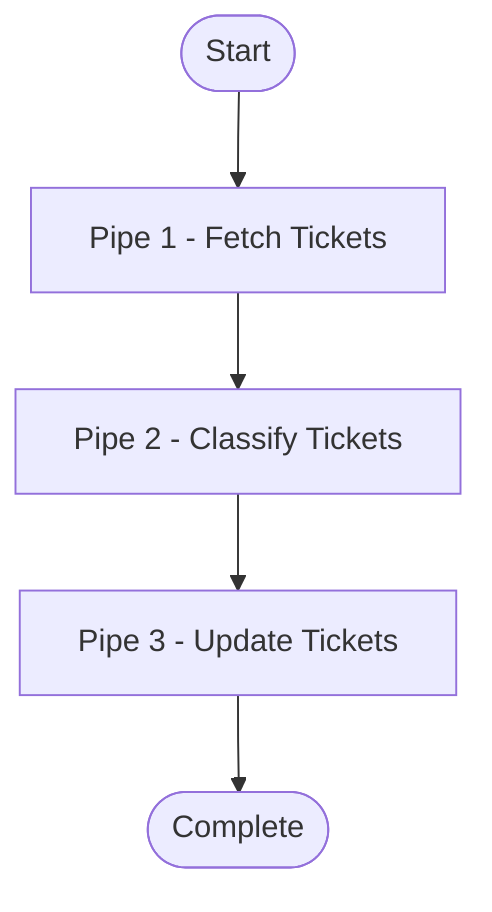

# Pipe System

Pipes are the fundamental processing units in Open Ticket AI. Each pipe performs a specific task, receives context from
previous pipes, executes its logic, and passes updated context forward.

## Basic Pipeline Flow

A pipeline is a sequence of pipes that execute one after another:



Each pipe:

1. Receives the `PipeContext` (containing results from previous pipes)
2. Executes its specific task
3. Creates a `PipeResult` with output data
4. Updates the context with its result
5. Passes the updated context to the next pipe

## What is a Pipe?

A **pipe** is a self-contained processing unit that:

- Implements specific business logic (fetch data, classify, update, etc.)
- Receives input via `PipeContext`
- Produces output as `PipeResult`
- Can depend on other pipes
- Can execute conditionally
- Can be composed into larger workflows

## Core Architecture

## Pipe Execution Lifecycle

How individual pipes execute their logic:

**Processing Steps:**

1. **Execute Path**: If checks pass:
    - Wrap execution in try-catch
    - Call `_process()` (implemented by pipe subclass)
    - Create `PipeResult` from return value
    - On exception: create failed `PipeResult` with error message
2. **Persistence**: Save result to `context.pipes[pipe_id]`
3. **Return**: Return updated context to next pipe

## Pipe Types

### Simple Pipes

Atomic processing units that implement specific business logic:

```yaml
- id: fetch_tickets
  use: open_ticket_ai.base:FetchTicketsPipe
  injects:
    ticket_system: "otobo_znuny"
  params:
    search_criteria:
      queue:
        name: "Support"
      limit: 10
```

**Characteristics:**

- Implements `_process()` method
- Returns single `PipeResult`
- No child pipes
- Accesses injected services via `self.<service_name>`

**Example Implementation:**

### Composite Pipes

Orchestrators that contain and execute child pipes:

```yaml
- id: ticket_workflow
  use: open_ticket_ai.base:CompositePipe
  params:
    threshold: 0.8
  steps:
    - id: fetch
      use: open_ticket_ai.base:FetchTicketsPipe
      injects: { ticket_system: "otobo_znuny" }
      params:
        search_criteria:
          queue: { name: "Incoming" }
          limit: 10

    - id: classify
      use: otai_hf_local:HFLocalTextClassificationPipe
      params:
        model: "bert-base-german-cased"
        text: "{{ get_pipe_result('fetch').data.fetched_tickets[0].subject }}"
      depends_on: [ fetch ]

    - id: update
      use: open_ticket_ai.base:UpdateTicketPipe
      injects: { ticket_system: "otobo_znuny" }
      params:
        ticket_id: "{{ get_pipe_result('fetch').data.fetched_tickets[0].id }}"
        updated_ticket:
          queue:
            name: "{{ get_pipe_result('classify').data.predicted_queue }}"
      depends_on: [ classify ]
```

**Characteristics:**

- Contains `steps` list of child pipe configs
- Uses `RenderableFactory` to build child pipes
- Executes children sequentially
- Merges results via `PipeResult.union()`
- Children can access parent params via `parent.params`

### Composite Pipe Execution

```mermaid
flowchart TB

%% ===================== COMPOSITE START =====================
    subgraph START["🔀 CompositePipe.process()"]
        direction TB
        Entry([Composite pipe]):::start
        InitLoop["Initialize step"]:::proc
        Entry --> InitLoop
    end

%% ===================== STEP PROCESSING =====================
    subgraph STEP_LOOP["🔁 For Each Step"]
        direction TB
        HasStep{"Has next?"}:::dec
        MergeCtx["Merge parent +"]:::proc
        BuildChild["factory.create_pipe"]:::factory
        RunChild["child.process"]:::proc
        CollectResult["Collect result"]:::ctx
        UnionResults["PipeResult.union"]:::proc
        Return["Return Result"]:::ctx
        End(["End"])
    end

%% ===================== CONNECTIONS =====================
    InitLoop --> HasStep
    HasStep -- Yes --> MergeCtx --> BuildChild --> RunChild --> CollectResult --> HasStep
    HasStep -- No --> UnionResults --> Return --> End
%% ===================== STYLES =====================
    classDef start fill: #2d6a4f, stroke: #1b4332, stroke-width: 3px, color: #fff, font-weight: bold
    classDef dec fill: #d97706, stroke: #b45309, stroke-width: 2px, color: #fff, font-weight: bold
    classDef proc fill: #2b2d42, stroke: #14213d, stroke-width: 2px, color: #e0e0e0
    classDef render fill: #4338ca, stroke: #312e81, stroke-width: 2px, color: #e0e0e0
    classDef factory fill: #7c2d12, stroke: #5c1a0a, stroke-width: 2px, color: #e0e0e0
    classDef ctx fill: #165b33, stroke: #0d3b24, stroke-width: 2px, color: #e0e0e0
```



**Composite Execution:**

1. **Initialization**: Prepare to iterate through `steps` list
2. **For Each Step**:
    - **Merge**: Combine parent params with step params (step overrides)
    - **Render**: Apply Jinja2 template rendering to step config
    - **Build**: Use factory to create child pipe instance
    - **Execute**: Call `child.process(context)` → updates context
    - **Collect**: Child result stored in `context.pipes[child_id]`
    - **Loop**: Continue to next step
3. **Finalization**:
    - **Union**: Merge all child results using `PipeResult.union()`
    - **Save**: Store composite result in context
    - **Return**: Return final updated context

## Dependency Management

The `depends_on` field creates execution dependencies between pipes:

```yaml
- id: step_a
  use: PipeA
  # Executes first (no dependencies)

- id: step_b
  use: PipeB
  depends_on: [ step_a ]
  # Executes only if step_a succeeded

- id: step_c
  use: PipeC
  depends_on: [ step_a, step_b ]
  # Executes only if both step_a and step_b succeeded
```

**Field Details:**

- **`pipes`**: Contains results from all previously executed pipes, keyed by pipe ID
    - Accumulated as each pipe completes
    - In CompositePipe: merged results from all child steps
    - Access via `pipe_result('pipe_id')` in templates

- **`params`**: Current pipe's parameters
    - Set when the pipe is created
    - Accessible via `params.*` in templates
    - For nested pipes, can reference parent via `parent.params`

- **`parent`**: Reference to parent context (if inside a CompositePipe)
    - Allows access to parent scope variables
    - Creates hierarchical context chain
    - Can traverse multiple levels (`parent.parent...`)

**Accessing Context in Templates:**

```yaml
- id: child_pipe
  params:
    # Access previous pipe result
    tickets: "{{ pipe_result('fetch').data.fetched_tickets }}"

    # Access parent parameter
    threshold: "{{ parent.params.confidence_threshold }}"

    # Access own parameter
    limit: "{{ params.limit }}"

    # Check if pipe succeeded
    should_update: "{{ has_succeeded('classify') }}"
```

## PipeResult Structure

Each pipe produces a `PipeResult` containing execution outcome and data:

```python
class PipeResult[T]():
    success: bool  # True if execution succeeded
    failed: bool  # True if execution failed
    message: str  # Human-readable message
    data: T  # Pipe-specific result data (Pydantic model)
```

## Best Practices

### Pipe Design

- Keep pipes focused on single responsibility
- Make pipes reusable across different workflows
- Use descriptive pipe IDs
- Document expected input and output
- Handle errors gracefully

### Configuration

- Use template variables for dynamic values
- Leverage `depends_on` for clear execution order
- Use `if_` conditions to skip unnecessary work
- Group related pipes in CompositePipe

### Performance

- Avoid blocking operations in `_process()`
- Use async/await for I/O operations
- Keep pipe execution time reasonable
- Consider batching for large datasets

### Testing

- Test pipes independently with mock services
- Test dependency chains
- Test conditional execution paths
- Test error scenarios

## Key Implementation Files

### Core Pipeline

- **`src/open_ticket_ai/core/pipeline/pipe.py`** - Base `Pipe` class
- **`src/open_ticket_ai/core/pipeline/pipe_config.py`** - `PipeConfig`, `PipeResult` models
- **`src/open_ticket_ai/core/pipeline/pipe_context.py`** - `PipeContext` model

### Base Pipes

- **`src/open_ticket_ai/base/pipes/composite_pipe.py`** - `CompositePipe` implementation
- **`src/open_ticket_ai/base/pipes/jinja_expression_pipe.py`** - Expression evaluation
- **`src/open_ticket_ai/base/pipes/ticket_system_pipes/`** - Ticket operations

### Configuration

- **`src/open_ticket_ai/core/config/renderable_factory.py`** - Pipe instantiation
- **`src/open_ticket_ai/core/config/renderable.py`** - `Renderable` interface

## Related Documentation

- **[Orchestrator System](orchestrator.md)** - How pipelines are scheduled and executed
- **[Configuration & Rendering](config_rendering.md)** - Template rendering and context
- **[First Pipeline Tutorial](../guides/first_pipeline.md)** - Step-by-step guide
- **[Plugin Development](../developers/plugin_development.md)** - Creating custom pipes
- **[Configuration Reference](../details/config_reference.md)** - YAML structure

## Summary

Pipes are the building blocks of Open Ticket AI workflows:

**Core Concepts:**

- Self-contained processing units
- Context-driven data flow
- Sequential execution with dependencies
- Conditional and composable

**Key Features:**

- Dependency management (`depends_on`)
- Conditional execution (`if_`)
- Nested composition (CompositePipe)
- Error isolation and handling
- Template-driven configuration

**Design Principles:**

- Single responsibility
- Reusability across workflows
- Type-safe results
- Graceful error handling

This architecture enables building complex automation workflows from simple, testable, composable components.
