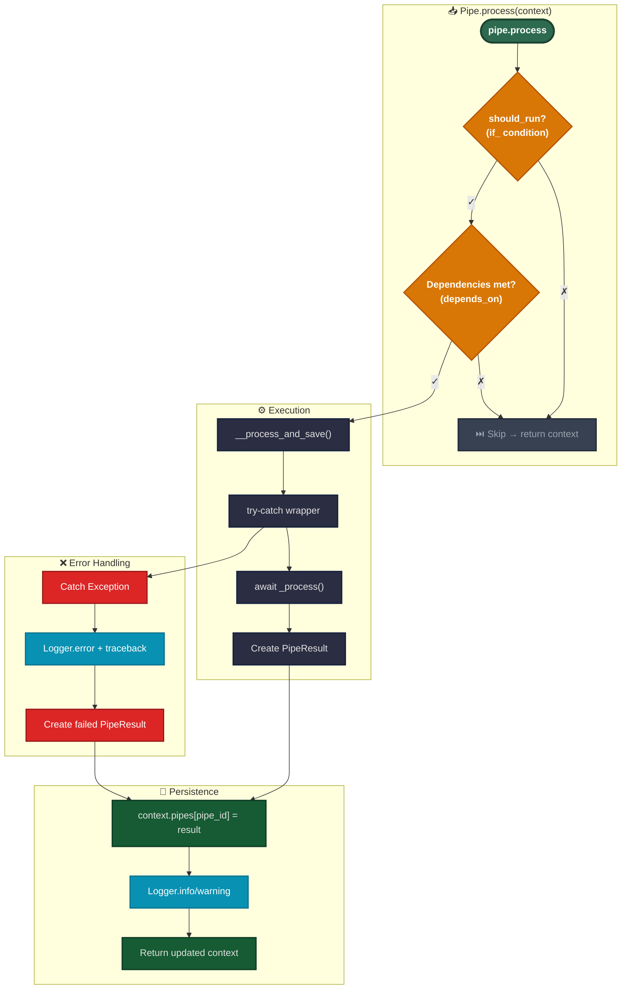

```mermaid
%%{init:{
  "flowchart":{"defaultRenderer":"elk","htmlLabels":true,"curve":"linear"},
  "themeVariables":{"fontSize":"14px","fontFamily":"system-ui","lineColor":"#718096"},
}}%%

flowchart TB

%% ===================== PIPE ENTRY =====================
subgraph ENTRY["📥 Pipe.process(context)"]
  direction TB
  Start([pipe.process]):::start
  CheckShould{"should_run?<br/>(if_ condition)"}:::dec
  CheckDeps{"Dependencies met?<br/>(depends_on)"}:::dec
  Skip["⏭️ Skip → return context"]:::skip
  
  Start --> CheckShould
  CheckShould -- ✓ --> CheckDeps
  CheckShould -- ✗ --> Skip
  CheckDeps -- ✗ --> Skip
end

%% ===================== EXECUTION =====================
subgraph EXEC["⚙️ Execution"]
  direction TB
  ProcessAndSave["__process_and_save()"]:::proc
  TryCatch["try-catch wrapper"]:::proc
  RunProcess["await _process()"]:::proc
  CreateResult["Create PipeResult"]:::proc
  
  ProcessAndSave --> TryCatch --> RunProcess --> CreateResult
end

%% ===================== ERROR HANDLING =====================
subgraph ERROR["❌ Error Handling"]
  direction TB
  CatchEx["Catch Exception"]:::error
  LogError["Logger.error + traceback"]:::log
  CreateFailed["Create failed PipeResult"]:::error
  
  CatchEx --> LogError --> CreateFailed
end

%% ===================== PERSISTENCE =====================
subgraph PERSIST["💾 Persistence"]
  direction TB
  SaveResult["context.pipes[pipe_id] = result"]:::ctx
  LogResult["Logger.info/warning"]:::log
  Return["Return updated context"]:::ctx
  
  SaveResult --> LogResult --> Return
end

%% ===================== CONNECTIONS =====================
CheckDeps -- ✓ --> ProcessAndSave
TryCatch --> CatchEx
CreateResult --> SaveResult
CreateFailed --> SaveResult

%% ===================== STYLES =====================
classDef start fill:#2d6a4f,stroke:#1b4332,stroke-width:3px,color:#fff,font-weight:bold
classDef dec fill:#d97706,stroke:#b45309,stroke-width:2px,color:#fff,font-weight:bold
classDef skip fill:#374151,stroke:#1f2937,stroke-width:2px,color:#9ca3af
classDef proc fill:#2b2d42,stroke:#14213d,stroke-width:2px,color:#e0e0e0
classDef error fill:#dc2626,stroke:#991b1b,stroke-width:2px,color:#fff
classDef log fill:#0891b2,stroke:#0e7490,stroke-width:2px,color:#fff
classDef ctx fill:#165b33,stroke:#0d3b24,stroke-width:2px,color:#e0e0e0
```