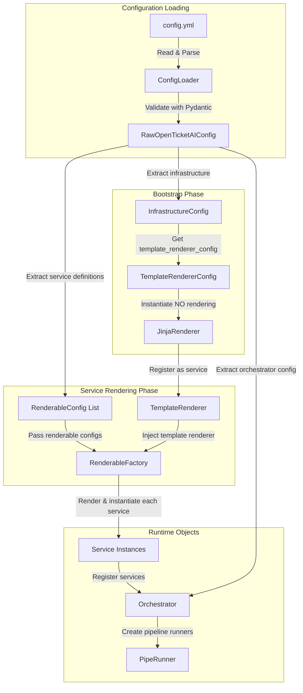
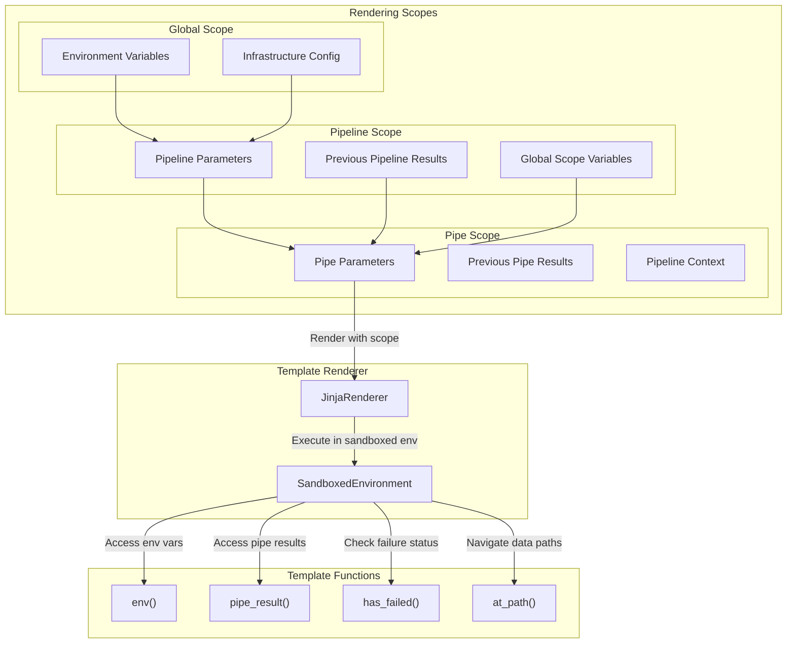
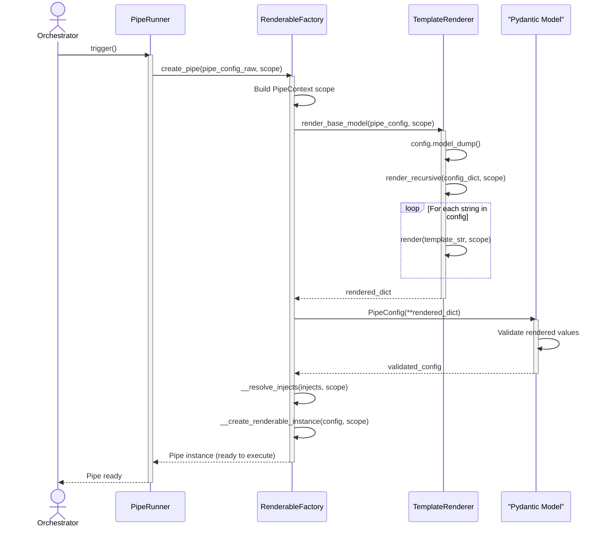

# Configuration and Template Rendering

The configuration and template rendering system is the foundation of Open Ticket AI's dynamic behavior. It transforms static YAML files into live, context-aware application objects through a multi-stage process involving validation, template rendering, and dependency injection.

## Overview

Configuration flows through several stages from file to runtime:

1. **YAML Parsing**: Configuration files are loaded and validated
2. **Template Bootstrapping**: The template renderer is initialized first
3. **Configuration Rendering**: Templates in config are evaluated against runtime context
4. **Object Instantiation**: Rendered configurations become application objects

This process enables dynamic, context-aware pipelines that adapt to runtime conditions while maintaining type safety and validation.

## Configuration Lifecycle

The following diagram illustrates the complete lifecycle of configuration from YAML to runtime objects:



## Template Rendering Architecture

Template rendering operates at multiple scopes, each with different available variables and context:



## Rendering Process Flow

When a pipeline is triggered, configuration rendering follows this sequence:



## Key Concepts

### Environment Variable Substitution

The template renderer provides environment variable access through the `env()` function:

```yaml
services:
  - id: api_client
    use: "mypackage:APIClient"
    params:
      api_key: "{{ env('OTAI_API_KEY') }}"
      endpoint: "{{ env('OTAI_ENDPOINT', 'https://default.example.com') }}"
```

Environment variables can be filtered by prefix using the `env_config.prefix` setting in the template renderer configuration.

### Jinja2 Template Evaluation

All string values in service and pipe configurations are treated as Jinja2 templates and evaluated against the current scope:

**Available in templates:**
- `{{ variable }}`: Variable substitution
- `...`: Conditional blocks
- `...`: Iteration
- `{{ value | filter }}`: Jinja2 filters
- Custom functions: `env()`, `pipe_result()`, `has_failed()`, `at_path()`

**Template rendering is recursive:**
- Strings are rendered as Jinja2 templates
- Lists have each item rendered
- Dictionaries have each value rendered
- Objects are converted to dicts, rendered, then reconstructed

### Context Scopes

Context flows hierarchically through the rendering system:

**Global Context:**
- Environment variables (via `env()` function)
- Infrastructure configuration
- Available at all levels

**Pipeline Context:**
- Pipeline-level parameters from `orchestrator.pipelines[].params`
- Results from previous pipeline runs
- Inherits global context

**Pipe Context (PipeContext):**
- Results from previous pipes in the pipeline: `context.pipes[pipe_id]`
- Pipe-specific parameters
- Parent pipeline context
- Inherits all parent scopes

Example of context access:

```yaml
orchestrator:
  pipelines:
    - name: process_tickets
      params:
        threshold: 0.8
      pipes:
        - id: fetch_tickets
          use: "mypackage:FetchTickets"
          
        - id: classify_tickets
          use: "mypackage:ClassifyTickets"
          params:
            # Access pipeline parameter
            confidence_threshold: "{{ context.params.threshold }}"
            # Access previous pipe result
            tickets: "{{ pipe_result('fetch_tickets').data.tickets }}"
```

### Bootstrap Exception: Template Renderer Config

**Critical Rule:** The template renderer configuration itself is **NEVER** rendered. It is used raw to bootstrap the rendering system.

This prevents circular dependencies and ensures the renderer can be initialized before any template processing occurs.

```yaml
infrastructure:
  template_renderer_config:
    type: "jinja"
    env_config:
      prefix: "OTAI_"  # ← This value is NOT rendered
    autoescape: false   # ← This value is NOT rendered
```

All other configurations (services, orchestrator, pipes) are rendered using this bootstrapped renderer.

### Validation Flow

Configuration validation occurs at two stages:

**1. Initial Validation (YAML → RawOpenTicketAIConfig):**
- YAML structure is correct
- Required fields are present
- Types match expected structure
- Happens in `ConfigLoader.load_config()`

**2. Post-Rendering Validation (Rendered dict → Typed Config):**
- Template-rendered values match expected types
- Rendered values satisfy constraints
- Computed values are valid
- Happens in `render_base_model()` after template evaluation

Example:

```yaml
params:
  timeout: "{{ env('TIMEOUT', '30') }}"  # Rendered to "30" (string)
```

After rendering, Pydantic validates that "30" can be coerced to an integer if the field type is `int`.

### Dependency Resolution

Services can depend on other services through the `injects` field:

```yaml
services:
  - id: database_client
    use: "mypackage:DatabaseClient"
    params:
      connection_string: "{{ env('DB_CONNECTION') }}"
  
  - id: ticket_fetcher
    use: "mypackage:TicketFetcher"
    injects:
      db_client: "database_client"  # Injects the database_client service
```

The `RenderableFactory` resolves these dependencies by:
1. Looking up the service by ID in the registry
2. Instantiating it if not already created
3. Passing it to the dependent service's constructor

## Implementation References

### Configuration Module

**Location**: `src/open_ticket_ai/core/config/`

- **`config_loader.py`**: `ConfigLoader` for loading YAML and initial validation
- **`config_models.py`**: Pydantic models (`RawOpenTicketAIConfig`, `InfrastructureConfig`)
- **`app_config.py`**: `AppConfig` for application-level configuration
- **`renderable_factory.py`**: `RenderableFactory` for rendering and instantiating services/pipes
- **`renderable.py`**: Base `Renderable` interface and `RenderableConfig` model

### Template Rendering Module

**Location**: `src/open_ticket_ai/core/template_rendering/`

- **`template_renderer.py`**: Abstract `TemplateRenderer` base class
- **`renderer_config.py`**: Configuration models for template renderers

**Location**: `src/open_ticket_ai/base/template_renderers/`

- **`jinja_renderer.py`**: `JinjaRenderer` implementation using Jinja2
- **`jinja_renderer_extras.py`**: Custom Jinja2 functions (`env`, `pipe_result`, etc.)

### Dependency Injection

**Location**: `src/open_ticket_ai/core/dependency_injection/`

- **`container.py`**: `AppModule` that bootstraps the DI container and provides the template renderer

## Related Documentation

- [Pipeline System](./pipeline.md) - How pipelines use rendered configurations
- [Template Rendering Code Details](../code/template_rendering.md) - Code-level documentation
- [Configuration Structure](../configuration/config_structure.md) - YAML configuration reference
- [Environment Variables](../configuration/environment_variables.md) - Environment variable usage
- [Services](../code/services.md) - Service registration and dependency injection

## Best Practices

**Configuration Organization:**
- Keep template logic simple and readable
- Use environment variables for secrets and environment-specific values
- Validate configurations early in development
- Document custom template functions and filters

**Template Usage:**
- Prefer simple variable substitution over complex logic
- Use conditional blocks sparingly
- Keep templates focused on data transformation
- Test templates with various input scenarios

**Scope Management:**
- Understand which scope variables are available in each context
- Avoid relying on implicit scope inheritance
- Use explicit context references for clarity
- Document expected context variables in pipe configurations

**Security:**
- Never hardcode secrets in YAML files
- Use environment variables for sensitive data
- Trust the sandboxed Jinja2 environment
- Be cautious with user-provided template input
