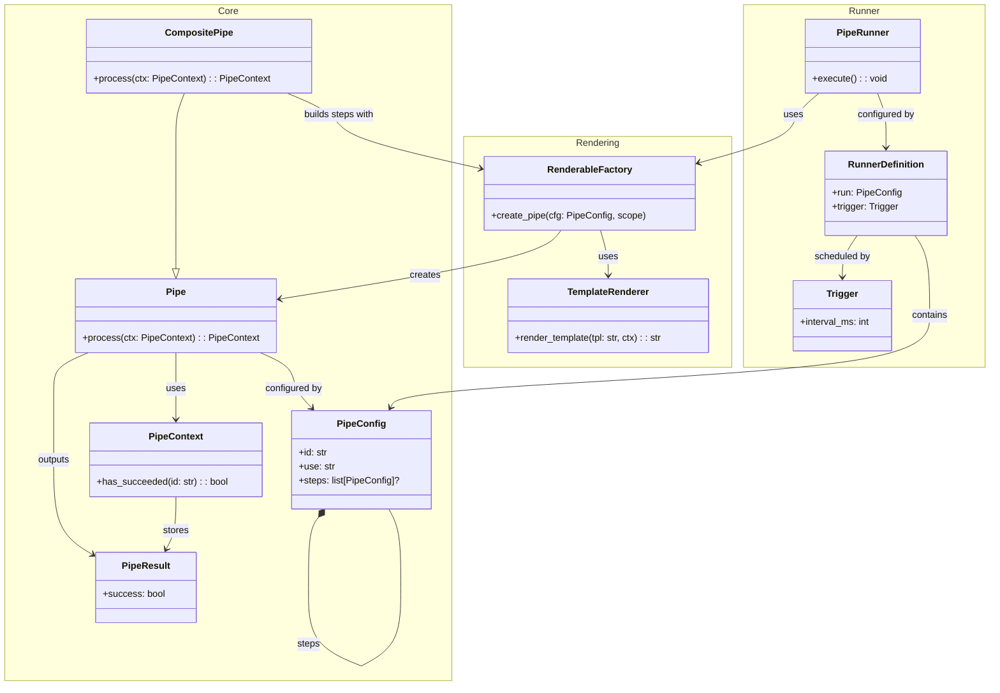
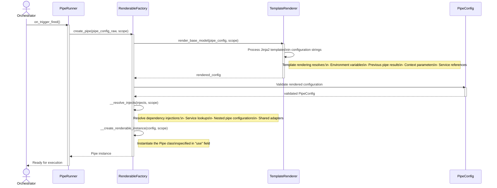

# Pipeline System

The pipeline system is Open Ticket AI's core orchestration mechanism. It coordinates the execution of data processing workflows through sequences of interconnected processing components called **pipes**.

## What is a Pipeline?

A **pipeline** in Open Ticket AI is a configured sequence of pipes that execute in order to accomplish a specific task, such as fetching tickets, classifying them, and updating their properties. Pipelines are:

- **Sequential**: Pipes execute one after another in defined order
- **Context-driven**: Data flows through a shared execution context
- **Declarative**: Defined in YAML configuration files
- **Scheduled**: Triggered by time intervals or external events
- **Composable**: Pipes can contain nested sub-pipelines

## Pipeline Architecture



## Pipeline Orchestration Lifecycle

The pipeline system follows a well-defined lifecycle from configuration to execution:

### 1. Initialization Phase

When Open Ticket AI starts:

1. **Configuration Loading**: YAML configuration files are parsed
2. **Service Bootstrapping**: Dependency injection container is initialized
3. **Factory Setup**: `RenderableFactory` and `TemplateRenderer` are created
4. **Registry Population**: Services and pipe definitions are registered

### 2. Scheduling Phase

The orchestrator sets up pipeline execution schedules:

1. **Pipeline Definitions**: Each pipeline in `orchestrator.pipelines` is processed
2. **Runner Creation**: A `PipeRunner` is created for each pipeline
3. **Trigger Setup**: Time-based or event-based triggers are configured
4. **Schedule Activation**: Triggers begin firing at specified intervals

### 3. Rendering Phase

When a pipeline is triggered, its configuration is rendered:



**Key rendering concepts:**

- **Template Resolution**: Jinja2 templates in configuration values are evaluated against the current context
- **Dependency Injection**: Services referenced in `injects` are resolved from the registry
- **Conditional Evaluation**: The `if` field determines whether the pipe should execute
- **Dependency Checking**: The `depends_on` field specifies prerequisite pipes

### 4. Execution Phase

Once rendered, the pipeline executes:

```mermaid
%%{init:{
  "flowchart":{"defaultRenderer":"elk","htmlLabels":true,"curve":"linear"},
  "themeVariables":{"fontSize":"14px","fontFamily":"system-ui","primaryColor":"#1a1a2e","primaryTextColor":"#e0e0e0","primaryBorderColor":"#4a5568","lineColor":"#718096","background":"#0f0f1a","mainBkg":"#1a1a2e","secondBkg":"#16213e","tertiaryColor":"#0f3460","clusterBkg":"#0a0a15","clusterBorder":"#2d3748","edgeLabelBackground":"#1a1a2e","nodeTextColor":"#e0e0e0"},
  "elk":{"spacing":{"nodeNode":18,"nodeNodeBetweenLayers":16,"componentComponent":12}}
}}%%

flowchart TB

%% ===================== BOOTSTRAP & DI =====================
subgraph BOOT["🚀 Application Bootstrap"]
  direction TB
  Start([Start App]):::start
  LoadEnv["Load .env / Environment"]:::cfg
  CreateDI["Create DI Container<br/>(AppModule)"]:::di
  LoadConfig["ConfigLoader.load_config()"]:::cfg
  ParseYAML["Parse YAML → RawOpenTicketAIConfig"]:::cfg
  SetupLog["Configure Logging<br/>(dictConfig)"]:::cfg
  RegisterServices["Register Services & TemplateRenderer"]:::di
  InitFactory["Initialize RenderableFactory"]:::di
  CreateOrch["Create Orchestrator"]:::di
  
  Start --> LoadEnv --> CreateDI --> LoadConfig --> ParseYAML --> SetupLog
  SetupLog --> RegisterServices --> InitFactory --> CreateOrch
end

%% ===================== ORCHESTRATOR SETUP =====================
subgraph ORCH_SETUP["🎯 Orchestrator Setup"]
  direction TB
  StartOrch["Orchestrator.start()"]:::proc
  LoopRunners{"For each<br/>RunnerDefinition"}:::dec
  CreateRunner["Create PipeRunner<br/>(definition, factory)"]:::proc
  HasTrigger{"Has triggers<br/>(on: [...])?":::dec}
  
  StartOrch --> LoopRunners --> CreateRunner --> HasTrigger
end

%% ===================== TRIGGER SYSTEM =====================
subgraph TRIGGER["⏰ Trigger System (Observer Pattern)"]
  direction TB
  GetOrCreateTrigger["Get/Create Trigger<br/>(IntervalTrigger, etc.)"]:::proc
  AttachRunner["trigger.attach(runner)"]:::proc
  StartTrigger["trigger.start()"]:::proc
  
  GetOrCreateTrigger --> AttachRunner --> StartTrigger
end

subgraph ONETIME["▶️ One-Time Execution"]
  direction TB
  ScheduleTask["asyncio.create_task(<br/>runner.execute())"]:::proc
end

%% ===================== EXECUTION TRIGGER =====================
subgraph EXEC_TRIGGER["⚡ Trigger Fires"]
  direction TB
  TriggerEvent["Trigger fires<br/>(interval/event)"]:::event
  NotifyObservers["trigger.notify()"]:::proc
  CallObserver["runner.on_trigger_fired()"]:::proc
  
  TriggerEvent --> NotifyObservers --> CallObserver
end

%% ===================== RUNNER EXECUTION =====================
subgraph RUNNER["🔄 PipeRunner Execution"]
  direction TB
  RunnerExec["PipeRunner.execute()"]:::proc
  CreatePipeCtx["Create PipeContext<br/>(params from run config)"]:::ctx
  FactoryCreate["factory.create_pipe<br/>(pipe_config, scope)"]:::factory
  RenderParams["Render params with Jinja<br/>(render_base_model)"]:::render
  InstantiatePipe["Instantiate Pipe class"]:::proc
  CallProcess["pipe.process(context)"]:::proc
  
  RunnerExec --> CreatePipeCtx --> FactoryCreate --> RenderParams
  RenderParams --> InstantiatePipe --> CallProcess
end

%% ===================== PIPE PROCESSING =====================
subgraph PIPE_PROC["🔧 Pipe.process() Logic"]
  direction TB
  CheckShould{"should_run?<br/>(if_ condition)"}:::dec
  CheckDeps{"Dependencies met?<br/>(depends_on)"}:::dec
  ProcessAndSave["__process_and_save()"]:::proc
  SkipPipe["Skip → return context"]:::skip
  
  CheckShould -- ✓ --> CheckDeps
  CheckShould -- ✗ --> SkipPipe
  CheckDeps -- ✓ --> ProcessAndSave
  CheckDeps -- ✗ --> SkipPipe
end

%% ===================== PIPE EXECUTION =====================
subgraph PIPE_EXEC["⚙️ Pipe Execution"]
  direction TB
  TryCatch["try-catch wrapper"]:::proc
  IsComposite{"Composite<br/>Pipe?"}:::dec
  
  TryCatch --> IsComposite
end

%% ===================== SIMPLE PIPE =====================
subgraph SIMPLE["📦 Simple Pipe"]
  direction TB
  ExecProcess["await _process()"]:::proc
  CreateResult["Create PipeResult"]:::proc
  
  ExecProcess --> CreateResult
end

%% ===================== COMPOSITE PIPE =====================
subgraph COMPOSITE["🔀 Composite Pipe"]
  direction TB
  LoopSteps{"For each step"}:::dec
  MergeCtx["Merge parent + step params"]:::proc
  BuildChild["factory.create_pipe<br/>(step_config, child_scope)"]:::factory
  RenderStep["Render step params"]:::render
  RunChild["child.process(context)"]:::proc
  CollectResult["Collect result in context"]:::ctx
  AllDone{"All steps<br/>done?"}:::dec
  UnionResults["PipeResult.union(results)"]:::proc
  
  LoopSteps -- Has step --> MergeCtx --> BuildChild --> RenderStep
  RenderStep --> RunChild --> CollectResult --> LoopSteps
  LoopSteps -- Done --> AllDone --> UnionResults
end

%% ===================== RESULT HANDLING =====================
subgraph RESULT["💾 Result Persistence"]
  direction TB
  SaveResult["context.pipes[pipe_id] = result"]:::ctx
  LogResult["Logger.info/warning"]:::log
  ReturnContext["Return updated context"]:::ctx
  
  SaveResult --> LogResult --> ReturnContext
end

%% ===================== ERROR HANDLING =====================
subgraph ERROR["❌ Error Handling"]
  direction TB
  CatchEx["Catch Exception"]:::error
  CreateFailed["Create failed PipeResult<br/>(success=False, failed=True)"]:::error
  LogError["Logger.error + traceback"]:::log
  
  CatchEx --> LogError --> CreateFailed
end

%% ===================== CONNECTIONS =====================
CreateOrch --> StartOrch

HasTrigger -- Yes --> GetOrCreateTrigger
StartTrigger --> TriggerEvent
HasTrigger -- No --> ScheduleTask
ScheduleTask --> RunnerExec

CallObserver --> RunnerExec
CallProcess --> CheckShould
ProcessAndSave --> TryCatch

IsComposite -- No --> ExecProcess
IsComposite -- Yes --> LoopSteps

CreateResult --> SaveResult
UnionResults --> SaveResult
ReturnContext --> LoopRunners

TryCatch --> CatchEx
CreateFailed --> SaveResult

%% ===================== STYLES =====================
classDef start fill:#2d6a4f,stroke:#1b4332,stroke-width:3px,color:#fff,font-weight:bold
classDef cfg fill:#1e3a5f,stroke:#0d1f3d,stroke-width:2px,color:#e0e0e0
classDef di fill:#5a189a,stroke:#3c096c,stroke-width:2px,color:#e0e0e0
classDef proc fill:#2b2d42,stroke:#14213d,stroke-width:2px,color:#e0e0e0
classDef ctx fill:#165b33,stroke:#0d3b24,stroke-width:2px,color:#e0e0e0
classDef dec fill:#d97706,stroke:#b45309,stroke-width:2px,color:#fff,font-weight:bold
classDef factory fill:#7c2d12,stroke:#5c1a0a,stroke-width:2px,color:#e0e0e0
classDef render fill:#4338ca,stroke:#312e81,stroke-width:2px,color:#e0e0e0
classDef event fill:#be123c,stroke:#9f1239,stroke-width:3px,color:#fff,font-weight:bold
classDef skip fill:#374151,stroke:#1f2937,stroke-width:2px,color:#9ca3af
classDef error fill:#dc2626,stroke:#991b1b,stroke-width:2px,color:#fff
classDef log fill:#0891b2,stroke:#0e7490,stroke-width:2px,color:#fff

%% Apply styles
class Start start
class LoadEnv,LoadConfig,ParseYAML,SetupLog cfg
class CreateDI,RegisterServices,InitFactory,CreateOrch di
class StartOrch,CreateRunner,GetOrCreateTrigger,AttachRunner,StartTrigger,ScheduleTask,NotifyObservers,CallObserver,RunnerExec,CreatePipeCtx,InstantiatePipe,CallProcess,ProcessAndSave,TryCatch,ExecProcess,CreateResult,RunChild,CollectResult proc
class CheckShould,CheckDeps,HasTrigger,IsComposite,LoopSteps,AllDone,LoopRunners dec
class FactoryCreate,BuildChild factory
class RenderParams,RenderStep render
class TriggerEvent event
class SkipPipe skip
class CatchEx,CreateFailed error
class LogResult,LogError log
class CreatePipeCtx,MergeCtx,CollectResult,SaveResult,ReturnContext ctx
```



**Execution flow details:**

1. **Conditional Check**: Pipe evaluates its `if` condition
2. **Dependency Check**: Verifies all `depends_on` pipes have succeeded
3. **Processing**: 
   - **Regular Pipe**: Calls `_process()` to execute business logic
   - **Composite Pipe**: Iterates through `steps`, creating and executing child pipes
4. **Result Aggregation**: Composite pipes merge child results using `PipeResult.union()`
5. **Context Update**: Result is saved to `context.pipes[pipe_id]`
6. **Return**: Updated context is returned for next pipe

### 5. Result Handling Phase

After execution:

1. **Success Check**: `PipeRunner` examines the final `PipeResult`
2. **Logging**: Success or failure is logged with context
3. **Error Handling**: Exceptions are caught and logged
4. **Cleanup**: Context is discarded after pipeline completion

## When and How Pipelines Execute

### Trigger Mechanisms

Pipelines can be triggered by:

#### 1. Time-based Intervals

The most common trigger type, configured with `run_every_milli_seconds`:

```yaml
orchestrator:
  pipelines:
    - name: ticket_classifier
      run_every_milli_seconds: 300000  # Every 5 minutes
      pipes:
        - pipe_name: classify_tickets
```

#### 2. Event-based Triggers

Pipelines can respond to external events (webhook triggers, file system changes, etc.)

### Execution Guarantees

The orchestrator provides:

- **Non-overlapping Execution**: A pipeline won't start if previous execution is still running
- **Error Isolation**: One pipeline failure doesn't affect others
- **Consistent Context**: Each execution gets a fresh context
- **Ordered Execution**: Pipes execute in configuration order

## Relationship of Pipes, Composite Pipes, and Steps

### Regular Pipes

**Regular pipes** are atomic processing units:

```yaml
- id: fetch_tickets
  use: open_ticket_ai.base.pipes.ticket_system_pipes.FetchTicketsPipe
  params:
    criteria:
      state: new
```

A regular pipe:
- Implements `_process()` method with business logic
- Receives input from context
- Produces a single `PipeResult`
- Returns updated context

### Composite Pipes

**Composite pipes** orchestrate multiple child pipes:

```yaml
- id: process_ticket_workflow
  use: open_ticket_ai.base.pipes.CompositePipe
  steps:
    - id: fetch
      use: FetchTicketsPipe
      params:
        criteria: { state: new }
    
    - id: classify
      use: ClassifyTicketPipe
      params:
        input_ticket: "{{ pipes.fetch.data.ticket }}"
      depends_on: [fetch]
    
    - id: update
      use: UpdateTicketPipe
      params:
        ticket_id: "{{ pipes.fetch.data.ticket.id }}"
        updates: "{{ pipes.classify.data.classification }}"
      depends_on: [classify]
```

A composite pipe:
- Contains a `steps` list of child pipe configurations
- Uses `RenderableFactory` to instantiate each child
- Executes children sequentially
- Merges child results into a single `PipeResult`
- Allows child pipes to depend on previous siblings

### Dependency Relationships

The `depends_on` field creates execution dependencies:

```yaml
- id: step_a
  use: SomePipe

- id: step_b
  use: AnotherPipe
  depends_on: [step_a]  # Waits for step_a to succeed

- id: step_c
  use: FinalPipe
  depends_on: [step_a, step_b]  # Waits for both
```

**Dependency behavior:**

- A pipe only executes if all `depends_on` pipes have `success=True` and `failed=False`
- If dependencies aren't met, the pipe is skipped
- Dependencies are checked via `context.has_succeeded(pipe_id)`
- Circular dependencies are not detected and will cause execution to skip

### Conditional Execution

The `if` field enables conditional execution:

```yaml
- id: conditional_update
  use: UpdateTicketPipe
  if: "{{ pipes.classify.data.confidence > 0.8 }}"
  params:
    ticket_id: "{{ ticket.id }}"
```

**Conditional behavior:**

- `if` is evaluated as a Jinja2 template
- Result must be truthy for pipe to execute
- Can reference context data, environment variables, or service state
- Defaults to `"True"` if not specified

## Implementation References

The pipeline system is implemented across several modules:

### Core Pipeline Module

**Location**: `src/open_ticket_ai/core/pipeline/`

- **`pipe.py`**: Base `Pipe` class with `process()` and dependency checking
- **`pipe_config.py`**: `PipeConfig` and `PipeResult` data models
- **`pipe_context.py`**: `PipeContext` for sharing data between pipes

### Base Pipes Module

**Location**: `src/open_ticket_ai/base/pipes/`

- **`composite_pipe.py`**: `CompositePipe` implementation for step orchestration
- **`jinja_expression_pipe.py`**: Pipe that evaluates Jinja2 expressions

### Orchestration Module

**Location**: `src/open_ticket_ai/core/orchestration/`

- **`orchestrator.py`**: Main orchestrator that manages pipeline scheduling
- **`scheduled_runner.py`**: `PipeRunner` that executes individual pipelines
- **`trigger.py`**: Trigger definitions for scheduling

### Configuration Module

**Location**: `src/open_ticket_ai/core/config/`

- **`renderable_factory.py`**: `RenderableFactory` for creating pipes from configuration
- **`renderable.py`**: Base `Renderable` interface and `RenderableConfig` model

### Template Rendering Module

**Location**: `src/open_ticket_ai/core/template_rendering/`

- **`template_renderer.py`**: Jinja2 template rendering for configuration values

## Related Documentation

- **[Pipeline Architecture](./pipeline-architecture.md)** - Detailed system architecture
- **[First Pipeline Tutorial](../guides/first_pipeline.md)** - Step-by-step guide to creating pipelines
- **[Dependency Injection](../developers/code/dependency_injection.md)** - Service management and injection
- **[Template Rendering](../developers/code/template_rendering.md)** - Jinja2 template system
- **[Configuration Structure](../details/configuration/config_structure.md)** - YAML configuration reference
- **[Plugin Development](../plugins/plugin_development.md)** - Creating custom pipes

## Summary

The pipeline system in Open Ticket AI provides a powerful, flexible framework for orchestrating data processing workflows. By combining:

- **Declarative configuration** for defining workflows
- **Sequential execution** for predictable behavior
- **Shared context** for data flow
- **Dependency management** for execution ordering
- **Composite pipes** for workflow composition
- **Template rendering** for dynamic configuration

You can build sophisticated automation workflows that are maintainable, testable, and extensible.
