# Pipeline System

The pipeline system is Open Ticket AI's core orchestration mechanism that coordinates the execution of data processing workflows through sequences of interconnected processing components called **pipes**.

## What is a Pipeline?

A **pipeline** in Open Ticket AI is a configured sequence of pipes that execute in order to accomplish a specific task, such as fetching tickets, classifying them, and updating their properties.

**Key characteristics:**

- **Sequential execution**: Pipes run one after another in defined order
- **Context-driven**: Data flows through a shared execution context
- **Declarative**: Defined in YAML configuration files
- **Event-driven**: Triggered by time intervals or external events
- **Composable**: Pipes can contain nested sub-pipelines

## Core Architecture


## Pipeline Execution Lifecycle

The pipeline system follows a well-defined lifecycle from startup to execution:

### 1. **Application Bootstrap**

When Open Ticket AI starts:


**Key steps:**

1. **Environment Loading**: `.env` file and environment variables loaded
2. **DI Container Creation**: `AppModule` initializes dependency injection
3. **Configuration Loading**: `config.yml` parsed into `RawOpenTicketAIConfig`
4. **Logging Setup**: `dictConfig` applied from infrastructure settings
5. **Service Registration**: `TemplateRenderer` and other services registered
6. **Factory Initialization**: `RenderableFactory` created with renderer and service configs
7. **Orchestrator Creation**: Main orchestrator instantiated

### 2. **Pipeline Scheduling**

The orchestrator sets up execution schedules:

**For each `RunnerDefinition`:**

1. **Runner Creation**: `PipeRunner(definition, factory)` instantiated
2. **Trigger Decision**: Check if `on` field has triggers
3. **Trigger Path**: If triggers exist → create trigger → attach runner → start trigger
4. **One-Time Path**: If no triggers → schedule immediate execution via `asyncio.create_task()`

### 3. **Pipeline Execution**

When a trigger fires or one-time task runs:

```mermaid
%%{init:{
  "flowchart":{"defaultRenderer":"elk","htmlLabels":true,"curve":"linear"},
  "themeVariables":{"fontSize":"14px","fontFamily":"system-ui","lineColor":"#718096"},
  "elk":{"spacing":{"nodeNode":18}}
}}%%

flowchart TB

%% ===================== RUNNER EXECUTION =====================
subgraph RUNNER["🔄 PipeRunner.execute()"]
  direction TB
  Start([Trigger fired]):::event
  CreateCtx["Create PipeContext<br/>(params from run config)"]:::ctx
  FactoryCreate["factory.create_pipe<br/>(pipe_config, scope)"]:::factory
  RenderParams["🎨 Render params with Jinja<br/>(render_base_model)"]:::render
  InstantiatePipe["Instantiate Pipe class"]:::proc
  CallProcess["pipe.process(context)"]:::proc
  
  Start --> CreateCtx --> FactoryCreate --> RenderParams
  RenderParams --> InstantiatePipe --> CallProcess
end

%% ===================== RESULT HANDLING =====================
subgraph RESULT["📊 Result Handling"]
  direction TB
  GetResult["Get PipeResult"]:::proc
  CheckSuccess{"Success?"}:::dec
  LogSuccess["✅ Log success"]:::log
  LogFailure["❌ Log failure"]:::log
  
  GetResult --> CheckSuccess
  CheckSuccess -- Yes --> LogSuccess
  CheckSuccess -- No --> LogFailure
end

%% ===================== CONNECTIONS =====================
CallProcess --> GetResult

%% ===================== STYLES =====================
classDef event fill:#be123c,stroke:#9f1239,stroke-width:3px,color:#fff,font-weight:bold
classDef ctx fill:#165b33,stroke:#0d3b24,stroke-width:2px,color:#e0e0e0
classDef factory fill:#7c2d12,stroke:#5c1a0a,stroke-width:2px,color:#e0e0e0
classDef render fill:#4338ca,stroke:#312e81,stroke-width:2px,color:#e0e0e0
classDef proc fill:#2b2d42,stroke:#14213d,stroke-width:2px,color:#e0e0e0
classDef dec fill:#d97706,stroke:#b45309,stroke-width:2px,color:#fff,font-weight:bold
classDef log fill:#0891b2,stroke:#0e7490,stroke-width:2px,color:#fff
```



**Execution flow:**

1. **Context Creation**: Fresh `PipeContext` with params from `run` config
2. **Pipe Creation**: `RenderableFactory.create_pipe()` called
3. **Template Rendering**: All params rendered via Jinja2 (except template renderer config itself)
4. **Pipe Instantiation**: Pipe class constructed with rendered config
5. **Processing**: `pipe.process(context)` invoked
6. **Result Logging**: Success or failure logged with pipe ID

### 4. **Pipe Processing**

How individual pipes execute:

```mermaid
%%{init:{
  "flowchart":{"defaultRenderer":"elk","htmlLabels":true,"curve":"linear"},
  "themeVariables":{"fontSize":"14px","fontFamily":"system-ui","lineColor":"#718096"},
  "elk":{"spacing":{"nodeNode":18}}
}}%%

flowchart TB

%% ===================== PIPE ENTRY =====================
subgraph ENTRY["📥 Pipe.process(context)"]
  direction TB
  Start([pipe.process]):::start
  CheckShould{"should_run?<br/>(if_ condition)"}:::dec
  CheckDeps{"Dependencies met?<br/>(depends_on)"}:::dec
  Skip["⏭️ Skip → return context"]:::skip
  
  Start --> CheckShould
  CheckShould -- ✓ --> CheckDeps
  CheckShould -- ✗ --> Skip
  CheckDeps -- ✗ --> Skip
end

%% ===================== EXECUTION =====================
subgraph EXEC["⚙️ Execution"]
  direction TB
  ProcessAndSave["__process_and_save()"]:::proc
  TryCatch["try-catch wrapper"]:::proc
  RunProcess["await _process()"]:::proc
  CreateResult["Create PipeResult"]:::proc
  
  ProcessAndSave --> TryCatch --> RunProcess --> CreateResult
end

%% ===================== ERROR HANDLING =====================
subgraph ERROR["❌ Error Handling"]
  direction TB
  CatchEx["Catch Exception"]:::error
  LogError["Logger.error + traceback"]:::log
  CreateFailed["Create failed PipeResult"]:::error
  
  CatchEx --> LogError --> CreateFailed
end

%% ===================== PERSISTENCE =====================
subgraph PERSIST["💾 Persistence"]
  direction TB
  SaveResult["context.pipes[pipe_id] = result"]:::ctx
  LogResult["Logger.info/warning"]:::log
  Return["Return updated context"]:::ctx
  
  SaveResult --> LogResult --> Return
end

%% ===================== CONNECTIONS =====================
CheckDeps -- ✓ --> ProcessAndSave
TryCatch --> CatchEx
CreateResult --> SaveResult
CreateFailed --> SaveResult

%% ===================== STYLES =====================
classDef start fill:#2d6a4f,stroke:#1b4332,stroke-width:3px,color:#fff,font-weight:bold
classDef dec fill:#d97706,stroke:#b45309,stroke-width:2px,color:#fff,font-weight:bold
classDef skip fill:#374151,stroke:#1f2937,stroke-width:2px,color:#9ca3af
classDef proc fill:#2b2d42,stroke:#14213d,stroke-width:2px,color:#e0e0e0
classDef error fill:#dc2626,stroke:#991b1b,stroke-width:2px,color:#fff
classDef log fill:#0891b2,stroke:#0e7490,stroke-width:2px,color:#fff
classDef ctx fill:#165b33,stroke:#0d3b24,stroke-width:2px,color:#e0e0e0
```



**Processing steps:**

1. **Condition Check**: Evaluate `if_` field (defaults to `"True"`)
2. **Dependency Check**: Verify `context.has_succeeded(dep_id)` for each `depends_on` entry
3. **Skip Path**: If conditions fail → return original context unchanged
4. **Execute Path**: If conditions pass:
   - Wrap in try-catch
   - Call `_process()` (implemented by subclass)
   - Create `PipeResult` from return value
   - On exception: create failed `PipeResult` with error message
5. **Persistence**: Save result to `context.pipes[pipe_id]`
6. **Return**: Return updated context

### 5. **Composite Pipe Processing**

How composite pipes orchestrate child steps:

```mermaid
%%{init:{
  "flowchart":{"defaultRenderer":"elk","htmlLabels":true,"curve":"linear"},
  "themeVariables":{"fontSize":"14px","fontFamily":"system-ui","lineColor":"#718096"},
  "elk":{"spacing":{"nodeNode":18}}
}}%%

flowchart TB

%% ===================== COMPOSITE START =====================
subgraph START["🔀 CompositePipe.process()"]
  direction TB
  Entry([Composite pipe starts]):::start
  InitLoop["Initialize step iteration"]:::proc
  
  Entry --> InitLoop
end

%% ===================== STEP PROCESSING =====================
subgraph STEP_LOOP["🔁 For Each Step"]
  direction TB
  HasStep{"Has next<br/>step?"}:::dec
  MergeCtx["Merge parent + step params"]:::proc
  RenderStep["🎨 Render step config with Jinja"]:::render
  BuildChild["factory.create_pipe<br/>(step_config, child_scope)"]:::factory
  RunChild["child.process(context)"]:::proc
  CollectResult["Collect result in context"]:::ctx
  
  HasStep -- Yes --> MergeCtx --> RenderStep --> BuildChild
  BuildChild --> RunChild --> CollectResult --> HasStep
end

%% ===================== FINALIZATION =====================
subgraph FINAL["✅ Finalization"]
  direction TB
  AllDone["All steps done"]:::proc
  UnionResults["PipeResult.union(results)"]:::proc
  SaveComposite["Save composite result to context"]:::ctx
  Return["Return updated context"]:::ctx
  
  AllDone --> UnionResults --> SaveComposite --> Return
end

%% ===================== CONNECTIONS =====================
InitLoop --> HasStep
HasStep -- No --> AllDone

%% ===================== STYLES =====================
classDef start fill:#2d6a4f,stroke:#1b4332,stroke-width:3px,color:#fff,font-weight:bold
classDef dec fill:#d97706,stroke:#b45309,stroke-width:2px,color:#fff,font-weight:bold
classDef proc fill:#2b2d42,stroke:#14213d,stroke-width:2px,color:#e0e0e0
classDef render fill:#4338ca,stroke:#312e81,stroke-width:2px,color:#e0e0e0
classDef factory fill:#7c2d12,stroke:#5c1a0a,stroke-width:2px,color:#e0e0e0
classDef ctx fill:#165b33,stroke:#0d3b24,stroke-width:2px,color:#e0e0e0
```



**Composite execution:**

1. **Initialization**: Prepare to iterate through `steps` list
2. **For Each Step**:
   - **Merge**: Combine parent params with step params (step params override)
   - **Render**: Apply Jinja2 template rendering to step config
   - **Build**: Use factory to create child pipe instance
   - **Execute**: Call `child.process(context)` → updates context
   - **Collect**: Child result stored in `context.pipes[child_id]`
   - **Loop**: Continue to next step
3. **Finalization**:
   - **Union**: Merge all child results using `PipeResult.union()`
   - **Save**: Store composite result in context
   - **Return**: Return final updated context

## Trigger Mechanisms

### Time-Based Triggers

Most common trigger type using `IntervalTrigger`:

```yaml
orchestrator:
  runners:
    - on:
        - id: "every_5_minutes"
          use: "open_ticket_ai.base.interval_trigger:IntervalTrigger"
          params:
            milliseconds: 300000
      run:
        id: ticket_classifier
        use: open_ticket_ai.base:CompositePipe
        steps: [...]
```

**How it works:**

1. `IntervalTrigger` created with millisecond interval
2. Runner attached as observer via `trigger.attach(runner)`
3. `trigger.start()` begins periodic timer
4. On fire → `trigger.notify()` → calls `runner.on_trigger_fired()` → executes pipeline

### One-Time Execution

Pipelines without triggers run once at startup:

```yaml
orchestrator:
  runners:
    - run:  # No "on" field
        id: startup_task
        use: SomePipe
```

**Flow:**

1. No `on` field → orchestrator detects one-time execution
2. `asyncio.create_task(runner.execute())` scheduled immediately
3. Runs once, then completes

## Pipe Types and Relationships

### Simple Pipes

Atomic processing units that implement business logic:

```yaml
- id: fetch_tickets
  use: open_ticket_ai.base:FetchTicketsPipe
  injects:
    ticket_system: "otobo_znuny"
  params:
    search_criteria:
      queue:
        name: "Support"
      limit: 10
```

**Characteristics:**

- Implements `_process()` method
- Returns single `PipeResult`
- No child pipes
- Accesses injected services via `self.<service_name>`

### Composite Pipes

Orchestrators that contain and execute child pipes:

```yaml
- id: ticket_workflow
  use: open_ticket_ai.base:CompositePipe
  steps:
    - id: fetch
      use: open_ticket_ai.base:FetchTicketsPipe
      injects: { ticket_system: "otobo_znuny" }
      params:
        search_criteria: { queue: { name: "Incoming" } }
    
    - id: classify
      use: otai_hf_local:HFLocalTextClassificationPipe
      params:
        model: "bert-base-german-cased"
        prompt: "{{ pipe_result('fetch', 'fetched_tickets') | first | attr('subject') }}"
      depends_on: [fetch]
    
    - id: update
      use: open_ticket_ai.base:UpdateTicketPipe
      injects: { ticket_system: "otobo_znuny" }
      params:
        ticket_id: "{{ pipe_result('fetch', 'fetched_tickets') | first | attr('id') }}"
        updated_ticket:
          queue:
            name: "{{ pipe_result('classify', 'label') }}"
      depends_on: [classify]
```

**Characteristics:**

- Contains `steps` list of child pipe configs
- Uses `RenderableFactory` to build children
- Executes children in sequence
- Merges results via `PipeResult.union()`
- Children can access parent params via `parent.params`

### Dependency Management

The `depends_on` field creates execution dependencies:

```yaml
- id: step_a
  use: PipeA
  # Executes first (no dependencies)

- id: step_b
  use: PipeB
  depends_on: [step_a]
  # Executes only if step_a succeeded

- id: step_c
  use: PipeC
  depends_on: [step_a, step_b]
  # Executes only if both succeeded
```

**Dependency rules:**

- Pipe executes only if `context.has_succeeded(dep_id)` returns `True` for all dependencies
- `has_succeeded()` checks: `pipes[dep_id].success == True` and `pipes[dep_id].failed == False`
- If dependencies fail → pipe is skipped → original context returned
- **Warning**: Circular dependencies are NOT detected and will cause execution failures

### Conditional Execution

The `if` field enables runtime conditional logic:

```yaml
- id: high_confidence_update
  use: UpdateTicketPipe
  if: "{{ pipe_result('classify', 'confidence') > 0.8 }}"
  params:
    ticket_id: "{{ ticket.id }}"
    updated_ticket:
      queue:
        name: "{{ pipe_result('classify', 'label') }}"
```

**Condition evaluation:**

- `if` value rendered as Jinja2 template
- Result converted to Python truthy/falsy
- Can reference:
  - `params.*` - parent or context params
  - `pipe_result(pipe_id, key)` - results from previous pipes
  - `env.*` - environment variables
  - `has_failed(pipe_id)` - check if pipe failed
- Defaults to `"True"` if omitted

## Key Implementation Files

### Core Pipeline
- **`src/open_ticket_ai/core/pipeline/pipe.py`** - Base `Pipe` class
- **`src/open_ticket_ai/core/pipeline/pipe_config.py`** - `PipeConfig`, `PipeResult` models
- **`src/open_ticket_ai/core/pipeline/pipe_context.py`** - `PipeContext` for data flow

### Base Implementations
- **`src/open_ticket_ai/base/pipes/composite_pipe.py`** - `CompositePipe` implementation
- **`src/open_ticket_ai/base/pipes/jinja_expression_pipe.py`** - Expression evaluation pipe
- **`src/open_ticket_ai/base/pipes/ticket_system_pipes/`** - Built-in ticket operations

### Orchestration
- **`src/open_ticket_ai/core/orchestration/orchestrator.py`** - Main scheduler
- **`src/open_ticket_ai/core/orchestration/scheduled_runner.py`** - `PipeRunner` implementation
- **`src/open_ticket_ai/core/orchestration/trigger.py`** - Trigger base class

### Configuration & Rendering
- **`src/open_ticket_ai/core/config/renderable_factory.py`** - Pipe instantiation
- **`src/open_ticket_ai/core/config/renderable.py`** - `Renderable` interface
- **`src/open_ticket_ai/core/template_rendering/template_renderer.py`** - Jinja2 rendering

## Execution Guarantees

The pipeline system provides:

### Non-Overlapping Execution
- A pipeline won't start if previous execution is still running
- Managed by orchestrator's trigger system

### Error Isolation
- Pipe failures don't affect other pipes
- Exceptions caught and converted to failed `PipeResult`
- Failed pipes don't stop pipeline (dependent pipes skip)

### Consistent Context
- Each execution gets fresh `PipeContext`
- No state carried between executions
- Context only lives during single pipeline run

### Ordered Execution
- Pipes execute in configuration order (for simple pipes)
- Dependencies respected via `depends_on`
- Composite pipes execute steps sequentially

## Related Documentation

- **[Pipeline Architecture](./pipeline-architecture.md)** - System architecture diagrams
- **[First Pipeline Tutorial](../guides/first_pipeline.md)** - Step-by-step guide
- **[Dependency Injection](../developers/code/dependency_injection.md)** - Service management
- **[Template Rendering](../developers/code/template_rendering.md)** - Jinja2 system
- **[Configuration Reference](../details/configuration/config_structure.md)** - YAML structure
- **[Plugin Development](../plugins/plugin_development.md)** - Creating custom pipes

## Summary

The Open Ticket AI pipeline system provides a powerful framework for building data processing workflows through:

**Declarative Configuration**
- YAML-based pipeline definitions
- Template-driven parameter values
- Clear dependency specifications

**Flexible Execution**
- Time-based and event-driven triggers
- Conditional and dependency-based execution
- Nested composite pipelines

**Robust Data Flow**
- Shared context for inter-pipe communication
- Type-safe results via Pydantic models
- Error handling and result aggregation

**Extensibility**
- Custom pipes via inheritance
- Service injection for external integrations
- Plugin system for distribution

This architecture enables building sophisticated automation workflows that are maintainable, testable, and production-ready.