# Pipeline Execution Flow

```mermaid
flowchart TD
    Start([Start]) --> LoadConfig[Load Config]
    LoadConfig --> InitContext[Initialize Context]
    InitContext --> CreateContainer[Create Services]
    
    CreateContainer --> OrchestratorLoop{Orchestrator Loop}
    
    OrchestratorLoop --> GetPipelineConfig[Get Pipeline Config]
    GetPipelineConfig --> RenderConfig[Render Config with Jinja2]
    
    RenderConfig --> CreatePipe[Create Pipe]
    CreatePipe --> CheckWhen{Check when condition}
    
    CheckWhen -->|True| ProcessSteps[Process Steps]
    CheckWhen -->|False| SkipPipe[Skip Pipe]
    
    ProcessSteps --> StepLoop{For each step}
    
    StepLoop --> RenderStep[Render Step Config]
    RenderStep --> BuildPipe[Build Step Pipe]
    BuildPipe --> ExecutePipe[Execute Pipe]
    
    ExecutePipe --> PipeWork[Do Pipe Work]
    PipeWork --> SaveResult[Save to Context]
    SaveResult --> MoreSteps{More Steps?}
    
    MoreSteps -->|Yes| StepLoop
    MoreSteps -->|No| ExecuteMain[Execute Main Process]
    
    ExecuteMain --> SaveState[Save Pipe State]
    
    SkipPipe --> CheckMore{More Pipelines?}
    SaveState --> CheckMore
    
    CheckMore -->|Yes| OrchestratorLoop
    CheckMore -->|No| FinalState[Final Context]
    
    FinalState --> End([End])
    
    %% Styling
    classDef configClass fill:#e1f5fe
    classDef processClass fill:#f3e5f5
    classDef contextClass fill:#e8f5e8
    classDef decisionClass fill:#fff3e0
    
    class LoadConfig,RenderConfig,RenderStep configClass
    class ProcessSteps,ExecutePipe,PipeWork processClass
    class InitContext,SaveResult,SaveState,FinalState contextClass
    class CheckWhen,StepLoop,MoreSteps,CheckMore,OrchestratorLoop decisionClass
```

## Key Components

## Pipeline Architecture Concepts

### Configuration Layers
- **Root Configuration**: `RawOpenTicketAIConfig` groups the YAML input into `plugins`, `general_config`, reusable definition `defs`, and the `orchestrator` pipeline specification that drives execution.
- **Service Definitions (`defs`)**: The `InstanceCreator` walks over each definition, instantiates the configured class (via dotted import in the `use` field), and registers the object with the global `UnifiedRegistry` for later lookup inside templates and pipes.
- **Dependency Container**: The dependency injector binds the loaded configuration, registry, and instance creator as singletons so that every pipe can resolve shared services without rebuilding them.

### Pipe Construction
- **Config Normalization**: Each pipeline entry is wrapped in a `RegisterableConfig`, giving it a generated `id`, a display `name`, the Python class to `use`, a `when` flag, and nested `steps` to execute before the main pipe logic.
- **Rendered Pipe Config**: During execution the raw dictionaries are rendered into `RenderedPipeConfig` objects, computing boolean `when` conditions and optional `on_success`/`on_failure` policies before any code runs.
- **Jinja-Rendered Steps**: `ConfigurablePipe._build_pipe_from_step_config` runs each step configuration through the shared Jinja2 environment so that templates can reference context data or registered services when resolving the class in the `use` field.
- **Sequential Execution**: `_process_steps` walks the rendered list of step pipes and awaits their `process` methods, allowing complex behavior to be composed out of smaller reusable units before the main pipe executes.

### Context Handling
- **Execution Context**: The lightweight `Context` model carries a shared `pipes` dictionary for storing results and an optional `config` block for pipeline-wide settings.
- **State Propagation**: After `_process` finishes, `_save_state` writes its return payload under the pipe's configured name so that later steps can read it via Jinja expressions like `{{ pipes.my_pipe.some_value }}`.
- **Conditional Execution**: Pipes whose rendered `when` evaluates to `False` are skipped with a log message, allowing declarative feature toggles without changing code.

### Error Strategy
- **Centralized Logging**: Exceptions raised inside `_process` are logged with the pipe name before being re-raised, ensuring orchestration layers can react while preserving tracebacks.
- **Default Behavior**: `DefaultPipe` provides a no-op implementation that simply returns an empty state, useful for scaffolding new pipeline entries while their real logic is under development.

### Context Flow
- **Initial State**: Empty context with `pipes={}` and `config={}`
- **State Accumulation**: Each pipe saves results to `context.pipes[pipe_name]`
- **Template Access**: Subsequent steps access previous results via `{{ pipes.* }}`

### Configuration Rendering
- **Pipeline Level**: Renders service instances and environment variables
- **Step Level**: Renders with current execution context and pipe results
- **Just-in-Time**: Pipes created dynamically from rendered configurations

### Execution Pattern
- **Conditional Processing**: `when` conditions control pipe execution
- **Nested Steps**: Pipes can contain multiple sub-steps
- **State Preservation**: Context carries state through entire pipeline execution

### Service Integration
- **Registry Pattern**: Services accessed via `{{ get_instance('service_id') }}`
- **Template Functions**: Jinja2 functions for dynamic service resolution
- **Stateless Pipes**: Pipes recreated for each execution with fresh context
