# Pipeline-Code-Entwicklung

Dieser Leitfaden erklärt, wie benutzerdefinierte Pipes mit dem aktuellen Parametervalidierungsmuster implementiert werden.

## Pipe-Typen

### Einfache Pipes

Atomare Verarbeitungseinheiten, die spezifische Geschäftslogik implementieren:

```yaml
- id: fetch_tickets
  use: open_ticket_ai.base:FetchTicketsPipe
  injects:
    ticket_system: 'otobo_znuny'
  params:
    search_criteria:
      queue:
        name: 'Support'
      limit: 10
```

**Merkmale:**

- Führt spezifische Logik aus
- Keine Kind-Pipes

### Composite Pipes

Orchestratoren, die Kind-Pipes enthalten und ausführen:


<details>
<summary>Composite Pipe Beispiel</summary>

```yaml
- id: ticket_workflow
  use: open_ticket_ai.base:CompositePipe
  params:
    threshold: 0.8
  steps:
    - id: fetch
      use: open_ticket_ai.base:FetchTicketsPipe
      injects: { ticket_system: 'otobo_znuny' }
      params:
        search_criteria:
          queue: { name: 'Incoming' }
          limit: 10

    - id: classify
      use: otai_hf_local:HFLocalTextClassificationPipe
      params:
        model: 'bert-base-german-cased'
        text: "{{ get_pipe_result('fetch').data.fetched_tickets[0].subject }}"
      depends_on: [fetch]

    - id: update
      use: open_ticket_ai.base:UpdateTicketPipe
      injects: { ticket_system: 'otobo_znuny' }
      params:
        ticket_id: "{{ get_pipe_result('fetch').data.fetched_tickets[0].id }}"
        updated_ticket:
          queue:
            name: "{{ get_pipe_result('classify').data.predicted_queue }}"
      depends_on: [classify]
```

</details>

**Merkmale:**

- Enthält `steps`-Liste von Kind-Pipe-Konfigurationen
- Verwendet `PipeFactory` zum Erzeugen von Kind-Pipes
- Führt Kind-Pipes sequenziell aus
- Führt Ergebnisse mittels `PipeResult.union()` zusammen
- Kinder können über `parent.params` auf Eltern-Parameter zugreifen

**Composite-Ausführung:**

1. **Initialisierung**: Vorbereitung zum Durchlaufen der `steps`-Liste
2. **Für jeden Schritt**:
   - **Zusammenführen**: Kombiniert Eltern-Parameter mit Schritt-Parametern (Schritt überschreibt)
   - **Erstellen**: Nutzt die Factory, um eine Kind-Pipe-Instanz zu erzeugen
   - **Ausführen**: Aufruf von `child.process(context)` → aktualisiert den Kontext
   - **Sammeln**: Kind-Ergebnis wird in `context.pipes[child_id]` gespeichert
   - **Schleife**: Weiter zum nächsten Schritt
3. **Finalisierung**:
   - **Union**: Führt alle Kind-Ergebnisse mittels `PipeResult.union()` zusammen
   - **Speichern**: Speichert das Composite-Ergebnis im Kontext
   - **Rückgabe**: Gibt den final aktualisierten Kontext zurück

**Felddetails:**

- **`pipes`**: Enthält Ergebnisse aller zuvor ausgeführten Pipes, indiziert nach Pipe-ID
  - Gesammelt, sobald jede Pipe abgeschlossen ist
  - In CompositePipe: zusammengeführte Ergebnisse aller Kind-Schritte
  - Zugriff über `pipe_result('pipe_id')` in Templates

- **`params`**: Parameter der aktuellen Pipe
  - Wird beim Erzeugen der Pipe gesetzt
  - Zugänglich über `params.*` in Templates
  - Für verschachtelte Pipes kann über `parent.params` auf den Eltern-Parameter verwiesen werden

- **`parent`**: Referenz auf den Eltern-Kontext (falls innerhalb einer CompositePipe)
  - Ermöglicht Zugriff auf Variablen des Eltern-Scopes
  - Erstellt eine hierarchische Kontextkette
  - Kann mehrere Ebenen traversieren (`parent.parent...`)

## Pipe-Typen (Einfacher Leitfaden)

### Einfache Pipes

Kleine, fokussierte Schritte. Beispiele:

- **AddNotePipe** — `registryKey: base:AddNotePipe`
- **FetchTicketsPipe** — `registryKey: base:FetchTicketsPipe`
- **UpdateTicketPipe** — `registryKey: base:UpdateTicketPipe`

```yaml
- id: fetch_tickets
  use: 'base:FetchTicketsPipe'
  injects: { ticket_system: 'otobo_znuny' }
  params:
    ticket_search_criteria:
      queue: { name: 'Support' }
      limit: 10
```

---

### Expression Pipe (speziell)

Rendert einen Ausdruck und gibt diesen Wert zurück. Wenn er zu einem FailMarker rendert, schlägt die Pipe fehl.  
`registryKey: base:ExpressionPipe`

```yaml
- id: check_any_tickets
  use: 'base:ExpressionPipe'
  params:
    expression: >
      {{ fail() if (get_pipe_result('fetch_tickets','fetched_tickets')|length)==0 else 'ok' }}
```

---

### Composite Pipes

Führt mehrere Kind-Pipes in Reihenfolge aus und gibt die **Union** ihrer Ergebnisse zurück.  
`registryKey: base:CompositePipe`

```mermaid
flowchart LR
    A["Pipe #1"] --> B["Pipe #2"] --> C["Pipe #3"]
    classDef node fill: #111827, stroke: #374151, color: #e6e7ea
class A, B, C node
```

```yaml
- id: ticket_flow
  use: 'base:CompositePipe'
  params:
    steps:
      - id: fetch
        use: 'base:FetchTicketsPipe'
        injects: { ticket_system: 'otobo_znuny' }
        params:
          ticket_search_criteria: { queue: { name: 'Incoming' }, limit: 10 }

      - id: pick_first
        use: 'base:ExpressionPipe'
        params:
          expression: "{{ get_pipe_result('fetch','fetched_tickets')[0] }}"

      - id: classify
        use: 'base:ClassificationPipe'
        injects: { classification_service: 'hf_local' }
        params:
          text: "{{ get_pipe_result('pick_first')['subject'] }} {{ get_pipe_result('pick_first')['body'] }}"
          model_name: 'softoft/otai-queue-de-bert-v1'

      - id: update
        use: 'base:UpdateTicketPipe'
        injects: { ticket_system: 'otobo_znuny' }
        params:
          ticket_id: "{{ get_pipe_result('pick_first')['id'] }}"
          updated_ticket:
            queue:
              name: "{{ get_pipe_result('classify','label') if get_pipe_result('classify','confidence') >= 0.8 else 'OpenTicketAI::Unclassified' }}"
```

**Wie es sich verhält (nicht technisch):**

- Führt Kinder nacheinander aus
- Stoppt beim ersten Fehler
- Gibt ein zusammengeführtes Ergebnis aller erfolgreichen Schritte zurück  
Hier ist es — klein + einfach.


---

### SimpleSequentialOrchestrator (speziell)

Führt seine `steps` **in einer Endlosschleife** aus. Es ist für Hintergrundzyklen gedacht. Es gibt die Ergebnisse der Kind-Pipes **nicht** als ein einzelnes Pipe-Ergebnis frei.  
`registryKey: base:SimpleSequentialOrchestrator`

```yaml
- id: orchestrator
  use: 'base:SimpleSequentialOrchestrator'
  params:
    orchestrator_sleep: 'PT0.5S'
    exception_sleep: 'PT5S'
    always_retry: true
    steps:
      - id: tick
        use: 'base:IntervalTrigger'
        params: { interval: 'PT5S' }
      - id: fetch
        use: 'base:FetchTicketsPipe'
        injects: { ticket_system: 'otobo_znuny' }
        params:
          ticket_search_criteria: { queue: { name: 'Incoming' }, limit: 1 }
```

---

### SimpleSequentialRunner (speziell)

Hat zwei Parameter: `on` und `run` (beide sind Pipe-Konfigurationen). Wenn `on` **erfolgreich** ist, wird `run` ausgeführt; andernfalls wird übersprungen.  
`registryKey: base:SimpleSequentialRunner`

```yaml
- id: run-when-triggered
  use: 'base:SimpleSequentialRunner'
  params:
    on:
      id: gate
      use: 'base:IntervalTrigger'
      params: { interval: 'PT60S' }
    run:
      id: do-something
      use: 'base:ExpressionPipe'
      params: { expression: 'Triggered run' }
```

---

## Kurze Hinweise

- **registryKey** = was Sie in `use` eintragen, z. B. `use: "base:FetchTicketsPipe"`.
- **Zugriff auf Eltern-Parameter:** Verwenden Sie `parent` für die **direkten** Eltern-Parameter (keine mehrstufigen Ketten).

Falls gewünscht, kann ich das in eine VitePress-Seite mit derselben Struktur umwandeln.

## Pipe-Ausführungsfluss


---



```mermaid
flowchart TB

%% ===================== PIPE ENTRY =====================
    subgraph ENTRY["📥 Pipe.process()"]
        direction TB
        Start([pipe.process]):::start
        CheckShould{"should_run?"}:::dec
        CheckDeps{"Dependencies met?"}:::dec
        Skip["⏭️ Skip execution"]:::skip
        Start --> CheckShould
        CheckShould -- ✓ True --> CheckDeps
        CheckShould -- ✗ False --> Skip
        CheckDeps -- ✗ Missing --> Skip
    end

%% ===================== EXECUTION =====================
    subgraph EXEC["⚙️ Execution"]
        direction TB
        ProcessAndSave["__process_and_save()"]:::proc
        TryCatch["try-catch wrapper"]:::proc
        RunProcess["await _process()<br/>(subclass implementation)"]:::proc
        CreateResult["Create PipeResult<br/>with data"]:::proc
        ProcessAndSave --> TryCatch --> RunProcess --> CreateResult
    end

%% ===================== ERROR HANDLING =====================
    subgraph ERROR["❌ Error Handling"]
        direction TB
        CatchEx["Catch Exception"]:::error
        LogError["Logger.error<br/>+ traceback"]:::log
        CreateFailed["Create failed<br/>PipeResult"]:::error
        CatchEx --> LogError --> CreateFailed
    end

%% ===================== PERSISTENCE =====================
    subgraph PERSIST["💾 Context Update"]
        direction TB
        SaveResult["context.pipes[pipe_id]<br/>= result"]:::ctx
        LogResult["Log result<br/>(info/warning)"]:::log
        Return["Return updated<br/>context"]:::ctx
        SaveResult --> LogResult --> Return
    end

%% ===================== CONNECTIONS =====================
    CheckDeps -- ✓ Met --> ProcessAndSave
    TryCatch --> CatchEx
    CreateResult --> SaveResult
    CreateFailed --> SaveResult
%% ===================== STYLES =====================
    classDef start fill: #2d6a4f, stroke: #1b4332, stroke-width: 3px, color: #fff, font-weight: bold
    classDef dec fill: #d97706, stroke: #b45309, stroke-width: 2px, color: #fff, font-weight: bold
    classDef skip fill: #374151, stroke: #1f2937, stroke-width: 2px, color: #9ca3af
    classDef proc fill: #2b2d42, stroke: #14213d, stroke-width: 2px, color: #e0e0e0
    classDef error fill: #dc2626, stroke: #991b1b, stroke-width: 2px, color: #fff
    classDef log fill: #0891b2, stroke: #0e7490, stroke-width: 2px, color: #fff
    classDef ctx fill: #165b33, stroke: #0d3b24, stroke-width: 2px, color: #e0e0e0
```

## Implementierung einer benutzerdefinierten Pipe

### Schritt 1: Parameter-Modell definieren

Erstellen Sie ein Pydantic-Modell für die Parameter Ihrer Pipe:

```python
from pydantic import BaseModel


class MyPipeParams(BaseModel):
    input_field: str
    threshold: float = 0.5
    max_items: int = 100
```

### Schritt 2: Ergebnis-Datenmodell definieren

Erstellen Sie ein Modell für die Ausgabe Ihrer Pipe:

```python
class MyPipeResultData(BaseModel):
    processed_items: list[str]
    count: int
```

### Schritt 3: Pipe-Klasse implementieren

```python
from typing import Any
from open_ticket_ai.core.pipes.pipe import Pipe
from open_ticket_ai.core.pipes.pipe_models import PipeConfig, PipeResult
from open_ticket_ai.core.logging.logging_iface import LoggerFactory


class MyPipe(Pipe[MyPipeParams]):
    params_class = MyPipeParams  # Required class attribute

    def __init__(
            self,
            pipe_config: PipeConfig[MyPipeParams],
            logger_factory: LoggerFactory,
            # Add injected services here
            *args: Any,
            **kwargs: Any,
    ) -> None:
        super().__init__(pipe_config, logger_factory)
        # self.params is now a validated MyPipeParams instance

    async def _process(self) -> PipeResult[MyPipeResultData]:
        # Access validated parameters
        input_val = self.params.input_field
        threshold = self.params.threshold

        # Your processing logic here
        items = self._do_processing(input_val, threshold)

        # Return result
        return PipeResult[MyPipeResultData](
            success=True,
            failed=False,
            data=MyPipeResultData(
                processed_items=items,
                count=len(items)
            )
        )

    def _do_processing(self, input_val: str, threshold: float) -> list[str]:
        # Implementation details
        return []
```

## Parameter-Validierungsmuster

### Funktionsweise

Die Parametervalidierung erfolgt automatisch in der `Pipe`-Basisklasse:

```python
# In Pipe.__init__ (src/open_ticket_ai/core/pipes/pipe.py:27-30)
if isinstance(pipe_params._config, dict):
    self._config: ParamsT = self.params_class.model_validate(pipe_params._config)
else:
    self._config: ParamsT = pipe_params._config
```

**Ablauf:**

1. YAML-Konfiguration geladen und Templates gerendert → erzeugt `dict[str, Any]`
2. Dict an den Pipe-Konstruktor übergeben als `pipe_config.params`
3. Basisklasse prüft, ob params ein Dict ist
4. Wenn Dict: validiert mittels `params_class.model_validate()`
5. Wenn bereits typisiert: wird es unverändert verwendet
6. Ergebnis: `self.params` ist stets das validierte Pydantic-Modell

### YAML-Konfigurationsbeispiel

Benutzer schreiben YAML mit Templates:

```yaml
- id: my_custom_pipe
  use: 'mypackage:MyPipe'
  params:
    input_field: "{{ pipe_result('previous_step').data.output }}"
    threshold: "{{ env('THRESHOLD', '0.5') }}"
    max_items: 50
```

**Was passiert:**

1. Templates gerendert: `input_field` erhält den Wert aus der vorherigen Pipe, `threshold` aus der Umgebung
2. Ergebnis im Dict: `{"input_field": "some_value", "threshold": "0.5", "max_items": 50}`
3. An `MyPipe.__init__` übergeben
4. Validiert zu `MyPipeParams`: Typen konvertiert (threshold: str → float)
5. Verfügbar als `self.params.threshold` (float 0.5)

## Abhängigkeitsinjektion

Fügen Sie Service-Abhängigkeiten in die `__init__`-Signatur ein:

```python
from packages.base.src.otai_base.ticket_system_integration import TicketSystemService


class FetchTicketsPipe(Pipe[FetchTicketsParams]):
    params_class = FetchTicketsParams

    def __init__(
            self,
            ticket_system: TicketSystemService,  # Injected automatically
            pipe_config: PipeConfig[FetchTicketsParams],
            logger_factory: LoggerFactory,
            *args: Any,
            **kwargs: Any,
    ) -> None:
        super().__init__(pipe_config, logger_factory)
        self.ticket_system = ticket_system

    async def _process(self) -> PipeResult[FetchTicketsPipeResultData]:
        # Use injected service
        tickets = await self.ticket_system.find_tickets(...)
        return PipeResult[FetchTicketsPipeResultData](...)
```

**YAML-Konfiguration für Service-Injektion:**

```yaml
- id: fetch_tickets
  use: 'mypackage:FetchTicketsPipe'
  injects:
    ticket_system: 'otobo_system' # References a service by ID
  params:
    limit: 100
```

## Fehlerbehandlung

Die Basisklasse `Pipe` behandelt Fehler automatisch, Sie können jedoch auch spezifische Fälle behandeln:

```python
async def _process(self) -> PipeResult[MyPipeResultData]:
    try:
        result = await self._risky_operation()
        return PipeResult[MyPipeResultData](
            success=True,
            failed=False,
            data=MyPipeResultData(...)
        )
    except SpecificError as e:
        self._logger.warning(f"Handled specific error: {e}")
        return PipeResult[MyPipeResultData](
            success=False,
            failed=True,
            message=f"Operation failed: {e}",
            data=MyPipeResultData(processed_items=[], count=0)
        )
```

**Hinweis:** Unbehandelte Ausnahmen werden von der Basisklasse abgefangen und führen zu einem fehlgeschlagenen PipeResult.

## Testen benutzerdefinierter Pipes

```python
import pytest
from open_ticket_ai.core.pipes.pipe_context_model import PipeContext
from open_ticket_ai.core.pipes.pipe_models import PipeConfig


@pytest.mark.asyncio
async def test_my_pipe_processes_correctly(logger_factory):
    # Create params as dict (simulates YAML rendering)
    params = {
        "input_field": "test_value",
        "threshold": 0.7,
        "max_items": 10
    }

    # Create pipe config
    config = PipeConfig[MyPipeParams](
        id="test_pipe",
        params=params
    )

    # Instantiate pipe
    pipe = MyPipe(pipe_config=config, logger_factory=logger_factory)

    # Execute
    context = PipeContext()
    result_context = await pipe.process(context)

    # Assert
    assert "test_pipe" in result_context.pipe_results
    assert result_context.pipe_results["test_pipe"].succeeded
    assert result_context.pipe_results["test_pipe"].data.count > 0
```

## Häufige Muster

### Zugriff auf vorherige Pipe-Ergebnisse

```python
async def _process(self) -> PipeResult[MyPipeResultData]:
    # Access via pipe_config context (if needed)
    # Usually accessed via templates in YAML, but can also be done in code

    # Use self.params which were set from templates
    input_data = self._config.input_field  # Already resolved from template
    return PipeResult[MyPipeResultData](...)
```

### Bedingte Ausführung

```yaml
- id: conditional_pipe
  use: 'mypackage:MyPipe'
  if: "{{ pipe_result('classifier').data.category == 'urgent' }}"
  params:
  # ...
```

### Abhängige Pipes

```yaml
- id: step2
  use: 'mypackage:Step2Pipe'
  depends_on:
    - step1
  params:
    input: "{{ pipe_result('step1').data.output }}"
```

## Best Practices

**DO:**

- ✅ Immer `params_class` als Klassenattribut definieren
- ✅ Eltern-`__init__` die Parametervalidierung durchführen lassen
- ✅ Beschreibende Parameternamen verwenden
- ✅ Sinnvolle Standardwerte im Params-Modell bereitstellen
- ✅ Klare Fehlermeldungen im PipeResult zurückgeben
- ✅ Wichtige Schritte und Entscheidungen protokollieren
- ✅ `_process()` fokussiert und testbar halten

**DON'T:**

- ❌ Nicht manuell `model_validate()` im `__init__` aufrufen
- ❌ Nicht den `params_class`-Mechanismus umgehen
- ❌ Keine schwere Logik im `__init__` platzieren
- ❌ Nicht alle Ausnahmen abfangen und verbergen
- ❌ Nicht direkt auf nicht validierte `pipe_config.params` zugreifen
- ❌ Nicht vergessen, `super().__init__()` aufzurufen

## Verwandte Dokumentation

- [Configuration and Template Rendering](../users/config_rendering.mdx) - Verständnis des Rendering-Flusses
- [Configuration Reference](../details/config_reference.md) - YAML-Konfigurationssyntax
- [Testing Guide](./testing.md) - Teststrategien für Pipes
- [Dependency Injection](./dependency_injection.md) - Service-Injektionsmuster