# Pipeline Code Development

Dieses Handbuch erklärt, wie benutzerdefinierte Pipes mit dem aktuellen Parameter-Validierungsmuster implementiert werden.

## Pipe-Typen

### Simple Pipes

Atomare Verarbeitungseinheiten, die spezifische Geschäftslogik implementieren:

```yaml
- id: fetch_tickets
  use: open_ticket_ai.base:FetchTicketsPipe
  injects:
    ticket_system: 'otobo_znuny'
  params:
    search_criteria:
      queue:
        name: 'Support'
      limit: 10
```

**Merkmale:**

- Führt spezifische Logik aus
- Keine Child-Pipes

### Composite Pipes

Orchestratoren, die Child-Pipes enthalten und ausführen:


<details>
<summary>Composite Pipe Beispiel</summary>

```yaml
- id: ticket_workflow
  use: open_ticket_ai.base:CompositePipe
  params:
    threshold: 0.8
  steps:
    - id: fetch
      use: open_ticket_ai.base:FetchTicketsPipe
      injects: { ticket_system: 'otobo_znuny' }
      params:
        search_criteria:
          queue: { name: 'Incoming' }
          limit: 10

    - id: classify
      use: otai_hf_local:HFLocalTextClassificationPipe
      params:
        model: 'bert-base-german-cased'
        text: "{{ get_pipe_result('fetch').data.fetched_tickets[0].subject }}"
      depends_on: [fetch]

    - id: update
      use: open_ticket_ai.base:UpdateTicketPipe
      injects: { ticket_system: 'otobo_znuny' }
      params:
        ticket_id: "{{ get_pipe_result('fetch').data.fetched_tickets[0].id }}"
        updated_ticket:
          queue:
            name: "{{ get_pipe_result('classify').data.predicted_queue }}"
      depends_on: [classify]
```

</details>

**Merkmale:**

- Enthält `steps`-Liste von Child-Pipe-Konfigurationen
- Verwendet `PipeFactory` zum Erstellen von Child-Pipes
- Führt Child-Pipes sequenziell aus
- Führt Ergebnisse via `PipeResult.union()` zusammen
- Child-Pipes können über `parent.params` auf Parent-Parameter zugreifen

**Composite-Ausführung:**

1.  **Initialisierung**: Vorbereitung zum Durchlaufen der `steps`-Liste
2.  **Für jeden Schritt**:
    - **Merge**: Kombiniert Parent-Parameter mit Schritt-Parametern (Schritt überschreibt)
    - **Build**: Verwendet Factory, um Child-Pipe-Instanz zu erstellen
    - **Execute**: Ruft `child.process(context)` auf → aktualisiert Kontext
    - **Collect**: Child-Ergebnis wird in `context.pipes[child_id]` gespeichert
    - **Loop**: Fährt mit dem nächsten Schritt fort
3.  **Finalisierung**:
    - **Union**: Führt alle Child-Ergebnisse mit `PipeResult.union()` zusammen
    - **Save**: Speichert Composite-Ergebnis im Kontext
    - **Return**: Gibt den final aktualisierten Kontext zurück

**Feld-Details:**

- **`pipes`**: Enthält Ergebnisse aller zuvor ausgeführten Pipes, nach Pipe-ID geordnet
  - Wird akkumuliert, wenn jede Pipe abgeschlossen ist
  - In CompositePipe: zusammengeführte Ergebnisse aller Child-Schritte
  - Zugriff via `pipe_result('pipe_id')` in Templates

- **`params`**: Parameter der aktuellen Pipe
  - Wird gesetzt, wenn die Pipe erstellt wird
  - Zugänglich via `params.*` in Templates
  - Für verschachtelte Pipes kann via `parent.params` auf den Parent verwiesen werden

- **`parent`**: Referenz auf den Parent-Kontext (wenn innerhalb einer CompositePipe)
  - Ermöglicht Zugriff auf Parent-Scope-Variablen
  - Erstellt hierarchische Kontextkette
  - Kann mehrere Ebenen durchlaufen (`parent.parent...`)

## Pipe-Typen (Einfache Anleitung)

### Simple Pipes

Kleine, fokussierte Schritte. Beispiele:

- **AddNotePipe** — `registryKey: base:AddNotePipe`
- **FetchTicketsPipe** — `registryKey: base:FetchTicketsPipe`
- **UpdateTicketPipe** — `registryKey: base:UpdateTicketPipe`

```yaml
- id: fetch_tickets
  use: 'base:FetchTicketsPipe'
  injects: { ticket_system: 'otobo_znuny' }
  params:
    ticket_search_criteria:
      queue: { name: 'Support' }
      limit: 10
```

---

### Expression Pipe (speziell)

Rendert einen Ausdruck und gibt diesen Wert zurück. Wenn es zu einem FailMarker gerendert wird, schlägt die Pipe fehl.
`registryKey: base:ExpressionPipe`

```yaml
- id: check_any_tickets
  use: 'base:ExpressionPipe'
  params:
    expression: >
      {{ fail() if (get_pipe_result('fetch_tickets','fetched_tickets')|length)==0 else 'ok' }}
```

---

### Composite Pipes

Führt mehrere Child-Pipes in Reihenfolge aus und gibt die **Vereinigung** ihrer Ergebnisse zurück.
`registryKey: base:CompositePipe`

```mermaid
flowchart LR
    A["Pipe #1"] --> B["Pipe #2"] --> C["Pipe #3"]
    classDef node fill: #111827, stroke: #374151, color: #e6e7ea
class A, B, C node
```

```yaml
- id: ticket_flow
  use: 'base:CompositePipe'
  params:
    steps:
      - id: fetch
        use: 'base:FetchTicketsPipe'
        injects: { ticket_system: 'otobo_znuny' }
        params:
          ticket_search_criteria: { queue: { name: 'Incoming' }, limit: 10 }

      - id: pick_first
        use: 'base:ExpressionPipe'
        params:
          expression: "{{ get_pipe_result('fetch','fetched_tickets')[0] }}"

      - id: classify
        use: 'base:ClassificationPipe'
        injects: { classification_service: 'hf_local' }
        params:
          text: "{{ get_pipe_result('pick_first')['subject'] }} {{ get_pipe_result('pick_first')['body'] }}"
          model_name: 'softoft/otai-queue-de-bert-v1'

      - id: update
        use: 'base:UpdateTicketPipe'
        injects: { ticket_system: 'otobo_znuny' }
        params:
          ticket_id: "{{ get_pipe_result('pick_first')['id'] }}"
          updated_ticket:
            queue:
              name: "{{ get_pipe_result('classify','label') if get_pipe_result('classify','confidence') >= 0.8 else 'OpenTicketAI::Unclassified' }}"
```

**Wie es sich verhält (nicht-technisch):**

- Führt Child-Pipes nacheinander aus
- Stoppt beim ersten Fehler
- Gibt ein zusammengeführtes Ergebnis von allem zurück, was erfolgreich war
  Hier ist es — klein + einfach.


---

### SimpleSequentialOrchestrator (speziell)

Führt seine `steps` **in einer Endlosschleife** aus. Es ist für Hintergrund-artige Zyklen. Es macht die
Ergebnisse der Child-Pipes **nicht** als ein einzelnes Pipe-Ergebnis verfügbar. `registryKey: base:SimpleSequentialOrchestrator`

```yaml
- id: orchestrator
  use: 'base:SimpleSequentialOrchestrator'
  params:
    orchestrator_sleep: 'PT0.5S'
    exception_sleep: 'PT5S'
    always_retry: true
    steps:
      - id: tick
        use: 'base:IntervalTrigger'
        params: { interval: 'PT5S' }
      - id: fetch
        use: 'base:FetchTicketsPipe'
        injects: { ticket_system: 'otobo_znuny' }
        params:
          ticket_search_criteria: { queue: { name: 'Incoming' }, limit: 1 }
```

---

### SimpleSequentialRunner (speziell)

Hat zwei Parameter: `on` und `run` (beides sind Pipe-Konfigurationen). Wenn `on` **erfolgreich** ist, führt es `run` aus;
ansonsten wird es übersprungen. `registryKey: base:SimpleSequentialRunner`

```yaml
- id: run-when-triggered
  use: 'base:SimpleSequentialRunner'
  params:
    on:
      id: gate
      use: 'base:IntervalTrigger'
      params: { interval: 'PT60S' }
    run:
      id: do-something
      use: 'base:ExpressionPipe'
      params: { expression: 'Triggered run' }
```

---

## Kurze Hinweise

- **registryKey** = was Sie in `use` eintragen, z.B. `use: "base:FetchTicketsPipe"`.
- **Zugriff auf Parent-Parameter:** Verwenden Sie `parent` nur für die Parameter des **direkten** Parents (keine mehrstufigen
  Ketten).

Wenn Sie möchten, konvertiere ich dies in eine VitePress-Seite mit der gleichen Struktur.

## Pipe-Ausführungsfluss

```mermaid
%%{init:{
  "flowchart":{"defaultRenderer":"elk","htmlLabels":true,"curve":"linear"},
  "themeVariables":{"fontSize":"14px","fontFamily":"system-ui","lineColor":"#718096"},
}}%%
flowchart TB

%% ===================== PIPE ENTRY =====================
    subgraph ENTRY["📥 Pipe.process(context)"]
        direction TB
        Start([pipe.process]):::start
        CheckShould{"should_run?<br/>(if_ condition)"}:::dec
        CheckDeps{"Dependencies met?<br/>(depends_on)"}:::dec
        Skip["⏭️ Skip → return context"]:::skip
        Start --> CheckShould
        CheckShould -- ✓ --> CheckDeps
        CheckShould -- ✗ --> Skip
        CheckDeps -- ✗ --> Skip
    end

%% ===================== EXECUTION =====================
    subgraph EXEC["⚙️ Execution"]
        direction TB
        ProcessAndSave["__process_and_save()"]:::proc
        TryCatch["try-catch wrapper"]:::proc
        RunProcess["await _process()"]:::proc
        CreateResult["Create PipeResult"]:::proc
        ProcessAndSave --> TryCatch --> RunProcess --> CreateResult
    end

%% ===================== ERROR HANDLING =====================
    subgraph ERROR["❌ Error Handling"]
        direction TB
        CatchEx["Catch Exception"]:::error
        LogError["Logger.error + traceback"]:::log
        CreateFailed["Create failed PipeResult"]:::error
        CatchEx --> LogError --> CreateFailed
    end

%% ===================== PERSISTENCE =====================
    subgraph PERSIST["💾 Persistence"]
        direction TB
        SaveResult["context.pipes[pipe_id] = result"]:::ctx
        LogResult["Logger.info/warning"]:::log
        Return["Return updated context"]:::ctx
        SaveResult --> LogResult --> Return
    end

%% ===================== CONNECTIONS =====================
    CheckDeps -- ✓ --> ProcessAndSave
    TryCatch --> CatchEx
    CreateResult --> SaveResult
    CreateFailed --> SaveResult
%% ===================== STYLES =====================
    classDef start fill: #2d6a4f, stroke: #1b4332, stroke-width: 3px, color: #fff, font-weight: bold
    classDef dec fill: #d97706, stroke: #b45309, stroke-width: 2px, color: #fff, font-weight: bold
    classDef skip fill: #374151, stroke: #1f2937, stroke-width: 2px, color: #9ca3af
    classDef proc fill: #2b2d42, stroke: #14213d, stroke-width: 2px, color: #e0e0e0
    classDef error fill: #dc2626, stroke: #991b1b, stroke-width: 2px, color: #fff
    classDef log fill: #0891b2, stroke: #0e7490, stroke-width: 2px, color: #fff
    classDef ctx fill: #165b33, stroke: #0d3b24, stroke-width: 2px, color: #e0e0e0
```



---


## Implementierung einer benutzerdefinierten Pipe

### Schritt 1: Parameter-Modell definieren

Erstellen Sie ein Pydantic-Modell für die Parameter Ihrer Pipe:

```python
from pydantic import BaseModel


class MyPipeParams(BaseModel):
    input_field: str
    threshold: float = 0.5
    max_items: int = 100
```

### Schritt 2: Ergebnis-Datenmodell definieren

Erstellen Sie ein Modell für die Ausgabe Ihrer Pipe:

```python
class MyPipeResultData(BaseModel):
    processed_items: list[str]
    count: int
```

### Schritt 3: Pipe-Klasse implementieren

```python
from typing import Any
from open_ticket_ai.core.pipes.pipe import Pipe
from open_ticket_ai.core.pipes.pipe_models import PipeConfig, PipeResult
from open_ticket_ai.core.logging.logging_iface import LoggerFactory


class MyPipe(Pipe[MyPipeParams]):
    params_class = MyPipeParams  # Erforderliches Klassenattribut

    def __init__(
            self,
            pipe_config: PipeConfig[MyPipeParams],
            logger_factory: LoggerFactory,
            # Injected Services hier hinzufügen
            *args: Any,
            **kwargs: Any,
    ) -> None:
        super().__init__(pipe_config, logger_factory)
        # self.params ist jetzt eine validierte MyPipeParams-Instanz

    async def _process(self) -> PipeResult[MyPipeResultData]:
        # Auf validierte Parameter zugreifen
        input_val = self.params.input_field
        threshold = self.params.threshold

        # Ihre Verarbeitungslogik hier
        items = self._do_processing(input_val, threshold)

        # Ergebnis zurückgeben
        return PipeResult[MyPipeResultData](
            success=True,
            failed=False,
            data=MyPipeResultData(
                processed_items=items,
                count=len(items)
            )
        )

    def _do_processing(self, input_val: str, threshold: float) -> list[str]:
        # Implementierungsdetails
        return []
```

## Parameter-Validierungsmuster

### Wie es funktioniert

Die Parameter-Validierung geschieht automatisch in der `Pipe`-Basisklasse:

```python
# In Pipe.__init__ (src/open_ticket_ai/core/pipes/pipe.py:27-30)
if isinstance(pipe_params._config, dict):
    self._config: ParamsT = self.params_class.model_validate(pipe_params._config)
else:
    self._config: ParamsT = pipe_params._config
```

**Ablauf:**

1. YAML-Konfiguration geladen und Templates gerendert → erzeugt `dict[str, Any]`
2. Dict wird als `pipe_config.params` an Pipe-Konstruktor übergeben
3. Basisklasse prüft, ob params ein dict ist
4. Wenn dict: validiert mit `params_class.model_validate()`
5. Wenn bereits typisiert: verwendet es unverändert
6. Ergebnis: `self.params` ist immer das validierte Pydantic-Modell

### YAML-Konfigurationsbeispiel

Benutzer schreiben YAML mit Templates:

```yaml
- id: my_custom_pipe
  use: 'mypackage:MyPipe'
  params:
    input_field: "{{ pipe_result('previous_step').data.output }}"
    threshold: "{{ env('THRESHOLD', '0.5') }}"
    max_items: 50
```

**Was passiert:**

1. Templates gerendert: `input_field` erhält Wert von vorheriger Pipe, `threshold` von env
2. Ergebnis ist dict: `{"input_field": "some_value", "threshold": "0.5", "max_items": 50}`
3. Wird an `MyPipe.__init__` übergeben
4. Wird zu `MyPipeParams` validiert: Typen werden konvertiert (threshold: str → float)
5. Verfügbar als `self.params.threshold` (float 0.5)

## Dependency Injection

Fügen Sie Service-Abhängigkeiten in der `__init__`-Signatur hinzu:

```python
from packages.base.src.otai_base.ticket_system_integration import TicketSystemService


class FetchTicketsPipe(Pipe[FetchTicketsParams]):
    params_class = FetchTicketsParams

    def __init__(
            self,
            ticket_system: TicketSystemService,  # Wird automatisch injected
            pipe_config: PipeConfig[FetchTicketsParams],
            logger_factory: LoggerFactory,
            *args: Any,
            **kwargs: Any,
    ) -> None:
        super().__init__(pipe_config, logger_factory)
        self.ticket_system = ticket_system

    async def _process(self) -> PipeResult[FetchTicketsPipeResultData]:
        # Injected Service verwenden
        tickets = await self.ticket_system.find_tickets(...)
        return PipeResult[FetchTicketsPipeResultData](...)
```

**YAML-Konfiguration für Service-Injection:**

```yaml
- id: fetch_tickets
  use: 'mypackage:FetchTicketsPipe'
  injects:
    ticket_system: 'otobo_system' # Verweist auf einen Service per ID
  params:
    limit: 100
```

## Fehlerbehandlung

Die Basisklasse `Pipe` behandelt Fehler automatisch, aber Sie können auch spezifische Fälle behandeln:

```python
async def _process(self) -> PipeResult[MyPipeResultData]:
    try:
        result = await self._risky_operation()
        return PipeResult[MyPipeResultData](
            success=True,
            failed=False,
            data=MyPipeResultData(...)
        )
    except SpecificError as e:
        self._logger.warning(f"Handled specific error: {e}")
        return PipeResult[MyPipeResultData](
            success=False,
            failed=True,
            message=f"Operation failed: {e}",
            data=MyPipeResultData(processed_items=[], count=0)
        )
```

**Hinweis:** Unbehandelte Exceptions werden von der Basisklasse abgefangen und führen zu einem fehlgeschlagenen PipeResult.

## Testen benutzerdefinierter Pipes

```python
import pytest
from open_ticket_ai.core.pipes.pipe_context_model import PipeContext
from open_ticket_ai.core.pipes.pipe_models import PipeConfig


@pytest.mark.asyncio
async def test_my_pipe_processes_correctly(logger_factory):
    # Parameter als dict erstellen (simuliert YAML-Rendering)
    params = {
        "input_field": "test_value",
        "threshold": 0.7,
        "max_items": 10
    }

    # Pipe-Konfiguration erstellen
    config = PipeConfig[MyPipeParams](
        id="test_pipe",
        params=params
    )

    # Pipe instanziieren
    pipe = MyPipe(pipe_config=config, logger_factory=logger_factory)

    # Ausführen
    context = PipeContext()
    result_context = await pipe.process(context)

    # Assert
    assert "test_pipe" in result_context.pipe_results
    assert result_context.pipe_results["test_pipe"].succeeded
    assert result_context.pipe_results["test_pipe"].data.count > 0
```

## Häufige Muster

### Zugriff auf Ergebnisse vorheriger Pipes

```python
async def _process(self) -> PipeResult[MyPipeResultData]:
    # Zugriff via pipe_config context (falls benötigt)
    # Normalerweise via Templates in YAML, kann aber auch im Code erfolgen

    # self.params verwenden, die aus Templates gesetzt wurden
    input_data = self._config.input_field  # Bereits aus Template aufgelöst
    return PipeResult[MyPipeResultData](...)
```

### Bedingte Ausführung

Verwenden Sie das `if`-Feld in der YAML-Konfiguration:

```yaml
- id: conditional_pipe
  use: 'mypackage:MyPipe'
  if: "{{ pipe_result('classifier').data.category == 'urgent' }}"
  params:
  # ...
```

### Abhängige Pipes

Verwenden Sie das `depends_on`-Feld:

```yaml
- id: step2
  use: 'mypackage:Step2Pipe'
  depends_on:
    - step1
  params:
    input: "{{ pipe_result('step1').data.output }}"
```

## Best Practices

**TUN:**

- ✅ Immer `params_class` als Klassenattribut definieren
- ✅ Eltern-`__init__` die Parameter-Validierung überlassen
- ✅ Beschreibende Parameternamen verwenden
- ✅ Sinnvolle Defaults im Parameter-Modell angeben
- ✅ Klare Fehlermeldungen in PipeResult zurückgeben
- ✅ Wichtige Schritte und Entscheidungen loggen
- ✅ `_process()` fokussiert und testbar halten

**NICHT TUN:**

- ❌ Nicht manuell `model_validate()` in Ihrem `__init__` aufrufen
- ❌ Nicht den params_class-Mechanismus umgehen
- ❌ Keine aufwändige Logik in `__init__` einbauen
- ❌ Nicht alle Exceptions abfangen und verstecken
- ❌ Nicht direkt auf unvalidierte `pipe_config.params` zugreifen
- ❌ Nicht vergessen, `super().__init__()` aufzurufen

## Verwandte Dokumentation

- [Configuration and Template Rendering](../users/config_rendering.mdx) - Den Rendering-Flow verstehen
- [Configuration Reference](../details/config_reference.md) - YAML-Konfigurationssyntax
- [Testing Guide](./testing.md) - Teststrategien für Pipes
- [Dependency Injection](./dependency_injection.md) - Service-Injection-Muster