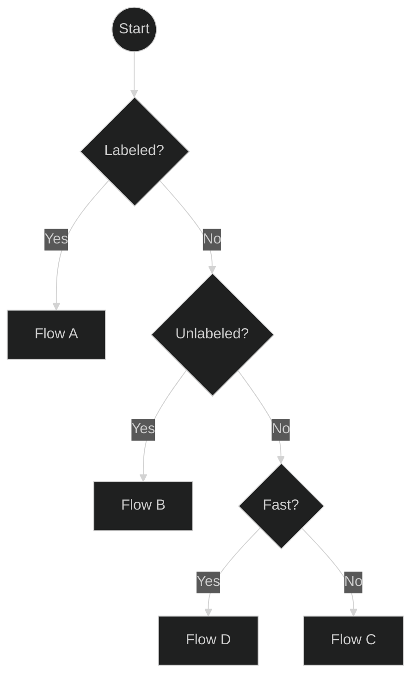
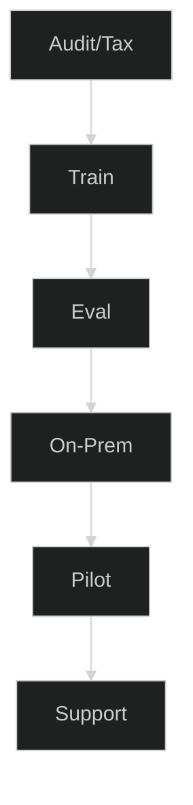
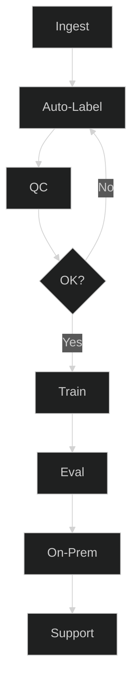
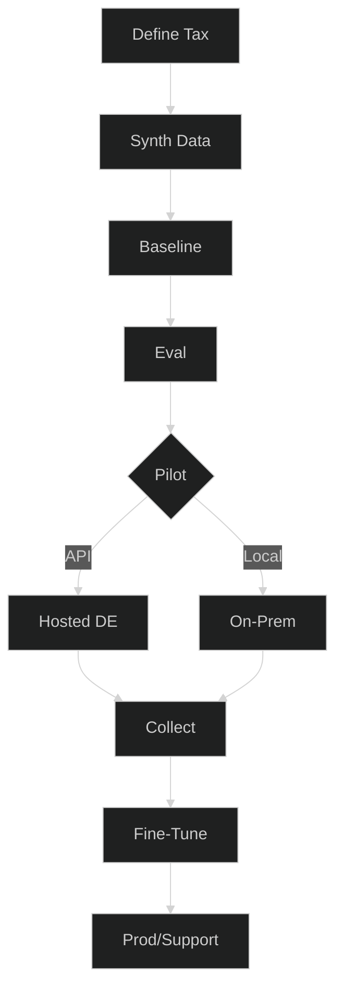
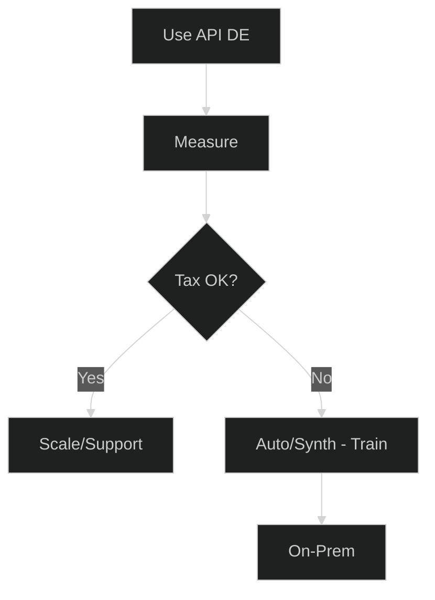
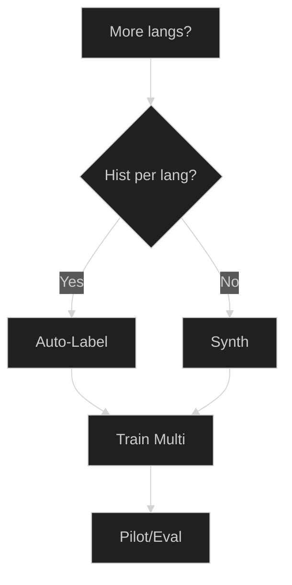
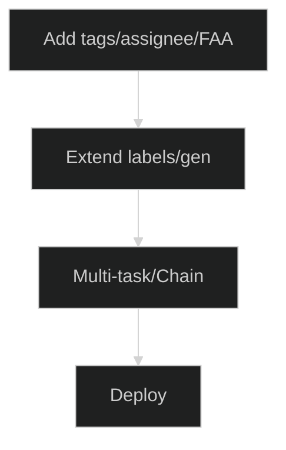

# Ticket Automation Planner — Wählen Sie Ihren besten Weg

Modernisieren Sie das Ticket-Routing schnell – egal, wo Sie starten. Dieser Planner hilft Ihnen, den richtigen Weg basierend auf Ihrer Datenrealität zu wählen: viele gelabelte Tickets, viele ungelabelte Tickets oder fast keine Daten. Jeder Weg endet in einem konkreten Service-Paket mit klaren Liefergegenständen und KPIs, sodass Sie ohne Rätselraten von der Idee → Pilot → Produktion gelangen.

**Für wen ist das:** IT-/Service-Teams auf Znuny/OTRS/OTOBO (oder ähnlich), die zuverlässige Queue-/Prioritäts-/Tag-Vorhersagen wünschen, entweder On-Prem oder über eine gehostete API.

**Was Sie erhalten:** kurzer Entscheidungsfluss, 4 umsetzbare Wege (A–D), Add-ons (mehrsprachig, zusätzliche Attribute), Gates/Metriken, um zu wissen, wann Sie bereit sind, und eine Checkliste zur Datenbereitschaft.

**So verwenden Sie diese Seite**

- Beginnen Sie mit der Ein-Bildschirm-Übersicht und beantworten Sie drei Fragen: **Gelabelt? → Ungelabelt? → Schnell?**
- Klicken Sie auf das Feld für **Flow A/B/C/D**, um zu seinen Schritten, Liefergegenständen und KPIs zu springen.
- Verwenden Sie die **Add-ons**, wenn Sie mehrere Sprachen oder mehr Ausgaben (Tags, Bearbeiter, erste Antwort) benötigen.
- Halten Sie die **Gates** streng (F1 pro Klasse + geschäftliche KPIs), damit Piloten in Produktionsvertrauen münden.

Fahren Sie nun mit dem Übersichtsdiagramm und den detaillierten Flows unten fort.
Gut – hier ist eine ausführlichere Beschreibung, die Sie unter Ihre Diagramme einfügen können. Ich habe sie überfliegbar gehalten, aber echte Anleitung und Schwellenwerte hinzugefügt, damit Leser sicher einen Flow wählen können.

Verstanden – ich behalte Ihre neuen kurzen Diagramme bei und füge jedem Abschnitt klaren, prägnanten Erklärungstext hinzu, damit der Artikel vollständig wirkt, während er dennoch leicht zu überfliegen ist.

---

## 0) Ein-Bildschirm-Übersicht

**So verwenden Sie diese Übersicht:**
Beginnen Sie oben, beantworten Sie die Fragen und folgen Sie dem Zweig zu Ihrem passenden Flow. Klicken Sie auf einen Flow, um seine Details zu sehen.

---

##  Flow A — Viele gelabelte Tickets

**Wann Sie diesen wählen sollten:**

- Sie haben bereits **Tausende von Tickets mit Queue-, Prioritäts- oder Tag-Labels**.
- Sie möchten ein **maßgeschneidert trainiertes** Modell für maximale Genauigkeit.

**Was in diesem Flow passiert:**

1. **Audit/Tax** — Label-Qualität, Klassenbalance und Namensgebung prüfen.
2. **Train** — Das Klassifikationsmodell mit Ihren Daten feinabstimmen.
3. **Eval** — Precision/Recall/F1 pro Klasse messen.
4. **On-Prem** — Innerhalb Ihrer eigenen Infrastruktur bereitstellen.
5. **Pilot** — In der Produktion mit Monitoring testen.
6. **Support** — Bei Bedarf iterieren und neu trainieren.

**Empfohlenes Paket:** Fine-Tune + On-Prem Install.

---

##  Flow B — Viele ungelabelte Tickets

**Wann Sie diesen wählen sollten:**

- Sie haben **große historische Ticket-Archive**, aber keine Labels.
- Sie können etwas menschliche Prüfzeit für Qualitätskontrollen einplanen.

**Was in diesem Flow passiert:**

1. **Ingest** — Tickets aus Ihrem System sammeln.
2. **Auto-Label** — LLM-unterstützte automatische Labeling verwenden.
3. **QC** — Stichproben prüfen & korrigieren.
4. **OK?** — Schleife, bis die Qualität den Schwellenwert erreicht.
5. **Train** — Mit dem kuratierten Set feinabstimmen.
6. **Eval / On-Prem / Support** — Wie in Flow A.

**Empfohlenes Paket:** Auto-Label + Fine-Tune.

---

##  Flow C — Wenige oder keine Tickets

**Wann Sie diesen wählen sollten:**

- Sie starten **von Grund auf** oder haben zu wenige Tickets zum Trainieren.
- Sie möchten eine **Cold-Start**-Lösung, um schnell live zu gehen.

**Was in diesem Flow passiert:**

1. **Define Tax** — Queues, Prioritäten, Ton festlegen.
2. **Synth Data** — Realistische Tickets generieren (DE/EN).
3. **Baseline** — Erstes Modell auf synthetischen Daten trainieren.
4. **Eval** — Leistung vor dem Rollout prüfen.
5. **Pilot** — Wählen Sie Hosted API für Geschwindigkeit oder On-Prem für Kontrolle.
6. **Collect** — Echte Tickets während des Piloten sammeln.
7. **Fine-Tune** — Reale + synthetische Daten zusammenführen.
8. **Prod/Support** — Live gehen mit fortlaufender Iteration.

**Empfohlenes Paket:** Synthetic Cold-Start.

---

##  Flow D — Schnellstart über Hosted API

**Wann Sie diesen wählen sollten:**

- Sie brauchen **sofort Ergebnisse**.
- Sie möchten Automatisierung ausprobieren, ohne zuerst zu trainieren.

**Was in diesem Flow passiert:**

1. **Use API DE** — Sofortige Klassifikation über gehostetes deutsches Modell.
2. **Measure** — Routing, SLA, Backlog-Auswirkung verfolgen.
3. **Tax OK?** — Wenn zufrieden, Nutzung skalieren; wenn nicht, zu Flow B oder C für Training gehen.

**Empfohlenes Paket:** Hosted API Pilot → Fine-Tune (optional).

---

## Optionale Add-ons

### Mehrsprachige Erweiterung

Fügen Sie Unterstützung für zusätzliche Sprachen über mehrsprachiges automatisches Labeling oder synthetische Generierung hinzu, dann trainieren und evaluieren Sie pro Sprache.

---

### Zusätzliche Attribute

Vorhersagen über Queues/Prioritäten hinaus – z.B. Tags, Bearbeiter oder First Answer Time – durch Erweiterung des Labelings und Training eines Multi-Task-Modells.
