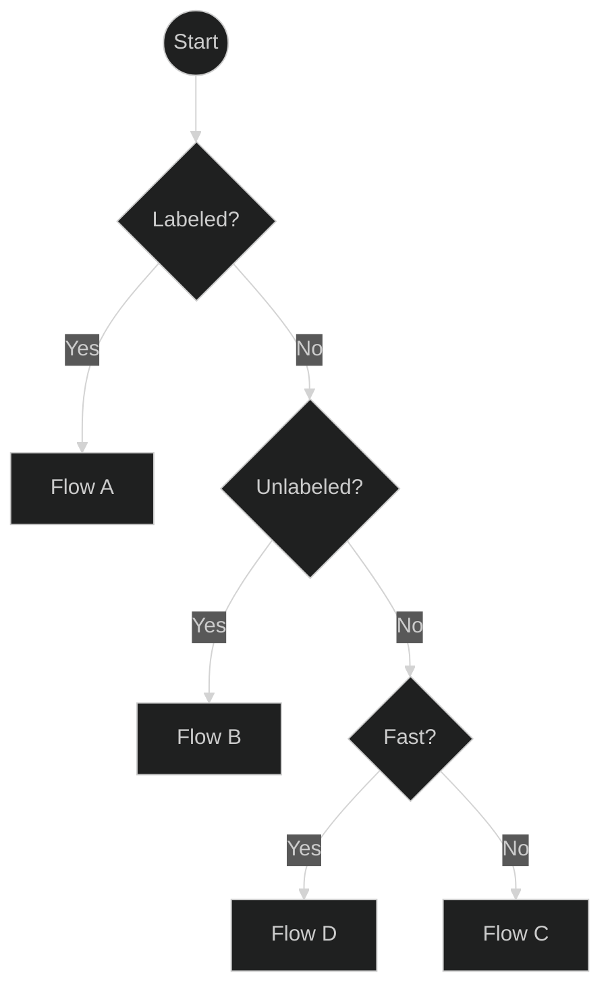
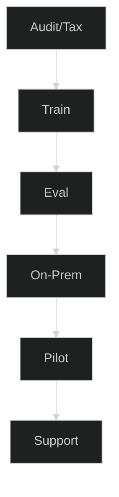
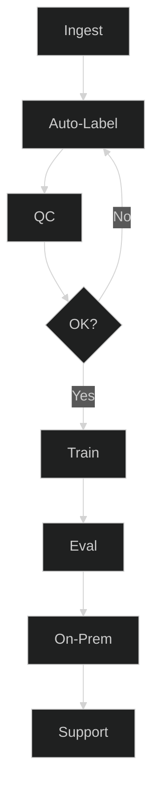
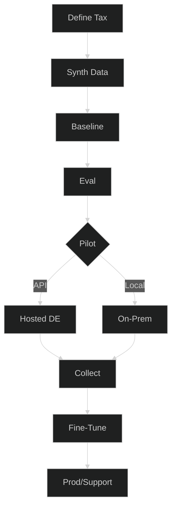
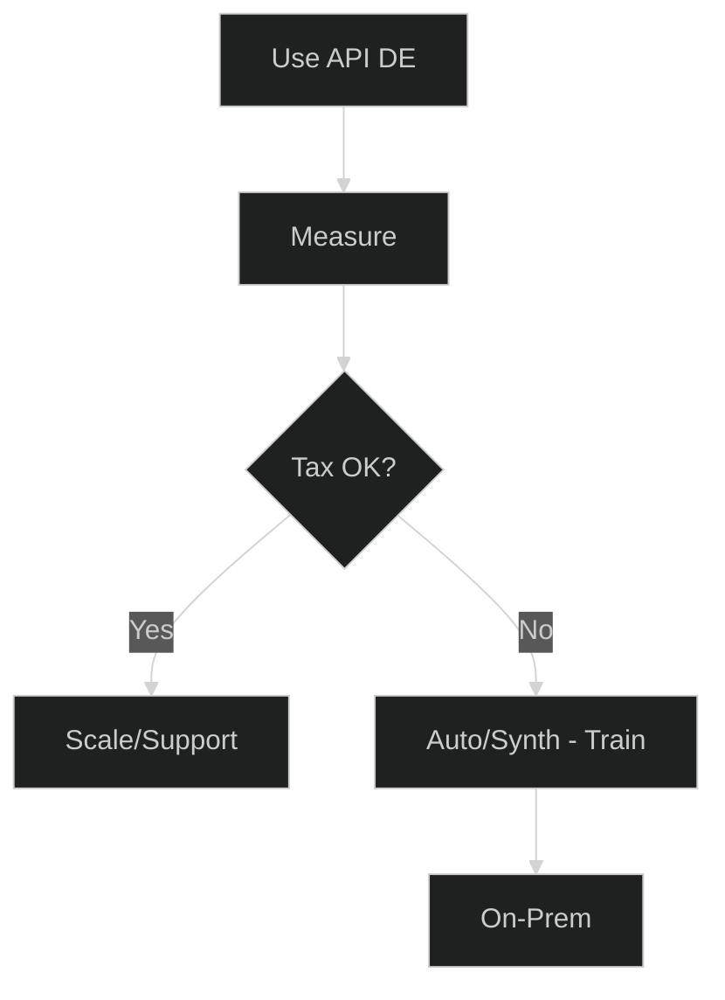
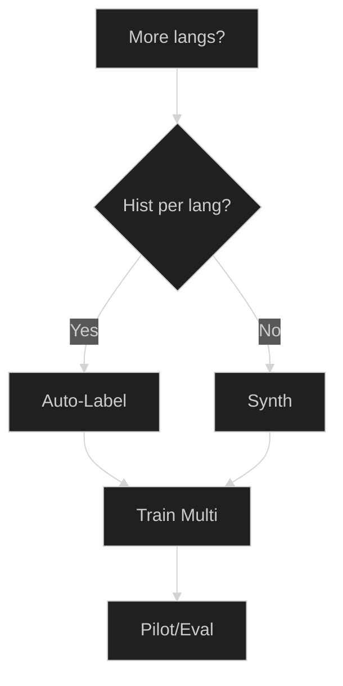
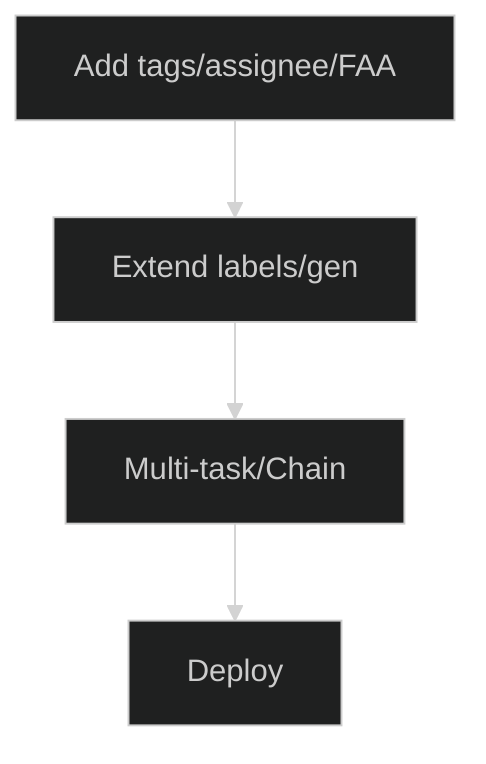

# Ticket-Automatisierungsplaner — Wählen Sie Ihren besten Pfad

Modernisieren Sie die Ticketweiterleitung schnell—egal, wo Sie beginnen. Dieser Planer hilft Ihnen, den richtigen Pfad basierend auf Ihrer Datenrealität zu wählen: viele gekennzeichnete Tickets, viele ungekennzeichnete Tickets oder fast keine Daten. Jeder Pfad endet in einem konkreten Service-Paket mit klaren Liefergegenständen und KPIs, sodass Sie von Idee → Pilot → Produktion ohne Rätselraten übergehen können.

**Für wen das ist:** IT/Service-Teams auf Znuny/OTRS/OTOBO (oder ähnlichen), die zuverlässige Vorhersagen für queue, priority, tag wünschen, entweder on-prem oder über eine gehostete API.

**Was Sie erhalten:** kurzen Entscheidungsfluss, 4 umsetzbare Pfade (A–D), Add-ons (mehrsprachig, zusätzliche Attribute), Gates/Metriken, um zu wissen, wann Sie bereit sind, und eine Datenbereitschafts-Checkliste.

**Wie Sie diese Seite verwenden**

- Beginnen Sie mit der Ein-Bildschirm-Übersicht und beantworten Sie drei Fragen: **Labeled? → Unlabeled? → Fast?**
- Klicken Sie auf das Feld für **Flow A/B/C/D**, um zu dessen Schritten, Liefergegenständen und KPIs zu springen.
- Verwenden Sie die **Add-ons**, wenn Sie mehrere Sprachen oder mehr Ausgaben (tags, assignee, first answer) benötigen.
- Halten Sie die **Gates** streng (per-class F1 + business KPIs), damit Piloten in Produktionsvertrauen übergehen.

Fahren Sie nun mit dem Übersichtsdiagramm und den detaillierten Abläufen unten fort. Schön—hier ist ein ausführlicherer Text, den Sie unter Ihre Diagramme einfügen können. Ich habe ihn übersichtlich gehalten, aber echte Anleitungen und Schwellenwerte hinzugefügt, damit Leser selbstbewusst einen Ablauf wählen können.

Verstanden — ich werde Ihre neuen kurzen Diagramme beibehalten und klaren, prägnanten Erklärungstext für jeden Abschnitt hinzufügen, damit der Artikel vollständig wirkt und dennoch leicht zu überfliegen ist.

---

## 0) Ein-Bildschirm-Übersicht

**Wie Sie diese Übersicht verwenden:**  
Beginnen Sie oben, beantworten Sie die Fragen und folgen Sie dem Zweig zu Ihrem passenden Ablauf. Klicken Sie auf einen Ablauf, um dessen Details zu sehen.

---

##  Flow A — Viele gekennzeichnete Tickets

**Wann Sie dies wählen sollten:**

- Sie haben bereits **tausende von Tickets mit queue, priority oder tag Labels**.
- Sie möchten ein **kundenspezifisch trainiertes** Modell für maximale Genauigkeit.

**Was in diesem Ablauf passiert:**

1. **Audit/Tax** — Überprüfen Sie die Label-Qualität, Klassenbalance und Benennung.
2. **Train** — Feinabstimmung des Klassifikationsmodells mit Ihren Daten.
3. **Eval** — Messen Sie die per-class Präzision/Recall/F1.
4. **On-Prem** — Deployment in Ihrer eigenen Infrastruktur.
5. **Pilot** — Testen Sie in der Produktion mit Monitoring.
6. **Support** — Iterieren und bei Bedarf neu trainieren.

**Empfohlenes Paket:** Fine-Tune + On-Prem Install.

---

##  Flow B — Viele ungekennzeichnete Tickets

**Wann Sie dies wählen sollten:**

- Sie haben **große historische Ticket-Archive**, aber keine Labels.
- Sie können etwas Zeit für menschliche Überprüfungen zur Qualitätskontrolle einplanen.

**Was in diesem Ablauf passiert:**

1. **Ingest** — Sammeln Sie Tickets aus Ihrem System.
2. **Auto-Label** — Verwenden Sie LLM-unterstützte Auto-Labeling.
3. **QC** — Stichproben prüfen & Muster korrigieren.
4. **OK?** — Schleife, bis die Qualität den Schwellenwert erreicht.
5. **Train** — Feinabstimmung mit dem kuratierten Satz.
6. **Eval / On-Prem / Support** — Wie bei Flow A.

**Empfohlenes Paket:** Auto-Label + Fine-Tune.

---

##  Flow C — Wenige oder keine Tickets

**Wann Sie dies wählen sollten:**

- Sie beginnen **von Grund auf** oder haben zu wenige Tickets zum Trainieren.
- Sie möchten eine **cold-start** Lösung, um schnell live zu gehen.

**Was in diesem Ablauf passiert:**

1. **Define Tax** — Entscheiden Sie über queues, priorities, Ton.
2. **Synth Data** — Generieren Sie realistische Tickets (DE/EN).
3. **Baseline** — Trainieren Sie das Anfangsmodell mit synthetischen Daten.
4. **Eval** — Prüfen Sie die Leistung vor dem Rollout.
5. **Pilot** — Wählen Sie Hosted API für Geschwindigkeit oder On-Prem für Kontrolle.
6. **Collect** — Sammeln Sie reale Tickets während des Piloten.
7. **Fine-Tune** — Kombinieren Sie reale + synthetische Daten.
8. **Prod/Support** — Gehen Sie live mit fortlaufender Iteration.

**Empfohlenes Paket:** Synthetic Cold-Start.

---

##  Flow D — Schnellstart über Hosted API

**Wann Sie dies wählen sollten:**

- Sie benötigen **Ergebnisse sofort**.
- Sie möchten die Automatisierung zuerst ohne Training ausprobieren.

**Was in diesem Ablauf passiert:**

1. **Use API DE** — Sofortige Klassifizierung über das gehostete deutsche Modell.
2. **Measure** — Verfolgen Sie Routing, SLA, Backlog-Auswirkungen.
3. **Tax OK?** — Wenn zufrieden, Nutzung skalieren; wenn nicht, zu Flow B oder C für Training gehen.

**Empfohlenes Paket:** Hosted API Pilot → Fine-Tune (optional).

---

## Optionale Add-ons

### Mehrsprachige Erweiterung

Fügen Sie Unterstützung für zusätzliche Sprachen über mehrsprachiges Auto-Labeling oder synthetische Erzeugung hinzu, dann trainieren und pro Locale evaluieren.

### Zusätzliche Attribute

Sagen Sie mehr als queues/priorities voraus — z.B. tags, assignee oder first answer time — indem Sie das Labeling erweitern und ein Multi-Task-Modell trainieren.