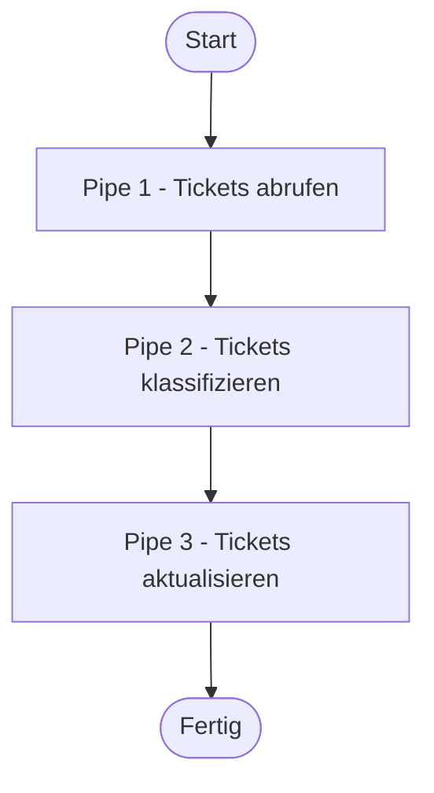
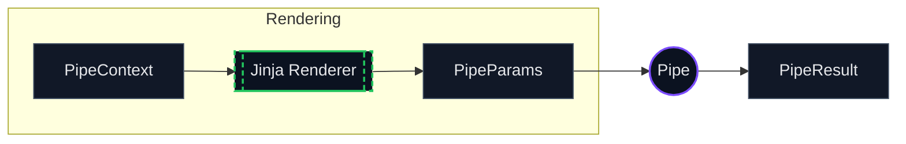
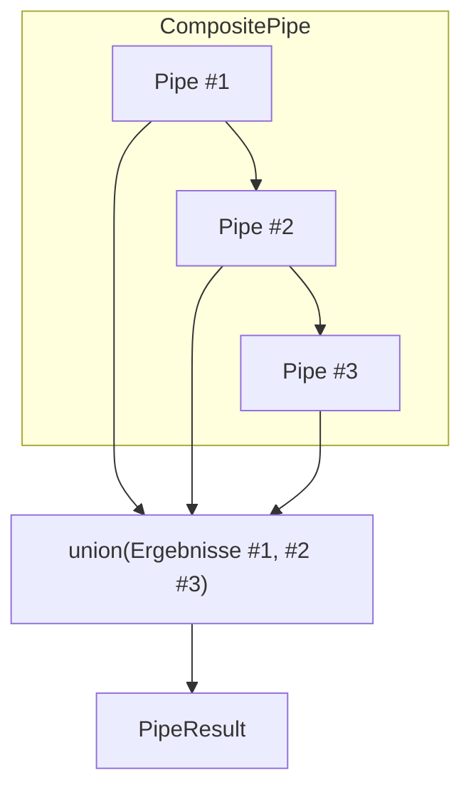
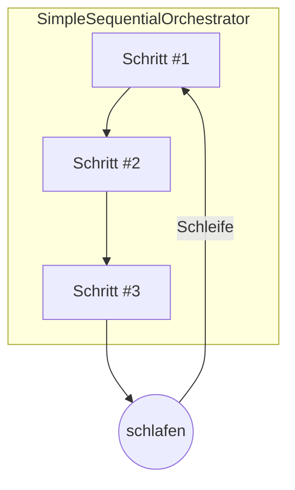
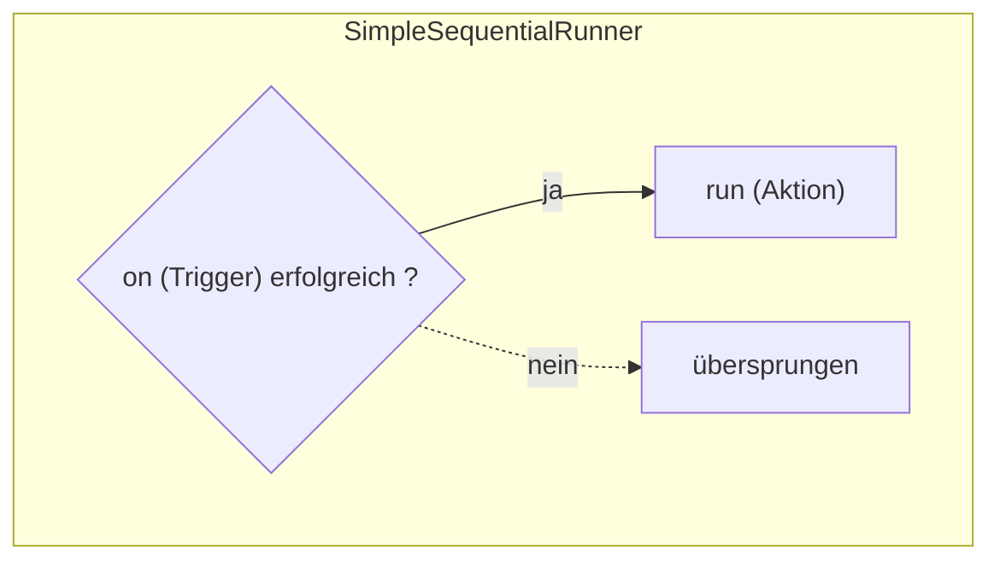

# Pipe-System

Pipes sind die grundlegenden Verarbeitungseinheiten in Open Ticket AI. Jede Pipe führt eine spezifische Aufgabe aus,
empfängt Kontext von
vorherigen Pipes, führt ihre Logik aus und gibt den aktualisierten Kontext weiter.

## Grundlegender Pipeline-Ablauf

Eine Pipeline ist eine Sequenz von Pipes, die nacheinander ausgeführt werden:



Jede Pipe:

1. Empfängt den `PipeContext` (enthält Ergebnisse vorheriger Pipes)
2. Führt ihre spezifische Aufgabe aus
3. Erstellt ein `PipeResult` mit Ausgabedaten

## Was ist eine Pipe?

Eine **Pipe** ist eine eigenständige Verarbeitungseinheit, die:

- Spezifische Geschäftslogik implementiert (Daten abrufen, klassifizieren, aktualisieren usw.)
- Eingabe über `PipeContext` erhält
- Ausgabe als `PipeResult` erzeugt



## Pipe-Typen

### Einfache Pipes

Atomare Verarbeitungseinheiten, die spezifische Geschäftslogik implementieren:

#### YAML-Beispiel

```yaml
- id: fetch_tickets
  use: open_ticket_ai.base:FetchTicketsPipe
  injects:
    ticket_system: 'otobo_znuny'
  params:
    search_criteria:
      queue:
        name: 'Support'
      limit: 10
```

#### Eigenschaften:

- Führt spezifische Logik aus
- Keine Kind-Pipes

#### Spezifische einfache Pipes:

- AddNotePipe — registryKey: base:AddNotePipe
- FetchTicketsPipe — registryKey: base:FetchTicketsPipe
- UpdateTicketPipe — registryKey: base:UpdateTicketPipe

### Expression Pipe (speziell)

Rendert einen Ausdruck und gibt diesen Wert zurück. Wenn es zu einem FailMarker gerendert wird, schlägt die Pipe fehl.
`registryKey: base:ExpressionPipe`

#### YAML-Beispiel

```yaml
- id: check_any_tickets
  use: 'base:ExpressionPipe'
  params:
    expression: >
      {{ fail() if (get_pipe_result('fetch_tickets','fetched_tickets')|length)==0 else 'ok' }}
```

---

### Zusammengesetzte Pipes

Orchestratoren, die Kind-Pipes enthalten und ausführen:

#### Flussdiagramm



#### YAML-Beispiel

<details>
<summary>Beispiel für zusammengesetzte Pipe</summary>

```yaml
- id: ticket_workflow
  use: open_ticket_ai.base:CompositePipe
  params:
    threshold: 0.8
  steps:
    - id: fetch
      use: open_ticket_ai.base:FetchTicketsPipe
      injects: { ticket_system: 'otobo_znuny' }
      params:
        search_criteria:
          queue: { name: 'Incoming' }
          limit: 10

    - id: classify
      use: otai_hf_local:HFLocalTextClassificationPipe
      params:
        model: 'bert-base-german-cased'
        text: "{{ get_pipe_result('fetch').data.fetched_tickets[0].subject }}"

    - id: update
      use: open_ticket_ai.base:UpdateTicketPipe
      injects: { ticket_system: 'otobo_znuny' }
      params:
        ticket_id: "{{ get_pipe_result('fetch').data.fetched_tickets[0].id }}"
        updated_ticket:
          queue:
            name: "{{ get_pipe_result('classify', 'predicted_queue') }}"
```

</details>

#### Eigenschaften

- Enthält `steps`-Liste von Kind-Pipe-Konfigurationen
- Führt Kinder sequentiell aus
- Führt Ergebnisse zusammen
- Kinder können über `parent.params` auf Eltern-Parameter zugreifen

**Zusammengesetzte Ausführung:**

1. **Für jeden Schritt**:
   - **Rendern**: Rendert Parameter mit Jinja2 unter Verwendung des aktuellen Kontexts
   - **Ausführen**: Führt die nächste Kind-Pipe mit gerenderten Parametern aus
   - **Schleife**: Fährt mit dem nächsten Schritt fort
2. **Finalisierung**:
   - **Vereinigung**: Führt alle Kindergebnisse zusammen unter Verwendung von
   - **Rückgabe**: Gibt den finalen aktualisierten Kontext zurück

### SimpleSequentialOrchestrator (speziell)

Führt seine `steps` **in einer Endlosschleife** aus. Es ist für Hintergrund-artige Zyklen gedacht. Es macht die Ergebnisse der Kind-Pipes **nicht** als ein einzelnes Pipe-Ergebnis verfügbar. `registryKey: base:SimpleSequentialOrchestrator`

#### Flussdiagramm



#### YAML-Beispiel

<details>
<summary>SimpleSequentialOrchestrator Beispiel</summary>

```yaml
- id: orchestrator
  use: 'base:SimpleSequentialOrchestrator'
  params:
    orchestrator_sleep: 'PT0.5S'
    exception_sleep: 'PT5S'
    always_retry: true
    steps:
      - id: tick
        use: 'base:IntervalTrigger'
        params: { interval: 'PT5S' }
      - id: fetch
        use: 'base:FetchTicketsPipe'
        injects: { ticket_system: 'otobo_znuny' }
        params:
          ticket_search_criteria: { queue: { name: 'Incoming' }, limit: 1 }
```

</details>

---

### SimpleSequentialRunner (speziell)

Hat zwei Parameter: `on` und `run` (beides sind Pipe-Konfigurationen). Wenn `on` **erfolgreich** ist, führt es `run` aus; andernfalls wird es übersprungen. `registryKey: base:SimpleSequentialRunner`

#### Flussdiagramm



#### YAML-Beispiel

```yaml
- id: run-when-triggered
  use: 'base:SimpleSequentialRunner'
  params:
    on:
      id: gate
      use: 'base:IntervalTrigger'
      params: { interval: 'PT60S' }
    run:
      id: do-something
      use: 'base:ExpressionPipe'
      params: { expression: 'Ausgelöster Lauf' }
```

## Kontextweitergabe zwischen Pipes

**Felddetails:**

- **`pipes`**: Enthält Ergebnisse aller zuvor ausgeführten Pipes, nach Pipe-ID geordnet
  - **Zugriff über `pipe_result('pipe_id')` in Templates**
  - Wird akkumuliert, wenn jede Pipe abgeschlossen ist
  - In CompositePipe: zusammengeführte Ergebnisse aller Kind-Schritte

- **`params`**: Parameter der aktuellen Pipe
  - Wird gesetzt, wenn die Pipe erstellt wird
  - Zugänglich über `params.*` in Templates
  - Für verschachtelte Pipes kann über `parent` auf die Elternreferenz verwiesen werden

- **`parent`**: Referenz auf Eltern-Parameter

## PipeResult-Struktur

Jede Pipe erzeugt ein `PipeResult`, das Ausführungsstatus und Daten enthält:

| Attribut       | Datentyp          | Beschreibung                                                                      |
| -------------- | ----------------- | --------------------------------------------------------------------------------- |
| **succeeded**  | true/false        | Ob die Pipe erfolgreich ohne Fehler abgeschlossen wurde                           |
| **data**       | Name:Wert-Paare   | Ausgabedaten, die von der Pipe für nachfolgende Pipes oder externe Systeme erzeugt wurden |
| _was_skipped_  | true/false        | Ob die Pipe aufgrund fehlgeschlagener Abhängigkeiten oder bedingter Ausführung übersprungen wurde |
| _message_      | TEXT              | Menschenlesbare Nachricht, die das Ergebnis oder Probleme beschreibt              |

Sie greifen auf diese Ergebnisse in den Parametern einer anderen Pipe mit diesen Funktionen zu. Derzeit gibt es keine Möglichkeit, was_skipped oder message zu lesen;

| Funktion          | Parameter                                         | Rückgabewert                                                     | Fehler, wenn…          |
| ----------------- | ------------------------------------------------- | --------------------------------------------------------------- | ---------------------- |
| `has_failed`      | `pipe_id: text`                                   | `True`, wenn das gegebene Pipe-Ergebnis als fehlgeschlagen markiert ist | Unbekannte Pipe-ID     |
| `get_pipe_result` | `pipe_id: text`, `data_key: text; default = value` | Wert, der im vorherigen Pipe-Ergebnis unter dem gegebenen `data_key` gespeichert ist | Pipe oder Schlüssel fehlt |

Wenn das Pipe-Ergebnis also beispielsweise ist:

```yaml
- id: ticket_fetcher
  result:
    succeeded: true
    data:
      fetched_tickets:
        - id: 123
          subject: 'Hilfe!'
        - id: 124
          subject: 'Ein weiteres Ticket'
```

Um auf die abgerufenen Tickets zuzugreifen, würden Sie verwenden:

```yaml
{ { get_pipe_result('ticket_fetcher', 'fetched_tickets') } }
```

Zurückgegeben wird:

```yaml
- id: 123
  subject: 'Hilfe!'
- id: 124
  subject: 'Ein weiteres Ticket'
```

Um auf den Betreff des ersten Tickets zuzugreifen, würden Sie verwenden:

```yaml
{ { (get_pipe_result('ticket_fetcher', 'fetched_tickets') | first)[ 'subject' ] }
```

Zurückgegeben wird:

```
Hilfe!
```

Um zu prüfen, ob die ticket_fetcher Pipe fehlgeschlagen ist, würden Sie verwenden:

```yaml
{ { has_failed('ticket_fetcher') } }
```

Zurückgegeben wird:

```
false
```

Die Erfolgsprüfung kann in Kombination mit fail() verwendet werden, um Wächter zu erstellen:

```yaml
- id: fail_no_tickets
  use: 'base:ExpressionPipe'
  params:
    expression: >
      {{ fail() if has_failed('ticket_fetcher' else 'ok' }}
```

Die Pipeline/der Flow würde an diesem Punkt die Ausführung stoppen, wenn die ticket_fetcher Pipe fehlgeschlagen ist.

## Pipe-Registry-Übersicht

| Name                         | registryKey                         | Parameter (Namen, kommagetrennt)                          |
| ---------------------------- | ----------------------------------- | -------------------------------------------------------- |
| AddNotePipe                  | `base:AddNotePipe`                  | ticket_id, note                                          |
| FetchTicketsPipe             | `base:FetchTicketsPipe`             | ticket_search_criteria                                   |
| UpdateTicketPipe             | `base:UpdateTicketPipe`             | ticket_id, updated_ticket                                |
| ClassificationPipe           | `base:ClassificationPipe`           | text, model_name, api_token                              |
| ExpressionPipe               | `base:ExpressionPipe`               | expression                                               |
| IntervalTrigger              | `base:IntervalTrigger`              | interval                                                 |
| SimpleSequentialRunner       | `base:SimpleSequentialRunner`       | on, run                                                  |
| SimpleSequentialOrchestrator | `base:SimpleSequentialOrchestrator` | orchestrator_sleep, exception_sleep, always_retry, steps |
| CompositePipe                | `base:CompositePipe`                | steps                                                    |

> Verwenden Sie diese Werte in Ihrem YAML als: `use: "<registryKey>"`.

---

## Pipe-Details

### AddNotePipe

Die Pipe `AddNotePipe` fügt einem gegebenen Ticket im Ticket-System eine strukturierte Notiz (Betreff/Text) hinzu.
Sie protokolliert eine kurze Vorschau der Notiz und schreibt sie über den Ticket-System-Service.

**registryKey:** `base:AddNotePipe`
Um sie zu "verwenden", setzen Sie `use` auf diesen registryKey.

```yaml
- id: 'my-add_note_pipe'
  use: 'base:AddNotePipe'
  params:
    ticket_id: '<Ticket-ID>'
    note:
      subject: '<Betreff>'
      body: '<Text>'
```

---

### FetchTicketsPipe

Die Pipe `FetchTicketsPipe` fragt Tickets vom Ticket-System unter Verwendung eines einheitlichen
`TicketSearchCriteria` (Queue, Limit, Offset usw.) ab und gibt sie als `fetched_tickets` zurück.

**registryKey:** `base:FetchTicketsPipe`

```yaml
- id: 'my-fetch_tickets'
  use: 'base:FetchTicketsPipe'
  params:
    ticket_search_criteria:
      queue:
        name: '<QueueName>'
      limit: 10
```

---

### UpdateTicketPipe

Die Pipe `UpdateTicketPipe` aktualisiert ein bestehendes Ticket anhand der ID unter Verwendung einer einheitlichen `UnifiedTicket`-
Nutzlast (z.B. Queue, Priorität, Felder). Gibt den Erfolgsstatus vom Ticket-System zurück.

**registryKey:** `base:UpdateTicketPipe`

```yaml
- id: 'my-update_ticket'
  use: 'base:UpdateTicketPipe'
  params:
    ticket_id: '<Ticket-ID>'
    updated_ticket:
      queue:
        name: '<QueueName>'
```

---

### ClassificationPipe

Die Pipe `ClassificationPipe` klassifiziert Eingabetext unter Verwendung eines konfigurierten `ClassificationService` und
Modells und gibt Label, Konfidenz und Scores (falls verfügbar) zurück.

**registryKey:** `base:ClassificationPipe`

```yaml
- id: 'my-classify'
  use: 'base:ClassificationPipe'
  injects: { classification_service: 'hf_local' }
  params:
    text: '{{ some_text }}'
    model_name: 'softoft/otai-queue-de-bert-v1'
    api_token: '{{ env.HF_TOKEN | default(None) }}'
```

---

### ExpressionPipe

Die Pipe `ExpressionPipe` gibt den Wert von `expression` zurück; wenn er zu einem `FailMarker` ausgewertet wird, schlägt die
Pipe fehl (nützlich für Kontrollfluss/Wächter).

**registryKey:** `base:ExpressionPipe`

```yaml
- id: 'my-expression'
  use: 'base:ExpressionPipe'
  params:
    expression: "{{ fail() if condition else 'ok' }}"
```

---

### IntervalTrigger

Die Pipe `IntervalTrigger` steuert die nachgelagerte Ausführung basierend auf einem Zeitintervall; sie ist erfolgreich, sobald das
Intervall seit dem letzten Trigger vergangen ist, andernfalls schlägt sie fehl.

**registryKey:** `base:IntervalTrigger`

```yaml
- id: 'my-interval'
  use: 'base:IntervalTrigger'
  params:
    interval: 'PT60S'
```

---

### SimpleSequentialRunner

Die Pipe `SimpleSequentialRunner` führt `on` aus und nur, wenn es erfolgreich ist, führt es `run` aus. Es ist ein minimaler
Zwei-Schritt-Kontroll-Runner.

**registryKey:** `base:SimpleSequentialRunner`

```yaml
- id: 'my-simple_runner'
  use: 'base:SimpleSequentialRunner'
  params:
    on:
      id: 'interval'
      use: 'base:IntervalTrigger'
      params: { interval: 'PT5M' }
    run:
      id: 'do-something'
      use: 'base:ExpressionPipe'
      params: { expression: 'los!' }
```

---

### SimpleSequentialOrchestrator

Die Pipe `SimpleSequentialOrchestrator` läuft endlos in einer Schleife und führt `steps` in jeder Runde der Reihe nach aus; sie
schläft optional zwischen den Runden und bei Ausnahmen und kann automatisch wiederholen.

**registryKey:** `base:SimpleSequentialOrchestrator`
Für `SimpleSequentialOrchestrator` müssen Sie keine Parameter setzen, da alle Attribute optional sind.

```yaml
- id: 'my-orchestrator'
  use: 'base:SimpleSequentialOrchestrator'
  params:
    orchestrator_sleep: 'PT0.5S'
    exception_sleep: 'PT5S'
    always_retry: true
    steps:
      - id: 'step-1'
        use: 'base:ExpressionPipe'
        params: { expression: 'ok' }
```

---

### CompositePipe

Die Pipe `CompositePipe` führt ihre `steps` sequentiell aus, stoppt beim ersten Fehler und gibt
eine Vereinigung der vorherigen Ergebnisse zurück. Sie ist der grundlegende Baustein für mehrstufige Flows.

**registryKey:** `base:CompositePipe`
Für `CompositePipe` müssen Sie keine Parameter setzen, da alle Attribute optional sind.

```yaml
- id: 'my-composite'
  use: 'base:CompositePipe'
  params:
    steps:
      - id: 'one'
        use: 'base:ExpressionPipe'
        params: { expression: 'erster' }
      - id: 'two'
        use: 'base:ExpressionPipe'
        params: { expression: 'zweiter' }
```