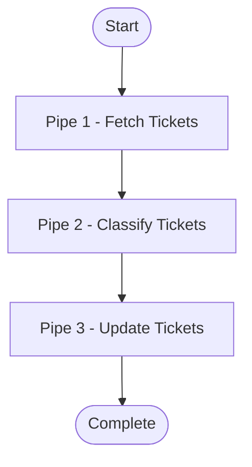
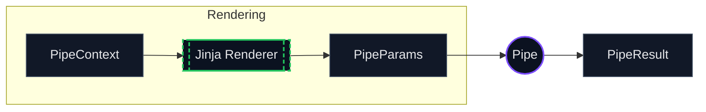
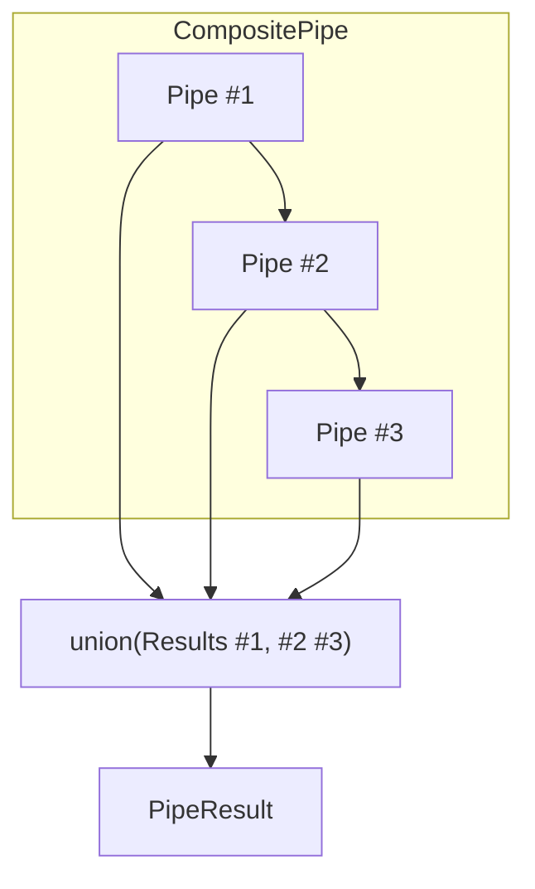
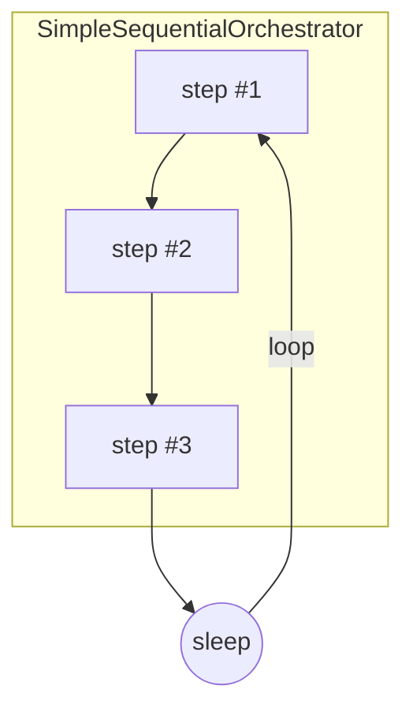
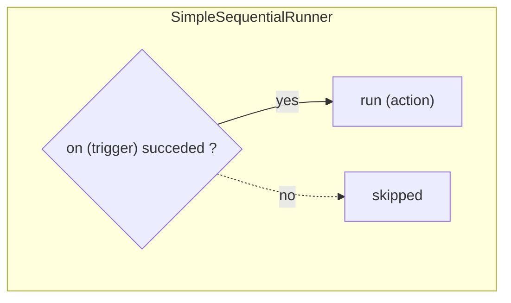

# Pipe-System

Pipes sind die grundlegenden Verarbeitungseinheiten in Open Ticket AI. Jeder Pipe führt eine spezifische Aufgabe aus,
erhält Kontext von
vorherigen Pipes, führt seine Logik aus und gibt den aktualisierten Kontext weiter.

## Grundlegender Pipeline-Fluss

Eine Pipeline ist eine Sequenz von Pipes, die nacheinander ausgeführt werden:



Each pipe:

1. Empfängt den `PipeContext` (enthält Ergebnisse vorheriger Pipes)
2. Führt seine spezifische Aufgabe aus
3. Erstellt ein `PipeResult` mit Ausgabedaten

## Was ist ein Pipe?

Ein **pipe** ist eine eigenständige Verarbeitungseinheit, die:

- Implementiert spezifische Geschäftslogik (Daten abrufen, klassifizieren, aktualisieren usw.)
- Empfängt Eingaben über `PipeContext`
- Erzeugt Ausgabe als `PipeResult`



## Pipe-Typen

### Einfache Pipes

Atomare Verarbeitungseinheiten, die spezifische Geschäftslogik implementieren:

#### YAML-Beispiel

```yaml
- id: fetch_tickets
  use: open_ticket_ai.base:FetchTicketsPipe
  injects:
    ticket_system: 'otobo_znuny'
  params:
    search_criteria:
      queue:
        name: 'Support'
      limit: 10
```

#### Eigenschaften:

- Führt spezifische Logik aus
- Keine Kind-Pipes

#### Spezifische einfache Pipes:

- AddNotePipe — registryKey: base:AddNotePipe
- FetchTicketsPipe — registryKey: base:FetchTicketsPipe
- UpdateTicketPipe — registryKey: base:UpdateTicketPipe

### Expression Pipe (speziell)

Rendert einen Ausdruck und gibt diesen Wert zurück. Wenn er zu einem FailMarker rendert, schlägt die Pipe fehl.
`registryKey: base:ExpressionPipe`

#### YAML-Beispiel

```yaml
- id: check_any_tickets
  use: 'base:ExpressionPipe'
  params:
    expression: >
      {{ fail() if (get_pipe_result('fetch_tickets','fetched_tickets')|length)==0 else 'ok' }}
```

---

### Composite Pipes

Orchestratoren, die Kind-Pipes enthalten und ausführen:

#### Flussdiagramm



#### YAML-Beispiel

<details>
<summary>Composite Pipe Beispiel</summary>

```yaml
- id: ticket_workflow
  use: open_ticket_ai.base:CompositePipe
  params:
    threshold: 0.8
  steps:
    - id: fetch
      use: open_ticket_ai.base:FetchTicketsPipe
      injects: { ticket_system: 'otobo_znuny' }
      params:
        search_criteria:
          queue: { name: 'Incoming' }
          limit: 10

    - id: classify
      use: otai_hf_local:HFLocalTextClassificationPipe
      params:
        model: 'bert-base-german-cased'
        text: "{{ get_pipe_result('fetch').data.fetched_tickets[0].subject }}"

    - id: update
      use: open_ticket_ai.base:UpdateTicketPipe
      injects: { ticket_system: 'otobo_znuny' }
      params:
        ticket_id: "{{ get_pipe_result('fetch').data.fetched_tickets[0].id }}"
        updated_ticket:
          queue:
            name: "{{ get_pipe_result('classify', 'predicted_queue') }}"
```

</details>

#### Eigenschaften

- Enthält eine `steps`-Liste von Kind-Pipe-Konfigurationen
- Führt Kind-Pipes sequenziell aus
- Führt Ergebnisse zusammen
- Kind-Pipes können über `parent.params` auf Eltern-Parameter zugreifen

**Composite Execution:**

1. **Für jeden Schritt**:
   - **Rendern**: Rendert Params mit Jinja2 unter Verwendung des aktuellen Kontextes
   - **Ausführen**: Führt die nächste Kind-Pipe mit gerenderten Params aus
   - **Schleife**: Weiter zum nächsten Schritt
2. **Abschluss**:
   - **Union**: Fügt alle Kind-Ergebnisse zusammen mittels
   - **Rückgabe**: Gibt den final aktualisierten Kontext zurück

### SimpleSequentialOrchestrator (speziell)

Führt seine `steps` **in einer Endlosschleife** aus. Es dient Hintergrund‑Zyklen. Es **exponiert** die Ergebnisse der Kind‑Pipes nicht als einzelnes Pipe‑Ergebnis. `registryKey: base:SimpleSequentialOrchestrator`

#### Flussdiagramm



#### YAML-Beispiel

<details>
<summary>SimpleSequentialOrchestrator Beispiel</summary>

```yaml
- id: orchestrator
  use: 'base:SimpleSequentialOrchestrator'
  params:
    orchestrator_sleep: 'PT0.5S'
    exception_sleep: 'PT5S'
    always_retry: true
    steps:
      - id: tick
        use: 'base:IntervalTrigger'
        params: { interval: 'PT5S' }
      - id: fetch
        use: 'base:FetchTicketsPipe'
        injects: { ticket_system: 'otobo_znuny' }
        params:
          ticket_search_criteria: { queue: { name: 'Incoming' }, limit: 1 }
```

</details>

### SimpleSequentialRunner (speziell)

Hat zwei Params: `on` und `run` (beide sind Pipe‑Konfigurationen). Wenn `on` **erfolgreich** ist, wird `run` ausgeführt; andernfalls wird übersprungen. `registryKey: base:SimpleSequentialRunner`

#### Flussdiagramm



#### YAML-Beispiel

```yaml
- id: run-when-triggered
  use: 'base:SimpleSequentialRunner'
  params:
    on:
      id: gate
      use: 'base:IntervalTrigger'
      params: { interval: 'PT60S' }
    run:
      id: do-something
      use: 'base:ExpressionPipe'
      params: { expression: 'Triggered run' }
```

## Kontextweitergabe zwischen Pipes

**Felddetails:**

- **`pipes`**: Enthält Ergebnisse aller zuvor ausgeführten Pipes, indiziert nach Pipe‑ID
  - **Zugriff über `pipe_result('pipe_id')` in Templates**
  - Akkumuliert, sobald jede Pipe abgeschlossen ist
  - In CompositePipe: zusammengeführte Ergebnisse aller Kind‑Schritte

- **`params`**: Parameter der aktuellen Pipe
  - Werden beim Erzeugen der Pipe gesetzt
  - Zugänglich über `params.*` in Templates
  - Für verschachtelte Pipes kann auf den Eltern‑Parameter via `parent` verwiesen werden

- **`parent`**: Referenz zu den Eltern‑Parametern

## PipeResult‑Struktur

Jede Pipe erzeugt ein `PipeResult`, das das Ausführungsergebnis und Daten enthält:

| Attribut      | Datentyp         | Beschreibung                                                                      |
| ------------- | ---------------- | -------------------------------------------------------------------------------- |
| **succeeded** | true/false       | Ob die Pipe erfolgreich ohne Fehler abgeschlossen wurde                           |
| **data**      | name:value‑Paare | Ausgabedaten, die von der Pipe erzeugt wurden und von nachfolgenden Pipes oder externen Systemen verwendet werden können |
| _was_skipped_ | true/false       | Ob die Pipe aufgrund fehlgeschlagener Abhängigkeiten oder bedingter Ausführung übersprungen wurde |
| _message_     | TEXT             | Menschlich lesbare Nachricht, die das Ergebnis oder etwaige Probleme beschreibt    |

Sie greifen in den Params einer anderen Pipe mit diesen Funktionen auf diese Ergebnisse zu. Derzeit gibt es keine Möglichkeit, `was_skipped` oder `message` auszulesen;

| Funktion          | Parameter                                         | Rückgabe                                                     | Fehler, wenn…          |
| ----------------- | -------------------------------------------------- | ----------------------------------------------------------- | ---------------------- |
| `has_failed`      | `pipe_id: text`                                    | `True` wenn das angegebene Pipe‑Ergebnis als fehlgeschlagen markiert ist | Unbekannte Pipe‑ID    |
| `get_pipe_result` | `pipe_id: text`, `data_key: text; default = value` | Wert, der im vorherigen Pipe‑Ergebnis unter dem angegebenen `data_key` gespeichert ist | Pipe oder Schlüssel fehlt |

So zum Beispiel, wenn piperesult ist

```yaml
- id: ticket_fetcher
  result:
    succeeded: true
    data:
      fetched_tickets:
        - id: 123
          subject: 'Help me!'
        - id: 124
          subject: 'Another ticket'
```

Um auf die abgerufenen Tickets zuzugreifen, würden Sie verwenden:

```yaml
{ { get_pipe_result('ticket_fetcher', 'fetched_tickets') } }
```

Rückgabe:

```yaml
- id: 123
  subject: 'Help me!'
- id: 124
  subject: 'Another ticket'
```

Um auf den Betreff des ersten Tickets zuzugreifen, würden Sie verwenden:

```yaml
{ { (get_pipe_result('ticket_fetcher', 'fetched_tickets') | first)[ 'subject' ] }
```

Rückgabe:

```
Help me!
```

Um zu prüfen, ob die `ticket_fetcher`‑Pipe fehlgeschlagen ist, würden Sie verwenden:

```yaml
{ { has_failed('ticket_fetcher') } }
```

Rückgabe:

```
false
```

Die Erfolgskontrolle kann in Kombination mit `fail()` verwendet werden, um Guard‑Bedingungen zu erstellen:

```yaml
- id: fail_no_tickets
  use: 'base:ExpressionPipe'
  params:
    expression: >
      {{ fail() if has_failed('ticket_fetcher' else 'ok' }}
```

Die Pipeline/FLow würde an dieser Stelle die Ausführung stoppen, wenn die `ticket_fetcher`‑Pipe fehlgeschlagen ist.

## Pipe‑Registry‑Übersicht

| Name                         | registryKey                         | Params (Namen, kommagetrennt)                          |
| ---------------------------- | ----------------------------------- | ------------------------------------------------------ |
| AddNotePipe                  | `base:AddNotePipe`                  | ticket_id, note                                        |
| FetchTicketsPipe             | `base:FetchTicketsPipe`             | ticket_search_criteria                                 |
| UpdateTicketPipe             | `base:UpdateTicketPipe`             | ticket_id, updated_ticket                              |
| ClassificationPipe           | `base:ClassificationPipe`           | text, model_name, api_token                            |
| ExpressionPipe               | `base:ExpressionPipe`               | expression                                             |
| IntervalTrigger              | `base:IntervalTrigger`              | interval                                               |
| SimpleSequentialRunner       | `base:SimpleSequentialRunner`       | on, run                                                |
| SimpleSequentialOrchestrator | `base:SimpleSequentialOrchestrator` | orchestrator_sleep, exception_sleep, always_retry, steps |
| CompositePipe                | `base:CompositePipe`                | steps                                                  |

> Verwenden Sie diese Werte in Ihrem YAML wie: `use: "<registryKey>"`.

## Pipe‑Details

### AddNotePipe

Der Pipe `AddNotePipe` fügt einem angegebenen Ticket im Ticketsystem eine strukturierte Notiz (Betreff/Body) hinzu. Er protokolliert eine kurze Vorschau der Notiz und schreibt sie über den Ticket‑System‑Service.

**registryKey:** `base:AddNotePipe`
Um ihn zu „verwenden“, setzen Sie `use` auf diesen registryKey.

```yaml
- id: 'my-add_note_pipe'
  use: 'base:AddNotePipe'
  params:
    ticket_id: '<ticket id>'
    note:
      subject: '<subject>'
      body: '<body>'
```

### FetchTicketsPipe

Der Pipe `FetchTicketsPipe` fragt Tickets aus dem Ticketsystem mittels einer einheitlichen
`TicketSearchCriteria` (Queue, Limit, Offset usw.) ab und gibt sie als `fetched_tickets` zurück.

**registryKey:** `base:FetchTicketsPipe`

```yaml
- id: 'my-fetch_tickets'
  use: 'base:FetchTicketsPipe'
  params:
    ticket_search_criteria:
      queue:
        name: '<QueueName>'
      limit: 10
```

### UpdateTicketPipe

Der Pipe `UpdateTicketPipe` aktualisiert ein bestehendes Ticket per ID mittels einer einheitlichen `UnifiedTicket`‑Payload (z. B. Queue, Priorität, Felder). Gibt den Erfolgsstatus vom Ticketsystem zurück.

**registryKey:** `base:UpdateTicketPipe`

```yaml
- id: 'my-update_ticket'
  use: 'base:UpdateTicketPipe'
  params:
    ticket_id: '<ticket id>'
    updated_ticket:
      queue:
        name: '<QueueName>'
```

### ClassificationPipe

Der Pipe `ClassificationPipe` klassifiziert Eingabetext mithilfe eines konfigurierten `ClassificationService` und
Modells und gibt Label, Confidence und Scores (falls verfügbar) zurück.

**registryKey:** `base:ClassificationPipe`

```yaml
- id: 'my-classify'
  use: 'base:ClassificationPipe'
  injects: { classification_service: 'hf_local' }
  params:
    text: '{{ some_text }}'
    model_name: 'softoft/otai-queue-de-bert-v1'
    api_token: '{{ env.HF_TOKEN | default(None) }}'
```

### ExpressionPipe

Der Pipe `ExpressionPipe` gibt den Wert von `expression` zurück; wenn er zu einem `FailMarker` evaluiert, schlägt die
Pipe fehl (nützlich für Kontrollfluss/Guards).

**registryKey:** `base:ExpressionPipe`

```yaml
- id: 'my-expression'
  use: 'base:ExpressionPipe'
  params:
    expression: "{{ fail() if condition else 'ok' }}"
```

### IntervalTrigger

Der Pipe `IntervalTrigger` steuert die nachgelagerte Ausführung basierend auf einem Zeitintervall; er schlägt erfolgreich, sobald das Intervall seit dem letzten Trigger verstrichen ist, andernfalls schlägt er fehl.

**registryKey:** `base:IntervalTrigger`

```yaml
- id: 'my-interval'
  use: 'base:IntervalTrigger'
  params:
    interval: 'PT60S'
```

### SimpleSequentialRunner

Der Pipe `SimpleSequentialRunner` führt `on` aus und, nur wenn dieser erfolgreich ist, führt er `run` aus. Es ist ein minimaler
Zweistufen‑Kontroll‑Runner.

**registryKey:** `base:SimpleSequentialRunner`

```yaml
- id: 'my-simple_runner'
  use: 'base:SimpleSequentialRunner'
  params:
    on:
      id: 'interval'
      use: 'base:IntervalTrigger'
      params: { interval: 'PT5M' }
    run:
      id: 'do-something'
      use: 'base:ExpressionPipe'
      params: { expression: 'go!' }
```

### SimpleSequentialOrchestrator

Der Pipe `SimpleSequentialOrchestrator` führt `steps` endlos in Reihenfolge aus; er schläft optional zwischen Zyklen und bei Ausnahmen und kann automatisch neu versuchen.

**registryKey:** `base:SimpleSequentialOrchestrator`
Für `SimpleSequentialOrchestrator` müssen Sie keine Params setzen, da alle Attribute optional sind.

```yaml
- id: 'my-orchestrator'
  use: 'base:SimpleSequentialOrchestrator'
  params:
    orchestrator_sleep: 'PT0.5S'
    exception_sleep: 'PT5S'
    always_retry: true
    steps:
      - id: 'step-1'
        use: 'base:ExpressionPipe'
        params: { expression: 'ok' }
```

### CompositePipe

Der Pipe `CompositePipe` führt seine `steps` sequenziell aus, stoppt beim ersten Fehler und gibt eine Union vorheriger Ergebnisse zurück. Es ist das Grundbaustein‑Element für mehrstufige Abläufe.

**registryKey:** `base:CompositePipe`
Für `CompositePipe` müssen Sie keine Params setzen, da alle Attribute optional sind.

```yaml
- id: 'my-composite'
  use: 'base:CompositePipe'
  params:
    steps:
      - id: 'one'
        use: 'base:ExpressionPipe'
        params: { expression: 'first' }
      - id: 'two'
        use: 'base:ExpressionPipe'
        params: { expression: 'second' }
```