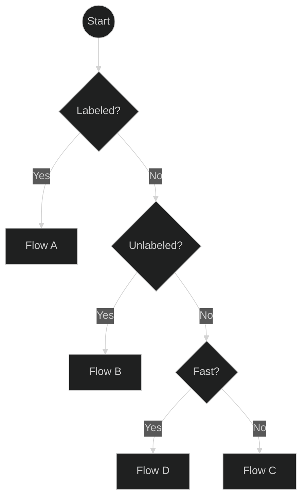
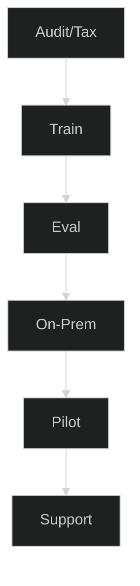
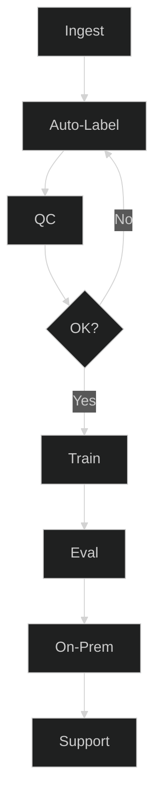
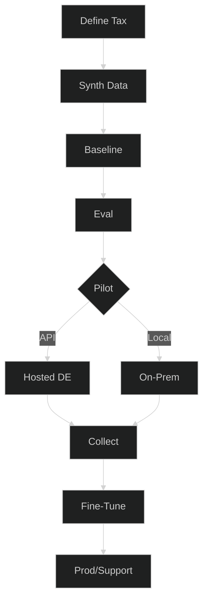
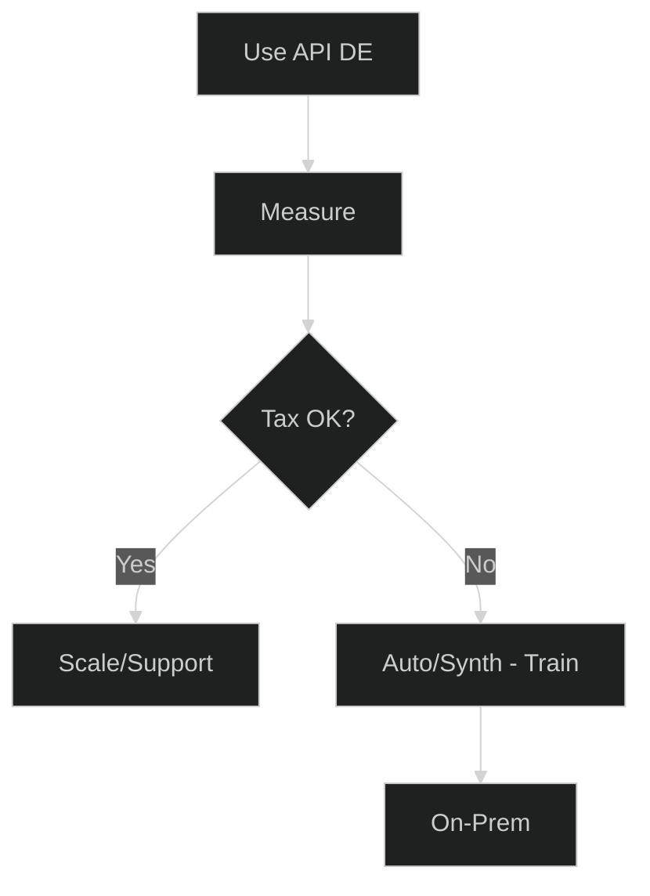
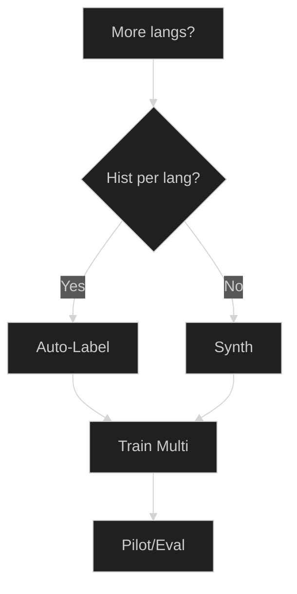
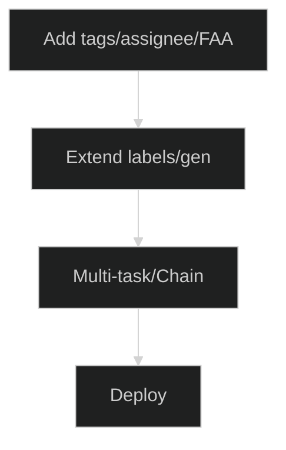

# Planer für Ticket-Automatisierung – Wählen Sie Ihren besten Weg

Modernisieren Sie das Ticket-Routing schnell – egal, wo Sie anfangen. Dieser Planer hilft Ihnen, den richtigen Weg basierend auf Ihrer Datenlage zu wählen: viele gelabelte Tickets, viele ungelabelte Tickets oder fast keine Daten. Jeder Weg führt zu einem konkreten Servicepaket mit klaren Ergebnissen und KPIs, sodass Sie ohne Raten von der Idee über das Pilotprojekt bis zum Produktivbetrieb gelangen.

**Für wen ist das?** IT-/Service-Teams, die Znuny/OTRS/OTOBO (oder ähnliche Systeme) nutzen und zuverlässige Vorhersagen für Warteschlangen, Prioritäten oder Tags benötigen – entweder On-Premise oder über eine gehostete API.

**Was Sie erhalten:** Einen kurzen Entscheidungsfluss, 4 umsetzbare Pfade (A–D), Add-ons (mehrsprachig, zusätzliche Attribute), Gates/Metriken zur Erfolgsmessung und eine Checkliste zur Datenbereitschaft.

**So verwenden Sie diese Seite**

* Beginnen Sie mit der Übersicht und beantworten Sie drei Fragen: **Gelabelt? → Ungelabelt? → Schnell?**
* Klicken Sie auf das Feld für **Flow A/B/C/D**, um zu den jeweiligen Schritten, Ergebnissen und KPIs zu springen.
* Nutzen Sie die **Add-ons**, wenn Sie mehrere Sprachen oder weitere Ausgaben (Tags, Bearbeiter, erste Antwort) benötigen.
* Halten Sie die **Gates** eng (F1-Score pro Klasse + Business-KPIs), damit Pilotprojekte zu verlässlichen Produktionsergebnissen führen.

Fahren Sie nun mit dem Übersichtsdiagramm und den detaillierten Abläufen unten fort.
Super – hier ist eine ausführlichere Beschreibung, die Sie unter Ihre Diagramme einfügen können. Ich habe sie überfliegbar gehalten, aber echte Anleitungen und Schwellenwerte hinzugefügt, damit die Leser zuversichtlich einen Ablauf wählen können.

Verstanden – ich behalte Ihre neuen kurzen Diagramme bei und füge für jeden Abschnitt klare, prägnante Erläuterungen hinzu, damit der Artikel vollständig wirkt und trotzdem leicht zu überfliegen ist.

---

## 0) Übersicht

**So verwenden Sie diese Übersicht:**
Beginnen Sie oben, beantworten Sie die Fragen und folgen Sie dem Zweig zu Ihrem passenden Flow. Klicken Sie auf einen Flow, um die Details anzuzeigen.

---

##  Flow A – Viele gelabelte Tickets

**Wann Sie diesen Weg wählen sollten:**

* Sie haben bereits **Tausende von Tickets mit Labels für Warteschlange, Priorität oder Tags**.
* Sie möchten ein **individuell trainiertes** Modell für maximale Genauigkeit.

**Was in diesem Flow passiert:**

1. **Audit/Taxonomie** – Prüfung von Label-Qualität, Klassenverteilung und Benennung.
2. **Training** – Feinabstimmung (Fine-Tuning) des Klassifikationsmodells mit Ihren Daten.
3. **Evaluierung** – Messung von Precision/Recall/F1 pro Klasse.
4. **On-Premise** – Deployment in Ihrer eigenen Infrastruktur.
5. **Pilot** – Test im Produktivbetrieb mit Monitoring.
6. **Support** – Iteration und erneutes Training nach Bedarf.

**Empfohlenes Paket:** Fine-Tune + On-Premise-Installation.

---

##  Flow B – Viele ungelabelte Tickets

**Wann Sie diesen Weg wählen sollten:**

* Sie haben **große historische Ticket-Archive**, aber keine Labels.
* Sie können etwas Zeit für manuelle Qualitätsprüfungen einplanen.

**Was in diesem Flow passiert:**

1. **Ingest** – Sammeln von Tickets aus Ihrem System.
2. **Auto-Labeling** – Verwendung von LLM-gestütztem Auto-Labeling.
3. **QS** – Stichprobenartige Prüfung und Korrektur von Beispielen.
4. **OK?** – Wiederholen, bis die Qualität den Schwellenwert erreicht.
5. **Training** – Feinabstimmung (Fine-Tuning) mit dem kuratierten Datensatz.
6. **Evaluierung / On-Premise / Support** – Wie bei Flow A.

**Empfohlenes Paket:** Auto-Labeling + Fine-Tune.

---

##  Flow C – Wenige oder keine Tickets

**Wann Sie diesen Weg wählen sollten:**

* Sie fangen **bei Null an** oder haben zu wenige Tickets für ein Training.
* Sie möchten eine **Kaltstart-Lösung**, um schnell live zu gehen.

**Was in diesem Flow passiert:**

1. **Taxonomie definieren** – Festlegung von Warteschlangen, Prioritäten, Tonalität.
2. **Synthetische Daten** – Generierung realistischer Tickets (DE/EN).
3. **Baseline** – Training eines initialen Modells mit synthetischen Daten.
4. **Evaluierung** – Überprüfung der Leistung vor dem Rollout.
5. **Pilot** – Wahl zwischen gehosteter API (für Geschwindigkeit) oder On-Premise (für Kontrolle).
6. **Sammeln** – Erfassen von echten Tickets während des Pilotprojekts.
7. **Fine-Tune** – Zusammenführen von echten und synthetischen Daten.
8. **Produktion/Support** – Live-Betrieb mit fortlaufender Iteration.

**Empfohlenes Paket:** Synthetischer Kaltstart.

---

##  Flow D – Schnellstart über gehostete API

**Wann Sie diesen Weg wählen sollten:**

* Sie benötigen **sofort Ergebnisse**.
* Sie möchten die Automatisierung ausprobieren, ohne vorher ein Training durchzuführen.

**Was in diesem Flow passiert:**

1. **API DE nutzen** – Sofortige Klassifizierung über ein gehostetes deutsches Modell.
2. **Messen** – Verfolgung von Routing, SLA und Auswirkungen auf den Backlog.
3. **Taxonomie OK?** – Bei Zufriedenheit Nutzung skalieren; andernfalls zu Flow B oder C für das Training wechseln.

**Empfohlenes Paket:** Gehosteter API-Pilot → Fine-Tune (optional).

---

## Optionale Add-ons

### Mehrsprachige Erweiterung

Fügen Sie Unterstützung für weitere Sprachen durch mehrsprachiges Auto-Labeling oder synthetische Generierung hinzu, trainieren und evaluieren Sie dann pro Sprache.

---

### Zusätzliche Attribute

Sagen Sie mehr als nur Warteschlangen/Prioritäten voraus – z. B. Tags, Bearbeiter oder Erst-Antwort-Zeit – indem Sie das Labeling erweitern und ein Multi-Task-Modell trainieren.