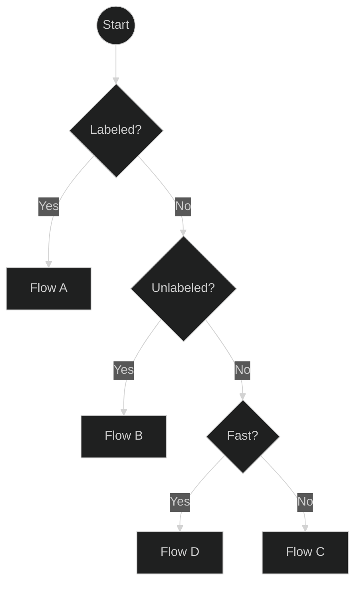
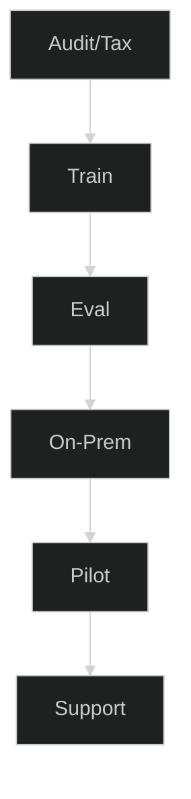
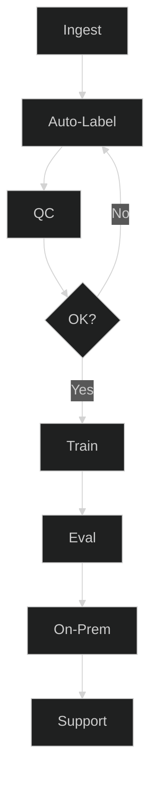
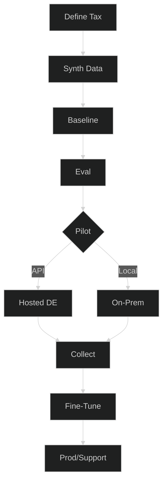
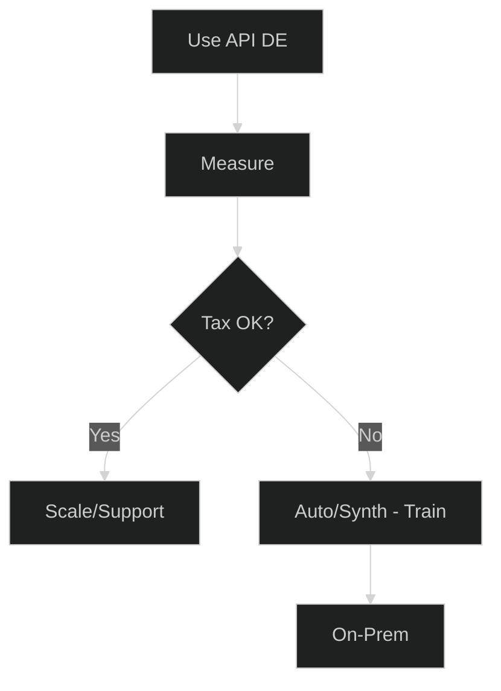
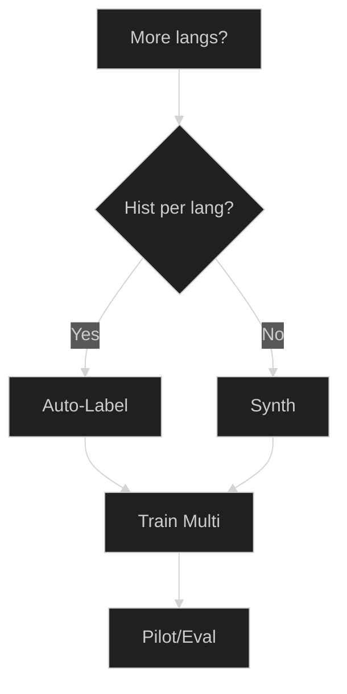
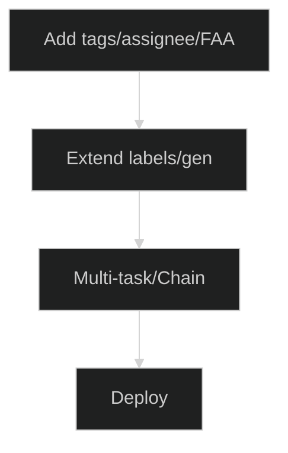

# Planificador de Automatización de Tickets — Elija su Mejor Ruta

Modernice el enrutamiento de tickets rápidamente, sin importar desde dónde empiece. Este planificador le ayuda a elegir la ruta correcta según la realidad de sus datos: muchos tickets etiquetados, muchos tickets sin etiquetar o casi ningún dato. Cada ruta finaliza en un paquete de servicios concreto con entregables y KPIs claros, para que pueda pasar de la idea → al piloto → a la producción sin conjeturas.

**Para quién es esto:** Equipos de TI/servicios en Znuny/OTRS/OTOBO (o similar) que deseen predicciones fiables de cola/prioridad/tags, ya sea en sus propias instalaciones (on-premise) o a través de una API alojada.

**Qué obtendrá:** un flujo de decisión corto, 4 rutas accionables (A–D), complementos (multilingüe, atributos adicionales), criterios/métricas para saber cuándo está listo y una lista de verificación de preparación de datos.

**Cómo usar esta página**

* Comience con el resumen en una pantalla y responda tres preguntas: **¿Etiquetados? → ¿Sin etiquetar? → ¿Rápido?**
* Haga clic en el cuadro del **Flujo A/B/C/D** para ir a sus pasos, entregables y KPIs.
* Use los **complementos** si necesita varios idiomas o más salidas (tags, asignatario, primera respuesta).
* Mantenga los **criterios** estrictos (F1 por clase + KPIs de negocio) para que los pilotos se traduzcan en confianza para la producción.

Ahora continúe con el diagrama de resumen y los flujos detallados a continuación.

---

## 0) Resumen en una pantalla

**Cómo usar este resumen:**
Comience desde arriba, responda las preguntas y siga la rama hasta el flujo que le corresponde. Haga clic en un flujo para ver sus detalles.

---

##  Flujo A — Muchos tickets etiquetados

**Cuándo elegir esta opción:**

* Ya tiene **miles de tickets con etiquetas de cola, prioridad o tags**.
* Desea un **modelo entrenado a medida** para obtener la máxima precisión.

**Qué sucede en este flujo:**

1. **Auditoría/Taxonomía** — Verificar la calidad de las etiquetas, el balance de clases y la nomenclatura.
2. **Entrenamiento** — Realizar un ajuste fino (fine-tuning) del modelo de clasificación con sus datos.
3. **Evaluación** — Medir la precisión/recall/F1 por clase.
4. **On-Premise** — Desplegar dentro de su propia infraestructura.
5. **Piloto** — Probar en producción con monitorización.
6. **Soporte** — Iterar y reentrenar según sea necesario.

**Paquete recomendado:** Ajuste Fino + Instalación On-Premise.

---

##  Flujo B — Muchos tickets sin etiquetar

**Cuándo elegir esta opción:**

* Tiene **grandes archivos históricos de tickets** pero sin etiquetas.
* Puede dedicar tiempo de revisión humana para controles de calidad.

**Qué sucede en este flujo:**

1. **Ingesta** — Recopilar tickets de su sistema.
2. **Etiquetado Automático** — Usar etiquetado automático asistido por LLM.
3. **Control de Calidad** — Revisar y corregir muestras de forma aleatoria.
4. **¿OK?** — Repetir hasta que la calidad alcance el umbral deseado.
5. **Entrenamiento** — Realizar un ajuste fino con el conjunto de datos curado.
6. **Evaluación / On-Premise / Soporte** — Igual que en el Flujo A.

**Paquete recomendado:** Etiquetado Automático + Ajuste Fino.

---

##  Flujo C — Pocos o ningún ticket

**Cuándo elegir esta opción:**

* Está empezando **desde cero** o tiene muy pocos tickets para entrenar un modelo.
* Desea una solución de **arranque en frío** para empezar a operar rápidamente.

**Qué sucede en este flujo:**

1. **Definir Taxonomía** — Decidir colas, prioridades, tono.
2. **Datos Sintéticos** — Generar tickets realistas (alemán/inglés).
3. **Modelo Base** — Entrenar el modelo inicial con datos sintéticos.
4. **Evaluación** — Comprobar el rendimiento antes del lanzamiento.
5. **Piloto** — Elegir la API Alojada por velocidad o el despliegue On-Premise por control.
6. **Recopilar** — Reunir tickets reales durante el piloto.
7. **Ajuste Fino** — Fusionar datos reales y sintéticos.
8. **Producción/Soporte** — Puesta en marcha con iteración continua.

**Paquete recomendado:** Arranque en Frío Sintético.

---

##  Flujo D — Inicio rápido mediante API Alojada

**Cuándo elegir esta opción:**

* Necesita **resultados de inmediato**.
* Quiere probar la automatización sin un entrenamiento previo.

**Qué sucede en este flujo:**

1. **Usar API (DE)** — Clasificación instantánea mediante un modelo alojado en alemán.
2. **Medir** — Monitorizar el impacto en el enrutamiento, los SLA y el backlog.
3. **¿Taxonomía OK?** — Si está satisfecho, escale el uso; si no, vaya al Flujo B o C para el entrenamiento.

**Paquete recomendado:** Piloto con API Alojada → Ajuste Fino (opcional).

---

## Complementos opcionales

### Expansión multilingüe

Añada soporte para idiomas adicionales mediante etiquetado automático multilingüe o generación sintética, y luego entrene y evalúe por localidad.

---

### Atributos adicionales

Prediga más que colas/prioridades (p. ej., tags, asignatario o tiempo de primera respuesta) extendiendo el etiquetado y entrenando un modelo multitarea.