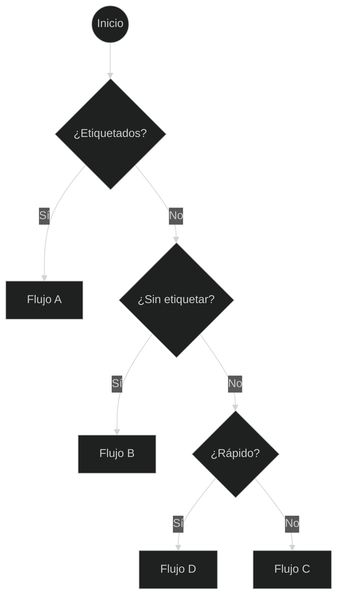
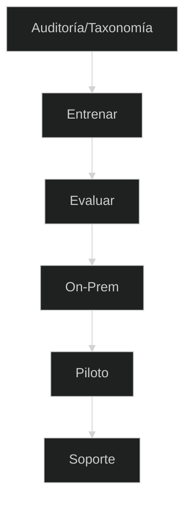
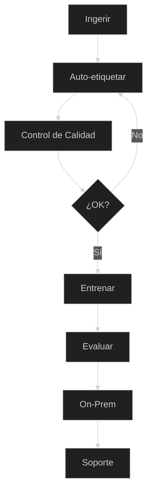
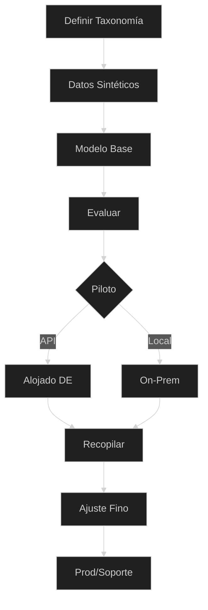
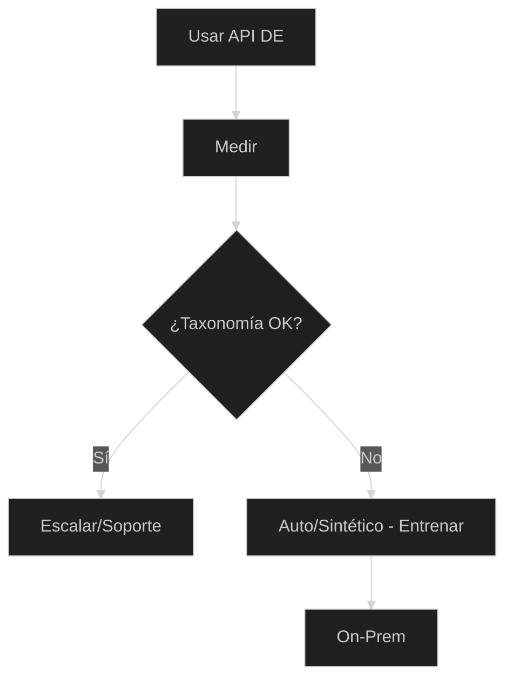
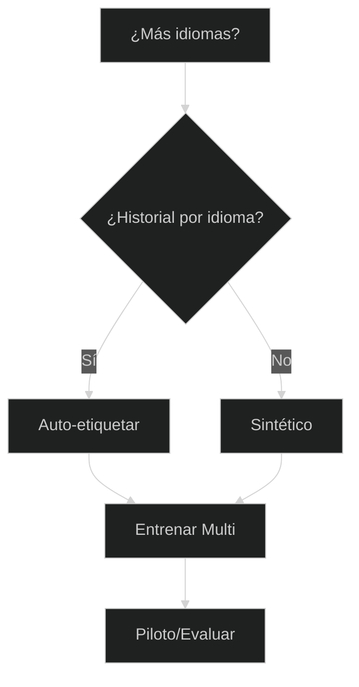
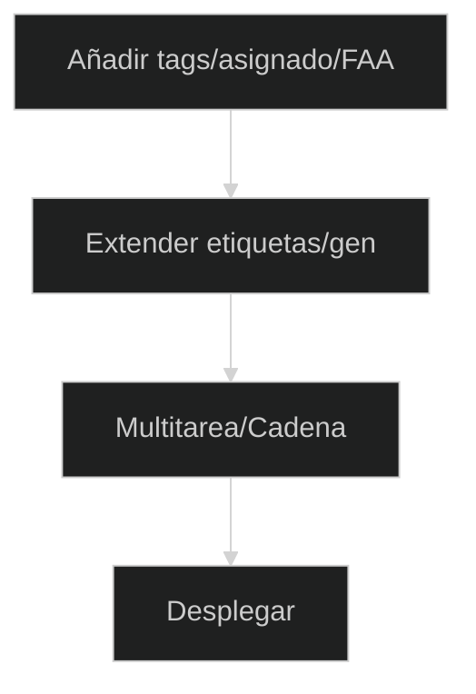

# Planificador de Automatización de Tickets — Elige tu Mejor Ruta

Moderniza el enrutamiento de tickets rápidamente, sin importar tu punto de partida. Este planificador te ayuda a elegir la ruta correcta según la realidad de tus datos: muchos tickets etiquetados, muchos tickets sin etiquetar o casi ningún dato. Cada ruta finaliza en un paquete de servicios concreto con entregables y KPIs claros, para que puedas pasar de la idea → piloto → producción sin conjeturas.

**Para quién es esto:** Equipos de TI/servicios en Znuny/OTRS/OTOBO (o similar) que desean predicciones fiables de cola/prioridad/etiqueta, ya sea on-prem o a través de una API alojada.

**Qué obtendrás:** un flujo de decisión corto, 4 rutas accionables (A–D), complementos (multilingüe, atributos extra), puntos de control/métricas para saber cuándo estás listo y una lista de verificación de preparación de datos.

**Cómo usar esta página**

* Comienza con la vista general de una pantalla y responde tres preguntas: **¿Etiquetados? → ¿Sin etiquetar? → ¿Rápido?**
* Haz clic en el cuadro de **Flujo A/B/C/D** para ir a sus pasos, entregables y KPIs.
* Usa los **complementos** si necesitas varios idiomas o más salidas (etiquetas, asignado, primera respuesta).
* Mantén los **puntos de control** estrictos (F1 por clase + KPIs de negocio) para que los pilotos se traduzcan en confianza para la producción.

Ahora continúa con el diagrama general y los flujos detallados a continuación.
Bien, aquí tienes una redacción más completa que puedes colocar debajo de tus diagramas. La mantuve fácil de escanear pero agregué orientación real y umbrales para que los lectores puedan elegir un flujo con confianza.

Entendido, mantendré tus nuevos diagramas cortos y agregaré texto explicativo claro y conciso para cada sección, para que el artículo se sienta completo pero siga siendo fácil de escanear.

---

## 0) Vista general en una pantalla

**Cómo usar esta vista general:**
Comienza desde arriba, responde las preguntas y sigue la rama hasta tu flujo correspondiente. Haz clic en un flujo para ver sus detalles.

---

##  Flujo A — Muchos tickets etiquetados

**Cuándo elegir esto:**

* Ya tienes **miles de tickets con etiquetas de cola, prioridad o tag**.
* Quieres un `model` **entrenado a medida** para una máxima precisión.

**Qué sucede en este flujo:**

1. **Auditoría/Taxonomía** — Verificar la calidad de las etiquetas, el balance de clases y la nomenclatura.
2. **Entrenar** — Ajustar (fine-tune) el `model` de clasificación con tus datos.
3. **Evaluar** — Medir precisión/recall/F1 por clase.
4. **On-Prem** — Desplegar dentro de tu propia infraestructura.
5. **Piloto** — Probar en producción con monitorización.
6. **Soporte** — Iterar y reentrenar según sea necesario.

**Paquete recomendado:** Ajuste Fino (Fine-Tune) + Instalación On-Prem.

---

##  Flujo B — Muchos tickets sin etiquetar

**Cuándo elegir esto:**

* Tienes **grandes archivos históricos de tickets** pero sin etiquetas.
* Puedes dedicar algo de tiempo de revisión humana para controles de calidad.

**Qué sucede en este flujo:**

1. **Ingerir** — Recopilar tickets de tu sistema.
2. **Auto-etiquetar** — Usar auto-etiquetado asistido por LLM.
3. **Control de Calidad** — Revisar y corregir muestras puntuales.
4. **¿OK?** — Repetir hasta que la calidad alcance el umbral.
5. **Entrenar** — Ajustar (fine-tune) con el conjunto de datos curado.
6. **Evaluar / On-Prem / Soporte** — Igual que en el Flujo A.

**Paquete recomendado:** Auto-etiquetado + Ajuste Fino (Fine-Tune).

---

##  Flujo C — Pocos o ningún ticket

**Cuándo elegir esto:**

* Estás empezando **desde cero** o tienes muy pocos tickets para entrenar.
* Quieres una solución de **arranque en frío** (cold-start) para empezar a operar rápidamente.

**Qué sucede en este flujo:**

1. **Definir Taxonomía** — Decidir colas, prioridades, tono.
2. **Datos Sintéticos** — Generar tickets realistas (DE/EN).
3. **Modelo Base** — Entrenar el `model` inicial con datos sintéticos.
4. **Evaluar** — Comprobar el rendimiento antes del despliegue.
5. **Piloto** — Elegir la API alojada por velocidad o la instalación On-Prem por control.
6. **Recopilar** — Reunir tickets reales durante el piloto.
7. **Ajuste Fino** — Fusionar datos reales y sintéticos.
8. **Prod/Soporte** — Puesta en producción con iteración continua.

**Paquete recomendado:** Arranque en Frío Sintético (Synthetic Cold-Start).

---

##  Flujo D — Inicio rápido mediante API alojada

**Cuándo elegir esto:**

* Necesitas **resultados inmediatamente**.
* Quieres probar la automatización sin entrenar primero.

**Qué sucede en este flujo:**

1. **Usar API DE** — Clasificación instantánea a través del `model` alemán alojado.
2. **Medir** — Seguir el impacto en el enrutamiento, SLA y backlog.
3. **¿Taxonomía OK?** — Si estás satisfecho, escala el uso; si no, ve al Flujo B o C para entrenar.

**Paquete recomendado:** Piloto con API Alojada → Ajuste Fino (Fine-Tune) (opcional).

---

## Complementos opcionales

### Expansión multilingüe

Añade soporte para idiomas adicionales mediante auto-etiquetado multilingüe o generación sintética, luego entrena y evalúa por localización.

---

### Atributos extra

Predice más que colas/prioridades —por ejemplo, `tags`, asignado o tiempo de primera respuesta— extendiendo el etiquetado y entrenando un `model` multitarea.