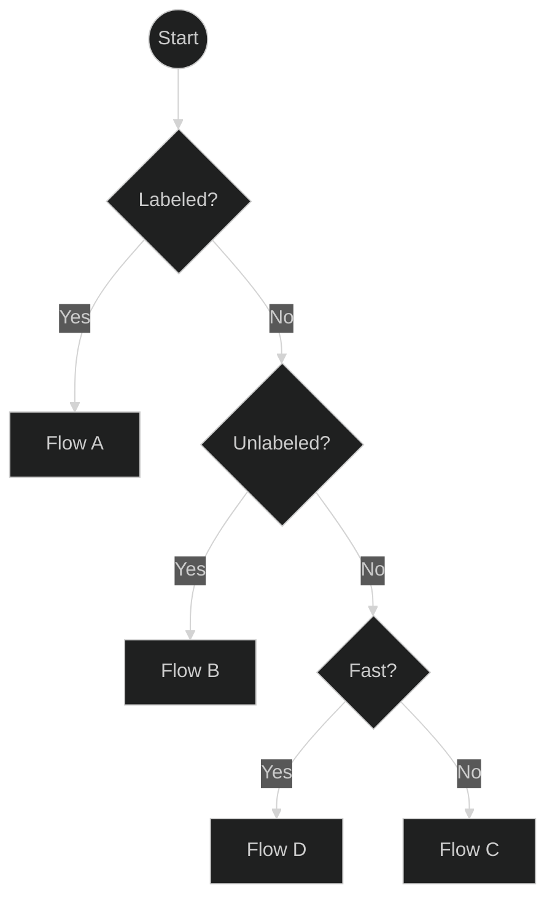
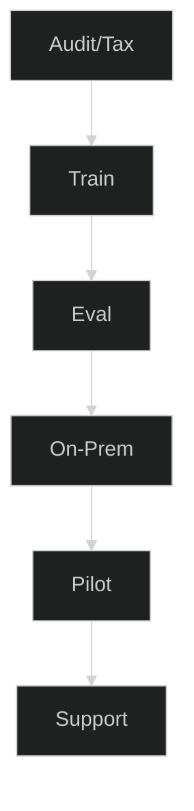
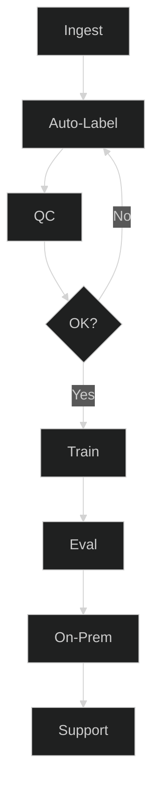
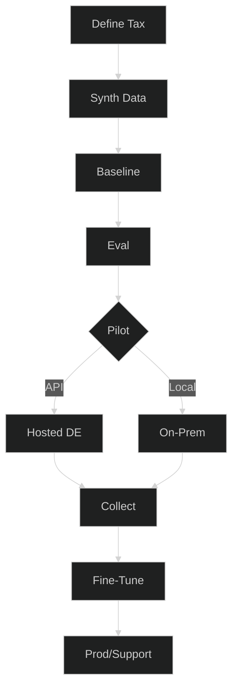
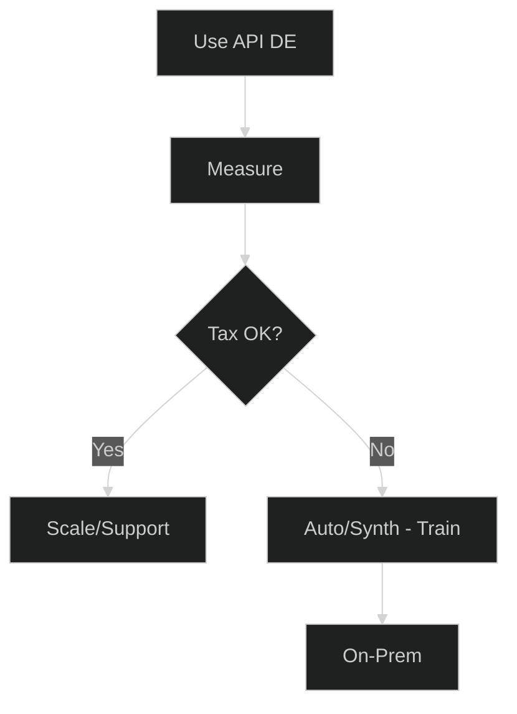
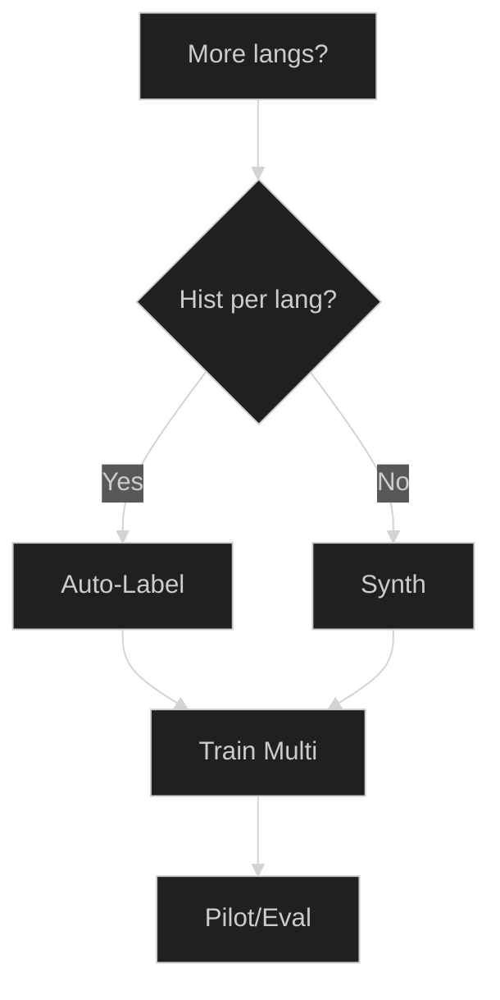
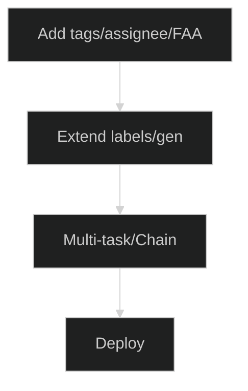

# Planificateur d'Automatisation des Tickets — Choisissez Votre Meilleur Parcours

Modernisez rapidement le routage des tickets, peu importe votre point de départ. Ce planificateur vous aide à choisir le bon parcours en fonction de la réalité de vos données : beaucoup de tickets étiquetés, beaucoup de tickets non étiquetés, ou presque aucune donnée. Chaque parcours se termine par un package de services concret avec des livrables et des KPIs clairs, afin que vous puissiez passer de l'idée → au pilote → à la production sans approximations.

**À qui s'adresse ce guide :** Les équipes IT/de service utilisant Znuny/OTRS/OTOBO (ou similaire) qui souhaitent des prédictions fiables de file d'attente/priorité/tag, que ce soit en déploiement sur site (on-prem) ou via une API hébergée.

**Ce que vous obtiendrez :** un flux de décision court, 4 parcours actionnables (A–D), des modules complémentaires (multilingue, attributs supplémentaires), des points de contrôle/métriques pour savoir quand vous êtes prêt, et une checklist de préparation des données.

**Comment utiliser cette page**

* Commencez par la vue d'ensemble et répondez à trois questions : **Étiqueté ? → Non étiqueté ? → Rapide ?**
* Cliquez sur la case du **Parcours A/B/C/D** pour accéder à ses étapes, livrables et KPIs.
* Utilisez les **modules complémentaires** si vous avez besoin de plusieurs langues ou de plus de sorties (tags, responsable, première réponse).
* Maintenez des **points de contrôle** stricts (F1 par classe + KPIs métier) pour que les pilotes se traduisent en confiance pour la production.

Continuez maintenant avec le diagramme de vue d'ensemble et les parcours détaillés ci-dessous.
Parfait — voici une version plus complète que vous pouvez placer sous vos diagrammes. Je l'ai gardée facile à parcourir tout en ajoutant des conseils concrets et des seuils pour que les lecteurs puissent choisir un parcours en toute confiance.

Compris — je vais conserver vos nouveaux diagrammes courts et ajouter un texte explicatif clair et concis pour chaque section afin que l'article semble complet tout en restant facile à lire.

---

## 0) Vue d'ensemble

**Comment utiliser cette vue d'ensemble :**
Commencez en haut, répondez aux questions et suivez la branche jusqu'au parcours qui vous correspond. Cliquez sur un parcours pour voir ses détails.

---

##  Parcours A — Beaucoup de tickets étiquetés

**Quand choisir ce parcours :**

* Vous avez déjà des **milliers de tickets avec des étiquettes de file d'attente, de priorité ou de tag**.
* Vous voulez un **modèle entraîné sur mesure** pour une précision maximale.

**Que se passe-t-il dans ce parcours :**

1. **Audit/Taxonomie** — Vérifier la qualité des étiquettes, l'équilibre des classes et les noms.
2. **Entraînement** — Affiner le modèle de classification avec vos données.
3. **Évaluation** — Mesurer la précision/le rappel/le F1 par classe.
4. **Sur site (On-Prem)** — Déployer au sein de votre propre infrastructure.
5. **Pilote** — Tester en production avec une surveillance.
6. **Support** — Itérer et ré-entraîner si nécessaire.

**Package recommandé :** Affinage + Installation sur site (On-Prem).

---

##  Parcours B — Beaucoup de tickets non étiquetés

**Quand choisir ce parcours :**

* Vous avez de **grandes archives historiques de tickets** mais pas d'étiquettes.
* Vous pouvez allouer du temps de révision humaine pour les contrôles de qualité.

**Que se passe-t-il dans ce parcours :**

1. **Ingestion** — Collecter les tickets de votre système.
2. **Étiquetage auto.** — Utiliser l'étiquetage automatique assisté par LLM.
3. **Contrôle Qualité (QC)** — Vérifier et corriger des échantillons.
4. **OK ?** — Boucler jusqu'à ce que la qualité atteigne le seuil.
5. **Entraînement** — Affiner avec l'ensemble de données préparé.
6. **Évaluation / Sur site / Support** — Identique au Parcours A.

**Package recommandé :** Étiquetage automatique + Affinage.

---

##  Parcours C — Peu ou pas de tickets

**Quand choisir ce parcours :**

* Vous partez de **zéro** ou avez trop peu de tickets pour un entraînement.
* Vous voulez une solution de **démarrage à froid (cold-start)** pour une mise en production rapide.

**Que se passe-t-il dans ce parcours :**

1. **Définir la taxonomie** — Décider des files d'attente, des priorités, du ton.
2. **Données synthétiques** — Générer des tickets réalistes (DE/EN).
3. **Modèle de base** — Entraîner le modèle initial sur des données synthétiques.
4. **Évaluation** — Vérifier les performances avant le déploiement.
5. **Pilote** — Choisir l'API hébergée pour la vitesse ou le déploiement sur site (On-Prem) pour le contrôle.
6. **Collecte** — Recueillir de vrais tickets pendant le pilote.
7. **Affinage** — Fusionner les données réelles et synthétiques.
8. **Prod/Support** — Mettre en production avec des itérations continues.

**Package recommandé :** Démarrage à froid synthétique.

---

##  Parcours D — Démarrage rapide via l'API hébergée

**Quand choisir ce parcours :**

* Vous avez besoin de **résultats immédiats**.
* Vous voulez essayer l'automatisation sans entraînement préalable.

**Que se passe-t-il dans ce parcours :**

1. **Utiliser l'API DE** — Classification instantanée via le modèle allemand hébergé.
2. **Mesurer** — Suivre l'impact sur le routage, les SLA et le backlog.
3. **Taxonomie OK ?** — Si satisfait, augmentez l'utilisation ; sinon, passez au Parcours B ou C pour l'entraînement.

**Package recommandé :** Pilote API hébergée → Affinage (optionnel).

---

## Modules complémentaires optionnels

### Expansion multilingue

Ajoutez le support pour des langues supplémentaires via l'étiquetage automatique multilingue ou la génération synthétique, puis entraînez et évaluez par langue.

---

### Attributs supplémentaires

Prédisez plus que les files d'attente/priorités — par ex., les tags, le responsable ou le temps de première réponse — en étendant l'étiquetage et en entraînant un modèle multi-tâches.