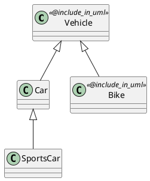

# pdgen - Pydantic Model to PlantUML Diagram Generator

`pdgen` is a tool for generating PlantUML class diagrams from Python code with inheritance support. It uses the `@include_in_uml` decorator to mark classes for inclusion in the diagram.

## Features

- **Selective Class Inclusion**: Use the `@include_in_uml` decorator to mark classes for diagram generation
- **Automatic Inheritance Detection**: Automatically includes parent and child classes in the inheritance hierarchy
- **Multi-file Support**: Scan entire directories for classes
- **PlantUML Output**: Generates standard PlantUML syntax for easy integration with documentation

## Installation

The tool is part of the open-ticket-ai repository and requires no additional installation beyond the project dependencies.

## Usage

### Basic Usage

Generate a diagram from a single file:

```bash
python scripts/pdgen_cli.py path/to/file.py
```

Generate a diagram from a directory:

```bash
python scripts/pdgen_cli.py path/to/directory/
```

Save output to a file:

```bash
python scripts/pdgen_cli.py path/to/file.py -o diagram.puml
```

### Using the Decorator

Mark classes you want to include in the diagram with `@include_in_uml`:

```python
from scripts.pdgen.decorator import include_in_uml

@include_in_uml
class Vehicle:
    """Base vehicle class"""
    pass

class Car(Vehicle):
    """This will be included because it inherits from Vehicle"""
    pass

@include_in_uml
class Bike(Vehicle):
    """This is explicitly marked for inclusion"""
    pass

class SportsCar(Car):
    """This will also be included through the inheritance chain"""
    pass

class UnrelatedClass:
    """This will NOT be included as it's not decorated and not related"""
    pass
```

### Output

The generated PlantUML diagram will look like:



## How It Works

1. **Decorator Marking**: Classes marked with `@include_in_uml` are explicitly included
2. **Parent Inclusion**: If a class is decorated, all its parent classes are included
3. **Child Inclusion**: If a class is decorated, all its child classes are included
4. **Transitive Closure**: The tool follows the inheritance chain in both directions
5. **Filtering**: Classes not connected to any decorated class are excluded

## Edge Cases

### Multiple Inheritance

The tool properly handles multiple inheritance:

```python
@include_in_uml
class Vehicle:
    pass

@include_in_uml
class Electric:
    pass

class ElectricCar(Vehicle, Electric):
    """Inherits from both decorated parents"""
    pass
```

Output includes all three classes with both inheritance arrows.

### Deep Inheritance

Works with inheritance chains of any depth:

```python
@include_in_uml
class Vehicle:
    pass

class Car(Vehicle):
    pass

class SportsCar(Car):
    pass

class RaceCar(SportsCar):
    pass
```

All classes in the chain are included.

### Cross-Module Classes

The parser extracts simple class names from base classes, so cross-module inheritance works as long as:
- The base class is imported and visible in the same file
- Or you mark both parent and child with `@include_in_uml`

## Limitations

- Nested classes are detected but treated as separate classes
- Only inheritance relationships are shown (no composition or aggregation yet)
- Decorators must be named `include_in_uml` (no aliases)

## Future Enhancements

Potential future improvements mentioned in the issue:
- Support for composition and aggregation relationships
- Better handling of cross-module inheritance
- Support for showing class attributes and methods
- Color coding or styling options
