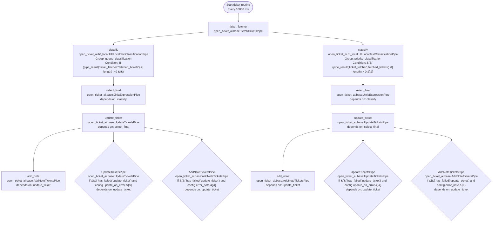

```mermaid
flowchart TD
    %% Pipeline 0: ticket-routing
    ticket_routing_start([Start ticket-routing<br/>Every 10000 ms])
    ticket_routing_ticket_fetcher[ticket_fetcher<br/>open_ticket_ai.base:FetchTicketsPipe]
    ticket_routing_queue_classification_classify["classify<br/>open_ticket_ai.hf_local:HFLocalTextClassificationPipe<br/>Group: queue_classification<br/>Condition: &#123&#123 (pipe_result('ticket_fetcher','fetched_tickets') &#124; length) > 0 &#125;&#125;"]
    ticket_routing_queue_classification_select_final[select_final<br/>open_ticket_ai.base:JinjaExpressionPipe<br/>depends on: classify]
    ticket_routing_queue_classification_update_ticket[update_ticket<br/>open_ticket_ai.base:UpdateTicketsPipe<br/>depends on: select_final]
    ticket_routing_queue_classification_add_note[add_note<br/>open_ticket_ai.base:AddNoteTicketsPipe<br/>depends on: update_ticket]
    ticket_routing_queue_classification_open_ticket_ai_base_UpdateTicketsPipe{"UpdateTicketsPipe<br/>open_ticket_ai.base:UpdateTicketsPipe<br/>if &#123;&#123; has_failed('update_ticket') and config.update_on_error &#125;&#125;<br/>depends on: update_ticket"}
    ticket_routing_queue_classification_open_ticket_ai_base_AddNoteTicketsPipe{"AddNoteTicketsPipe<br/>open_ticket_ai.base:AddNoteTicketsPipe<br/>if &#123;&#123; has_failed('update_ticket') and config.error_note &#125;&#125;<br/>depends on: update_ticket"}
    ticket_routing_priority_classification_classify["classify<br/>open_ticket_ai.hf_local:HFLocalTextClassificationPipe<br/>Group: priority_classification<br/>Condition: &#123;&#123; (pipe_result('ticket_fetcher','fetched_tickets') &#124; length) > 0 &#125;&#125;"]
    ticket_routing_priority_classification_select_final["select_final<br/>open_ticket_ai.base:JinjaExpressionPipe<br/>depends on: classify"]
    ticket_routing_priority_classification_update_ticket["update_ticket<br/>open_ticket_ai.base:UpdateTicketsPipe<br/>depends on: select_final"]
    ticket_routing_priority_classification_add_note["add_note<br/>open_ticket_ai.base:AddNoteTicketsPipe<br/>depends on: update_ticket"]
    ticket_routing_priority_classification_open_ticket_ai_base_UpdateTicketsPipe{"UpdateTicketsPipe<br/>open_ticket_ai.base:UpdateTicketsPipe<br/>if &#123;&#123; has_failed('update_ticket') and config.update_on_error &#125;&#125;<br/>depends on: update_ticket"}
    ticket_routing_priority_classification_open_ticket_ai_base_AddNoteTicketsPipe{"AddNoteTicketsPipe<br/>open_ticket_ai.base:AddNoteTicketsPipe<br/>if &#123;&#123; has_failed('update_ticket') and config.error_note &#125;&#125;<br/>depends on: update_ticket"}

    ticket_routing_queue_classification_classify --> ticket_routing_queue_classification_select_final
    ticket_routing_queue_classification_select_final --> ticket_routing_queue_classification_update_ticket
    ticket_routing_queue_classification_update_ticket --> ticket_routing_queue_classification_add_note
    ticket_routing_queue_classification_update_ticket --> ticket_routing_queue_classification_open_ticket_ai_base_UpdateTicketsPipe
    ticket_routing_queue_classification_update_ticket --> ticket_routing_queue_classification_open_ticket_ai_base_AddNoteTicketsPipe
    ticket_routing_ticket_fetcher --> ticket_routing_queue_classification_classify
    ticket_routing_priority_classification_classify --> ticket_routing_priority_classification_select_final
    ticket_routing_priority_classification_select_final --> ticket_routing_priority_classification_update_ticket
    ticket_routing_priority_classification_update_ticket --> ticket_routing_priority_classification_add_note
    ticket_routing_priority_classification_update_ticket --> ticket_routing_priority_classification_open_ticket_ai_base_UpdateTicketsPipe
    ticket_routing_priority_classification_update_ticket --> ticket_routing_priority_classification_open_ticket_ai_base_AddNoteTicketsPipe
    ticket_routing_ticket_fetcher --> ticket_routing_priority_classification_classify
    ticket_routing_start --> ticket_routing_ticket_fetcher
```
